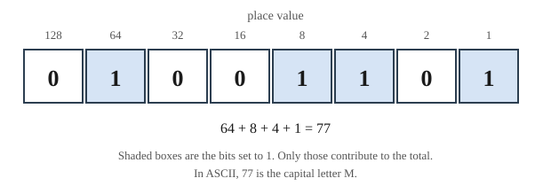
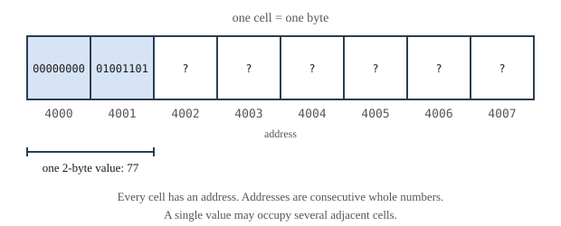

# Chapter 1 — Computing, Data, and the Software Landscape

## Learning Objectives

When you finish this chapter you will be able to:

- Explain what a program is and describe the four parts of a computer and how data moves between them. *(SLO 1.1)*
- Describe how data are represented in a computer using bits and bytes, and calculate how many distinct values a given number of bits can hold. *(SLO 1.1)*
- Convert whole numbers between decimal, binary, and hexadecimal. *(SLO 1.1)*
- Explain how negative numbers, real numbers, and text are represented, and identify the limits each representation imposes. *(SLO 1.1)*
- Distinguish machine language, assembly language, and high-level languages, and explain the trade-off each represents. *(SLO 1.2)*
- Distinguish compiled, interpreted, and hybrid languages, and describe the consequences of each for how a program is built and run. *(SLO 1.2)*
- Categorize programming languages by paradigm and select a language category appropriate to a stated purpose. *(SLO 1.2)*
- Explain where C++ sits among these categories and why this book uses it. *(SLO 1.2)*

---

## 1.1 What a Program Is

A **program** is a sequence of instructions that tells a computer how to accomplish a task.

That definition is short, and every word in it is doing work. *Sequence* means order matters: the same instructions in a different order are a different program, usually a broken one. *Instructions* means each step is something the machine can actually carry out, not a wish. And *tells a computer* means the instructions have to be expressed in a form the machine can act on, which turns out to be the central difficulty of the whole enterprise.

Here is the difficulty. The task in your head is something like "work out each student's grade." The instructions a processor can carry out are more like "copy the eight bytes at address 4000 into register 2." Between those two descriptions lies an enormous gap, and essentially everything in this book — variables, loops, functions, classes — exists to help you cross it.

You will cross it by writing **source code**: text, written by you, in a language designed to be readable by humans and translatable into machine instructions. This is the C++ source code for a complete program, and while you are not expected to understand it yet, notice that you can already guess roughly what it does:

```cpp
#include <iostream>

int main() {
    std::cout << "Grade Calculator\n";
    return 0;
}
```

That guessability is the entire point of a programming language. A processor would not accept a single character of it.

### Software and hardware

**Hardware** is the physical machinery: the chips, boards, drives, and cables. **Software** is the instructions the hardware carries out. The distinction is real but the boundary is less crisp than it sounds — a modern processor is itself controlled by low-level software, and some software is delivered permanently fixed in a chip. For your purposes the useful version is this: hardware is what you could drop on your foot, and software is what you can change without a screwdriver.

Software divides broadly into two kinds. **System software** manages the machine itself — the operating system, device drivers, and the development tools you will meet in Chapter 2. **Application software** does something a person actually wanted done: a browser, a spreadsheet, a game, or the grade calculator you are about to build.

---

## 1.2 Hardware in Brief

You do not need a hardware course to write good programs. You do need a working mental model of where your data lives, because several things that will otherwise seem arbitrary — why numbers overflow, why files must be opened, why a variable forgets its value when the program ends — follow directly from it.


**Figure 1.1 — The four parts of a computer and how data moves between them.**

*Description of Figure 1.1.* The processor sits at the centre. Main memory sits above it, and data flows in both directions between them. Input devices, such as a keyboard, send data one way into the processor. Output devices, such as a screen, receive data one way from the processor. Storage sits below main memory, and data flows in both directions between those two. Main memory loses its contents when power is lost; storage does not.

**The processor**, or CPU, carries out instructions. It does a small number of very simple things — arithmetic, comparison, moving data from one place to another, choosing which instruction to do next — at a rate of billions of operations per second. Every sophisticated behavior you have ever seen a computer produce is built from these primitives.

**Main memory**, or RAM, holds the data and instructions the processor is working with right now. It is fast, and it is **volatile**: when power stops, its contents are gone. Every variable you declare in this book lives in main memory, which is why a program that does not save its work to a file has nothing to show for itself once it exits. That fact will drive a real design decision in Chapter 15.

**Storage** — a hard disk or SSD — holds data that must survive after the power is off. It is **non-volatile** and much slower than memory. Files live here.

**Input and output** connect the machine to the world. In this book, input means text you type at a keyboard and output means text printed to the screen. That is a deliberate narrowing, and Section 5.8 explains why it is a reasonable place to start.

The one relationship to carry forward: **the processor works only with data in main memory.** Anything in storage must be loaded into memory before it can be used, and anything in memory must be written to storage before it will survive. Reading a file, saving your work, and the difference between the two are all consequences of that single fact.

---

## 1.3 Representing Data: Bits and Bytes

Here is the thing that surprises most people who look closely for the first time. A computer does not store numbers, or letters, or images. It stores **electrical states**, and the numbers, letters, and images you work with are conventions for interpreting those states.

The smallest unit is the **bit**, short for *binary digit*. A bit has exactly two possible states, written as `0` and `1`. Physically it might be a voltage that is high or low, or a region of a chip that is charged or not. What it *is* physically does not matter to you. What matters is that it has two states, and only two.

Two states is not much. So bits are used in groups.

### Counting what a group of bits can hold

Each additional bit doubles the number of distinct patterns available, because every pattern you already had can be extended in two ways.

| Bits | Distinct patterns | Calculation |
|---|---|---|
| 1 | 2 | 2¹ |
| 2 | 4 | 2² |
| 3 | 8 | 2³ |
| 4 | 16 | 2⁴ |
| 8 | 256 | 2⁸ |
| 16 | 65,536 | 2¹⁶ |
| 32 | 4,294,967,296 | 2³² |
| 64 | about 1.8 × 10¹⁹ | 2⁶⁴ |

The rule is simply that ***n* bits hold 2ⁿ distinct patterns.** Memorize that one; you will use it constantly, and it explains a great deal of otherwise mysterious behavior. When you learn in Chapter 3 that a certain kind of C++ integer can hold values from −2,147,483,648 to 2,147,483,647, you will recognize those numbers immediately: that is 2³² patterns, split between negative and non-negative.

### The byte

A group of **eight bits** is a **byte**. The byte is the standard unit of storage — memory sizes, file sizes, and network speeds are all quoted in bytes or multiples of them. One byte holds 2⁸ = 256 distinct patterns.



**Figure 1.2 — One byte holding the value 77.**

*Description of Figure 1.2.* Eight bit positions are shown side by side. Reading from left to right the bits are 0, 1, 0, 0, 1, 1, 0, 1. Above each position is its place value, halving from left to right: 128, 64, 32, 16, 8, 4, 2, 1. The four positions holding a 1 are those with place values 64, 8, 4, and 1. Adding those gives 64 + 8 + 4 + 1 = 77. Under the ASCII convention described in Section 1.6, the value 77 represents the capital letter M.

Larger groupings have names too. A **word** is the amount of data a processor handles most naturally in one operation — 64 bits on most current machines. Unlike the byte, the word is not a fixed size; it depends on the processor.

For quantities of storage, note that the prefixes are used in two conflicting ways. Manufacturers usually mean powers of ten; operating systems usually mean powers of two.

| Unit | Powers of ten | Powers of two |
|---|---|---|
| Kilobyte (KB) | 1,000 bytes | 1,024 bytes |
| Megabyte (MB) | 1,000,000 bytes | 1,048,576 bytes |
| Gigabyte (GB) | 1,000,000,000 bytes | 1,073,741,824 bytes |

This is why a drive sold as 500 GB shows up as roughly 465 GB once your operating system has counted it. Nobody is cheating; the two are using different definitions of the same word.

### Memory as addressed cells

Main memory is a long sequence of byte-sized cells, each with a number called its **address**. Addresses are consecutive whole numbers starting at zero.



**Figure 1.3 — Main memory as a numbered sequence of cells.**

*Description of Figure 1.3.* Eight memory cells are shown in a row. Each holds one byte. Beneath each cell is its address, running consecutively from 4000 to 4007. The cells at addresses 4000 and 4001 are shaded and bracketed together, labelled as a single value of 77 occupying two bytes. The figure notes that every cell has an address, that addresses are consecutive whole numbers, and that a single value may occupy several adjacent cells.

Two consequences matter for the rest of this book. First, **a single value may occupy several adjacent cells** — a value needing more than 256 possibilities cannot fit in one byte, so it spreads across two, four, or eight. Second, **every value in memory has an address**, and that address is itself a number that can be stored and passed around. That second fact is the whole idea behind pointers in Chapter 10. It will seem strange when you meet it. It is already true now.

---

## 1.4 Numbers in Binary, Octal, and Hexadecimal

You count in **decimal**, base ten, using ten digits. There is nothing mathematically special about ten; it is an accident of anatomy. A computer's two-state hardware makes **binary**, base two, the natural fit.

### How positional notation works

In any base, a digit's contribution depends on its position, and each position is worth the base times the position to its right.

In decimal, the number 4,207 means:

| Digit | 4 | 2 | 0 | 7 |
|---|---|---|---|---|
| Place value | 1000 | 100 | 10 | 1 |
| Contribution | 4000 | 200 | 0 | 7 |

Total: 4000 + 200 + 0 + 7 = 4,207.

Binary works identically, except that the place values are powers of two and the only digits available are 0 and 1. The binary number 1101 means:

| Digit | 1 | 1 | 0 | 1 |
|---|---|---|---|---|
| Place value | 8 | 4 | 2 | 1 |
| Contribution | 8 | 4 | 0 | 1 |

Total: 8 + 4 + 0 + 1 = 13.

### Converting binary to decimal

Write the place values above the digits, doubling from right to left, then add the place values that sit above a 1.

For binary 1001101, the place values from the right are 1, 2, 4, 8, 16, 32, 64:

```text
  1    0    0    1    1    0    1
 64   32   16    8    4    2    1
 64  +  0 +  0 +  8 +  4 +  0 +  1  =  77
```

### Converting decimal to binary

Repeatedly divide by two, recording each remainder, then read the remainders **from bottom to top**.

Converting 77:

| Division | Quotient | Remainder |
|---|---|---|
| 77 ÷ 2 | 38 | 1 |
| 38 ÷ 2 | 19 | 0 |
| 19 ÷ 2 | 9 | 1 |
| 9 ÷ 2 | 4 | 1 |
| 4 ÷ 2 | 2 | 0 |
| 2 ÷ 2 | 1 | 0 |
| 1 ÷ 2 | 0 | 1 |

Reading the remainder column from bottom to top gives 1001101, which matches the conversion above.

### Hexadecimal

Binary is faithful to the hardware and miserable to read. The value 3,735,928,559 in binary is thirty-two characters of ones and zeros that no one can check at a glance.

**Hexadecimal**, base sixteen, solves this. It needs sixteen digits, so it borrows the letters A through F for the values ten through fifteen.

| Hex | Dec | Binary | | Hex | Dec | Binary |
|---|---|---|---|---|---|---|
| 0 | 0 | 0000 | | 8 | 8 | 1000 |
| 1 | 1 | 0001 | | 9 | 9 | 1001 |
| 2 | 2 | 0010 | | A | 10 | 1010 |
| 3 | 3 | 0011 | | B | 11 | 1011 |
| 4 | 4 | 0100 | | C | 12 | 1100 |
| 5 | 5 | 0101 | | D | 13 | 1101 |
| 6 | 6 | 0110 | | E | 14 | 1110 |
| 7 | 7 | 0111 | | F | 15 | 1111 |

Hexadecimal earns its place because of one convenient fact: **sixteen is two to the fourth power, so each hex digit corresponds to exactly four bits.** Conversion is therefore mechanical, with no arithmetic at all. Group the binary digits into fours from the right and replace each group:

```text
binary   0100  1101
hex         4     D
```

So binary 01001101 is hex 4D, which is decimal 77. Two characters instead of eight, and you can convert back in your head.

You will see hexadecimal whenever raw memory is displayed — in a debugger in Chapter 16, in memory addresses in Chapter 10, and in color values on the web. **Octal**, base eight, works the same way with three bits per digit; it is largely a historical survivor, and you will meet it rarely.

---

## 1.5 Representing Negative and Real Numbers

Bits have no minus sign and no decimal point. Both have to be constructed out of conventions.

### Negative numbers

The obvious approach — reserve one bit to mean "negative" — turns out to work badly. It produces two different representations of zero, and it forces subtraction to be built as a separate operation from addition.

Real machines use **two's complement**, which is a genuinely clever piece of engineering. Reserve the leftmost bit as the sign bit, but give it a **negative place value**. In an 8-bit two's complement byte, the place values are −128, 64, 32, 16, 8, 4, 2, 1.

To see it work, take the byte 11110011:

```text
   1     1    1    1    0    0    1    1
-128    64   32   16    8    4    2    1
-128 +  64 + 32 + 16 +  0 +  0 +  2 +  1  =  -13
```

Two properties make this the universal choice. There is exactly one representation of zero. And ordinary binary addition produces the correct answer for negative values with no special handling, which means the same circuit does addition and subtraction.

An 8-bit two's complement byte holds values from −128 to 127. Notice the asymmetry: one more negative value than positive, because zero occupies a slot on the non-negative side. That asymmetry is real and will appear again in Chapter 3.

### Real numbers

Numbers with fractional parts use **floating-point** representation, which works like scientific notation. The value 6.02 × 10²³ is stored as three pieces: a sign, the digits 6.02 (the **mantissa**), and the exponent 23.

Floating-point buys enormous range — a 64-bit floating-point value covers roughly 10⁻³⁰⁸ to 10³⁰⁸ — and it pays for that range with **finite precision**. Only so many digits of the mantissa are kept.

This has a consequence that catches everyone once, and it is worth meeting now rather than being ambushed by it later. **Many decimal fractions cannot be represented exactly in binary.** The value 0.1 is one of them. In binary, one-tenth is a repeating fraction, exactly as one-third is a repeating decimal (0.3333…) in base ten. The computer stores the closest value it can, which is very close but not equal.

So in almost every programming language, including C++:

```text
0.1 + 0.2  is not exactly equal to  0.3
```

The result is approximately 0.30000000000000004. This is not a bug in C++ or in your machine; it is a direct consequence of storing base-ten fractions in a base-two system with limited space. Chapter 4 returns to this, and Chapter 9 shows the standard technique for comparing floating-point values safely.

The practical rule you can adopt today: **use whole numbers when the quantity is genuinely whole, and never test floating-point values for exact equality.**

---

## 1.6 Representing Text

Text is stored by agreeing that particular numbers stand for particular characters.

**ASCII** — the American Standard Code for Information Interchange — assigns the numbers 0 through 127 to English letters, digits, punctuation, and a set of control codes. Seven bits are enough, so one character fits comfortably in a byte.

| Character | ASCII value | | Character | ASCII value |
|---|---|---|---|---|
| `A` | 65 | | `a` | 97 |
| `B` | 66 | | `b` | 98 |
| `M` | 77 | | `m` | 109 |
| `Z` | 90 | | `z` | 122 |
| `0` | 48 | | space | 32 |
| `9` | 57 | | newline | 10 |

Three details in that table repay attention. The uppercase letters are consecutive, and so are the lowercase, which is why you can do arithmetic on characters in Chapter 3. Uppercase and lowercase are separated by exactly 32, which is why case conversion is a single addition. And **the character `0` is the number 48, not the number 0** — the digit you type and the quantity it names are entirely different things. That distinction causes real confusion later, and this is the moment it becomes clear.

ASCII's limitation is obvious: 128 values cannot hold Greek, Arabic, Chinese, or an emoji. **Unicode** solves this by assigning a number, called a **code point**, to every character in every writing system — over 150,000 of them so far.

Unicode says what number each character has, but not how to store it. That is the job of an **encoding**. The dominant one is **UTF-8**, which stores each character in one to four bytes: characters in the ASCII range take one byte and have exactly their ASCII values, so every ASCII file is already a valid UTF-8 file. Characters outside that range take more.

The practical consequence for you: in UTF-8, **the number of characters in a piece of text is not necessarily the number of bytes.** For the English text in this book they are the same, which is why the programs here can treat them interchangeably. It is worth knowing that this is a simplification rather than a law.

---

## 1.7 How Data Are Manipulated and Stored

Pull the last four sections together, because there is one idea underneath all of them.

Consider a single byte containing the pattern 01001101. What does it hold?

- As an unsigned whole number, 77.
- As a two's complement signed number, 77.
- As an ASCII character, the letter `M`.
- As part of a larger value spanning several bytes, some fragment with no independent meaning.
- As a machine instruction, some operation specific to that processor.

**All five readings are correct.** The bits do not know which one is intended. The pattern 01001101 carries no information about its own interpretation.

What supplies the interpretation is the program. When you declare in Chapter 3 that a variable holds a whole number, you are telling the compiler how to read the bits at that address. That declaration is not a description of what is stored — it *is* the meaning. This is the reason programming languages have types at all, and it is worth carrying with you as one of the few genuinely load-bearing ideas in this chapter.

The processor's working cycle is correspondingly simple. It repeats, billions of times per second:

1. **Fetch** the next instruction from memory.
2. **Decode** it to determine what operation is required.
3. **Execute** the operation, possibly reading or writing memory.
4. Repeat.

Everything a computer does is that loop, running very fast over data whose meaning is supplied entirely by the program operating on it.

---

## 1.8 Categories of Programming Languages

Thousands of programming languages exist. They can be sorted usefully along three independent dimensions, and knowing where a language sits on each tells you most of what you need to know about when to reach for it.

### 1.8.1 By distance from the hardware

**Machine language** is what the processor actually executes: numeric codes, usually written in hexadecimal. It is the only language a processor understands, and no one writes it by choice.

```text
B8 04 00 00 00
```

**Assembly language** replaces those numeric codes with short mnemonics, one per machine instruction. A program called an **assembler** translates it. It is readable, in the narrow sense that each line means something, but it remains tied to one specific processor family, and expressing an ordinary idea takes many lines.

```text
mov eax, 4
add eax, ebx
```

**High-level languages** let you express operations in terms closer to the problem than to the machine. One line may correspond to dozens of machine instructions. They are portable across processors, because the translator handles the differences. C++, Python, Java, and JavaScript are all high-level languages.

```cpp
total = total + bonusPoints;
```

The trade-off across these three is consistent: **the further you move from the hardware, the more you gain in readability, portability, and speed of development, and the less direct control you retain over exactly what the machine does.** For most work that trade is overwhelmingly worth taking, which is why high-level languages dominate.

### 1.8.2 By how they are translated

**Compiled languages** are translated in full, ahead of time, by a **compiler**, producing an executable file of machine code. The translation happens once; the result runs directly on the processor and is fast. The executable is specific to one kind of processor and operating system, so a program compiled for Windows will not run on a Mac without being recompiled. C and C++ work this way.

**Interpreted languages** are translated line by line, as the program runs, by an **interpreter**. Nothing is produced ahead of time. This makes the write-and-test cycle very quick and the same source runs anywhere an interpreter exists, at the cost of running more slowly, because translation happens repeatedly during execution. Python and JavaScript work this way.

**Hybrid languages** compile to an intermediate form called **bytecode**, which a **virtual machine** then executes. This recovers much of the speed of compilation while keeping much of the portability of interpretation. Java and C# work this way.

| | Compiled | Interpreted | Hybrid |
|---|---|---|---|
| Translated | Once, before running | Continuously, while running | Once to bytecode, then run |
| Speed of the running program | Fastest | Slowest | Between |
| Speed of write-and-test | Slower — must rebuild | Fastest | Between |
| Portability of the result | Rebuild per platform | Runs anywhere | Runs anywhere with a VM |
| Errors found before running | Most | Few | Many |
| Examples | C, C++, Rust, Go | Python, JavaScript, Ruby | Java, C# |

The row worth pausing on is the last but one. A compiler examines your entire program before it runs, so a whole class of mistakes is reported at your desk rather than discovered by a user. That is a real advantage of compiled languages for learning, and Chapter 4 makes the case in detail.

### 1.8.3 By paradigm

A **paradigm** is a style of organizing a program — a claim about what a program is fundamentally made of.

**Procedural programming** organizes a program as a sequence of steps grouped into procedures, or functions, that operate on data passed to them. Data and the code that acts on it are separate things. C is the classic example. **Chapters 2 through 12 of this book teach procedural programming**, and Course I ends with a complete procedural application.

**Object-oriented programming** organizes a program as a collection of objects, each bundling data together with the operations on that data. Instead of passing a student's information to a grading function, you ask a student object for its own grade. Java and C# are primarily object-oriented. **Chapters 13 through 24 teach object-oriented programming**, and Course II converts the Course I application to it — an exercise that will show you exactly what the paradigm buys.

**Functional programming** organizes a program as the evaluation of functions that avoid changing any stored state. Haskell is the pure example, though functional ideas now appear nearly everywhere, including in the lambda functions you will meet in Chapter 23.

These are not exclusive. Most widely used languages, C++ among them, support several, which means the paradigm is partly your choice rather than the language's decree.

### 1.8.4 Choosing a language for a purpose

The honest general answer is that language choice is driven as much by ecosystem, team, and existing code as by any property of the language itself. That said, the categories do predict fit.

| If the priority is | Prefer | Because |
|---|---|---|
| Raw execution speed, tight memory control | Compiled, C or C++ | No translation overhead while running; direct memory access |
| Getting something working quickly | Interpreted, Python | Fastest write-and-test cycle; large library ecosystem |
| Running unchanged across many platforms | Hybrid, Java or C# | Bytecode plus a virtual machine on each target |
| Running inside a web browser | JavaScript | It is what browsers execute |
| Catching errors before users see them | Compiled, statically typed | Whole-program checking before it ever runs |
| Working close to hardware | C, C++, Rust, assembly | Direct control over memory and machine behavior |

A useful sanity check: a language that is a poor choice for one job may be the obvious choice for another, and "which language is best?" has no more answer than "which tool is best?"

---

## 1.9 Where C++ Fits, and Why This Book Uses It

Locate C++ on all three dimensions:

- **Distance from hardware:** high-level, but unusually close to the machine for a high-level language. It gives you direct access to memory addresses when you want it, which most high-level languages do not.
- **Translation:** compiled. Your source becomes a native executable, and the compiler checks the whole program first.
- **Paradigm:** multi-paradigm. It fully supports procedural, object-oriented, and functional styles.

Three of these properties make C++ well suited to a first course, and it is worth being explicit about them, because C++ also has a reputation for difficulty that is not entirely undeserved.

**It is multi-paradigm, so one language carries both courses.** You will learn procedural programming in Course I and object-oriented programming in Course II without changing languages, tools, or projects. The same Grade Calculator evolves across both. You will therefore see the difference between the paradigms clearly, because everything else stays constant.

**It is compiled and statically typed, so the compiler is a teacher.** Many mistakes are reported before your program ever runs, with a message pointing at the line. In an interpreted language the same mistake might surface only when a particular input reaches a particular line, possibly long after you have moved on. Compiler messages are frustrating at first and become genuinely valuable once you learn to read them, which Chapter 2 begins and Chapter 4 develops.

**It does not hide the machine, so the ideas in this chapter stay visible.** Bytes, addresses, and fixed-size types are things you will work with directly rather than concepts you take on faith. Chapter 10 will have you manipulate memory addresses; Chapter 22 will have you manage memory yourself before showing you the modern tools that do it for you. Languages that hide these details are pleasant to use and leave you without a model of what is actually happening.

The honest counterweight: C++ is large, it has accumulated decades of history, and it will let you make mistakes that a more protective language would prevent. This book manages that by using a modern subset — the C++17 standard — consistently, and by explaining not just what to write but why the alternatives are worse.

---

## Common Misconceptions

There is no code yet, so there are no compiler errors yet. There are, however, four ideas from this chapter that are commonly misremembered in ways that cause trouble later.

**"The computer stores the number 77."** It stores a bit pattern. That pattern means 77 only under a particular interpretation, and the same pattern means the letter `M` under another. The interpretation comes from your program, not from the bits. This is the point of Section 1.7 and the reason Chapter 3 spends a whole chapter on types.

**"0.1 + 0.2 equals 0.3."** In decimal arithmetic, yes. In floating-point, no — the result is very slightly off, because 0.1 has no exact binary representation. Expecting exactness from floating-point produces bugs that appear only for certain values and are very hard to find. Never test floating-point values for equality.

**"The character `0` is the number 0."** The character `0` is stored as 48 in ASCII. Confusing a digit character with the quantity it names is a classic source of errors when reading input, and Chapter 3 shows how to convert deliberately between them.

**"A kilobyte is 1,000 bytes."** Sometimes. It is 1,024 bytes when your operating system says it, and 1,000 bytes when a drive manufacturer says it. Both usages are current. This is why advertised and reported drive capacities never match.

---

## Design Notes

Two habits are worth starting now, before you write any code.

**Write down what a program must do before deciding how it will do it.** The temptation is to start typing. Resist it long enough to state, in ordinary sentences, what the program accepts, what it produces, and what it is not responsible for. Chapter 5 develops this into a full design method with pseudocode and flowcharts. The Grade Calculator section below is your first practice.

**Say explicitly what is out of scope.** A requirements document that lists only what a program *will* do leaves every reader — including you, in three weeks — to guess about the rest. Recording what you have deliberately left out is what turns an omission into a decision. You will do this today, and you will not resolve the item you record until Chapter 20.

---

## Grade Calculator v0.0 — Problem Statement

Throughout both courses you will build one application: a **Grade Calculator**. It grows in every chapter, and by the end of Course II it will handle multiple grading schemes, custom letter scales, file storage, and full error handling.

This chapter has no code, because you have not yet met any C++. What it has is the thing that should always come first.

### Your deliverable

Write a **requirements statement** for a points-based grade calculator. Plain sentences, no code, no jargon. It must answer four questions.

**1. What does the program accept?**

At minimum, for each assignment: a name, the points the student earned, the points the assignment was worth, and any bonus points awarded. Also the student's name.

**2. What does the program compute?**

A percentage, calculated as total points earned divided by total points possible, and a letter grade derived from that percentage using a scale the user defines.

**3. What does the program report, and in what form?**

Describe the output you want a user to see. Be specific — "a percentage" is vague; "the percentage to one decimal place, followed by the letter grade" is a requirement you could check.

**4. What is explicitly out of scope?**

Write this section carefully, because it is the one most people skip. At minimum, record:

> **Out of scope for Course I:** weighted-category grading, in which categories such as exams and homework carry different percentages of the final grade. This calculator computes grades on total points only. Weighted grading is deferred as a planned future enhancement.

That paragraph will sit in your requirements document, untouched, for twelve chapters. You will analyze it formally in Chapter 13, design for it in Chapter 20, and implement it in Chapter 21. Recording it now, before you can possibly build it, is what makes it a scope decision instead of an oversight — and by Chapter 24 you will be able to trace one requirement across two full courses.

### A second, smaller task

Apply Section 1.3. Estimate the storage a single assignment record requires, assuming:

- The assignment name is up to 30 characters, one byte each
- Points earned, points possible, and bonus points are each an 8-byte floating-point value

How many bytes is one assignment record? How many for a class of 30 students with 12 assignments each? Show your arithmetic. You are not expected to be exactly right about how C++ lays this out — Chapter 3 covers that — only to reason correctly from bytes to totals.

---

## Try It Yourself

No compiler needed. These use only pencil, paper, and the tables in this chapter.

### 1. Binary to decimal

Convert each to decimal by writing the place values above the digits and adding those above a 1.

| Binary | Decimal |
|---|---|
| `1010` | ? |
| `100000` | ? |
| `1111` | ? |
| `10010110` | ? |

*Check yourself:* the second one is a power of two. If your answer is not 32, recount your place values — this is the most common slip.

### 2. Decimal to binary

Convert using repeated division by two, reading remainders bottom to top.

| Decimal | Binary |
|---|---|
| 12 | ? |
| 65 | ? |
| 100 | ? |
| 255 | ? |

*Check yourself:* 255 is the largest value one byte can hold as an unsigned number. Its binary form should be eight 1s. If you got nine digits, check your division.

### 3. Binary to hexadecimal

Group each into fours from the right and use the table in Section 1.4.

| Binary | Hex |
|---|---|
| `11111111` | ? |
| `00010000` | ? |
| `10101010` | ? |

### 4. Counting patterns

- How many distinct values can 12 bits hold?
- How many bits do you need to give a distinct pattern to each of 1,000 items? (Find the smallest *n* where 2ⁿ ≥ 1000.)
- A student ID must distinguish 50,000 students. Is a 16-bit value enough? Show why or why not.

### 5. Reading a byte five ways

The byte `01000001` holds the value 65.

- What letter is this in ASCII?
- What is it in hexadecimal?
- If the leftmost bit were a two's complement sign bit, would this value be positive or negative? How can you tell without any arithmetic?
- Change only the leftmost bit to 1. As an unsigned number, what is the new value? As a two's complement signed number?

### 6. Predict, then reason

- Your friend says their program printed `0.30000000000000004` when it added 0.1 and 0.2, and asks whether their computer is broken. What do you tell them, and what would you suggest they do instead of testing for exact equality?
- A file contains the two characters `4` and `2`. How many bytes is the file? What decimal values do those two bytes hold? Why is that not 42?

### 7. Choosing a category

For each situation, name the language category you would prefer from Section 1.8.4, and give one sentence of justification.

- Software controlling an engine, which must respond within a guaranteed time
- A script to rename 400 files on your laptop, needed within the hour
- An application that must run identically on Windows, macOS, and Linux
- An interactive chart on a public web page

---

## Summary

- A **program** is a sequence of instructions telling a computer how to accomplish a task. You write **source code**; the machine executes machine instructions; something must translate between them.
- A computer has four parts: **processor**, **main memory**, **storage**, and **input/output**. The processor works only with data in main memory. Memory is **volatile**; storage is not.
- The **bit** is the smallest unit, with two states. ***n* bits hold 2ⁿ distinct patterns.** Eight bits make a **byte**.
- Memory is a sequence of byte-sized cells, each with a numeric **address**. A single value may span several cells, and addresses are themselves numbers that can be stored.
- **Binary** is base two, **hexadecimal** base sixteen. Each hex digit maps to exactly four bits, which is why hexadecimal is used to display raw memory.
- Negative numbers use **two's complement**, giving the leftmost bit a negative place value. **Floating-point** gives real numbers enormous range at the cost of exactness; **never test floating-point values for equality**.
- Text is stored by convention: **ASCII** for 128 characters, **Unicode** with an encoding such as **UTF-8** for everything else. The character `0` is the value 48, not 0.
- **A bit pattern has no inherent meaning.** Interpretation is supplied by the program, which is why programming languages have types.
- Languages differ in **distance from hardware** (machine, assembly, high-level), **translation method** (compiled, interpreted, hybrid), and **paradigm** (procedural, object-oriented, functional).
- **C++ is a high-level, compiled, multi-paradigm language.** This book uses it because one language carries both the procedural and object-oriented courses, the compiler catches mistakes before the program runs, and it keeps the machine visible instead of hiding it.

---

## Key Terms

**address** — the number identifying one cell of main memory.

**application software** — software that performs a task a user wants done, as opposed to managing the machine.

**ASCII** — a character encoding assigning the values 0–127 to English letters, digits, punctuation, and control codes.

**assembler** — a program translating assembly language into machine language.

**assembly language** — a low-level language with one short mnemonic per machine instruction, specific to a processor family.

**binary** — base two, using the digits 0 and 1.

**bit** — the smallest unit of data, holding one of two states.

**bytecode** — an intermediate form produced by a hybrid language's compiler and executed by a virtual machine.

**byte** — eight bits; the standard unit of storage; holds 256 distinct patterns.

**code point** — the number Unicode assigns to a character.

**compiler** — a program translating an entire source program into machine code before it runs.

**decimal** — base ten, using the digits 0 through 9.

**encoding** — a scheme for storing Unicode code points as bytes; UTF-8 is the most common.

**floating-point** — a representation of real numbers as a sign, mantissa, and exponent, offering wide range with limited precision.

**hardware** — the physical components of a computer.

**hexadecimal** — base sixteen, using the digits 0–9 and letters A–F; each digit corresponds to four bits.

**high-level language** — a language whose statements describe operations in terms closer to the problem than to the machine.

**input** — data entering the computer from outside.

**interpreter** — a program translating and executing source code line by line as it runs.

**machine language** — the numeric instruction codes a processor executes directly.

**main memory** — fast, volatile storage holding data and instructions in current use; also called RAM.

**mantissa** — the significant digits of a floating-point value.

**non-volatile** — retaining contents when power is removed.

**octal** — base eight; each digit corresponds to three bits.

**output** — data leaving the computer to the outside world.

**paradigm** — a style of organizing a program, such as procedural, object-oriented, or functional.

**processor** — the component that fetches, decodes, and executes instructions; also called the CPU.

**program** — a sequence of instructions telling a computer how to accomplish a task.

**software** — the instructions a computer carries out.

**source code** — the text of a program as written by a programmer.

**storage** — non-volatile, slower memory holding data that must survive power loss.

**system software** — software managing the computer itself, such as an operating system.

**two's complement** — the standard representation of signed integers, in which the leftmost bit carries a negative place value.

**Unicode** — a standard assigning a code point to every character in every writing system.

**UTF-8** — a Unicode encoding storing each character in one to four bytes, compatible with ASCII.

**virtual machine** — a program executing bytecode, allowing hybrid-language programs to run on many platforms.

**volatile** — losing contents when power is removed.

**word** — the amount of data a processor handles most naturally in one operation; commonly 64 bits.

---

**Next:** In Chapter 2 you will meet the tools that turn source code into a running program, trace exactly what happens between typing `g++` and seeing output, and write and run your first C++ program — Grade Calculator v0.1.
