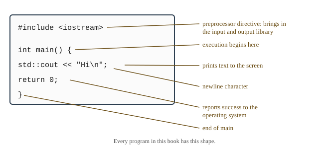

# Chapter 2 — From Source Code to Running Program

## Learning Objectives

When you finish this chapter you will be able to:

- Identify every part of a simple C++ program and explain what each one does. *(SLO 1.2)*
- Describe the four phases of program translation — preprocessing, compilation, assembly, and linking — and name the input and output of each. *(SLO 2.9)*
- Explain the difference between an error and a warning, and read a compiler message to locate a mistake in your source. *(SLO 1.2)*
- Edit, compile, and run a C++ program in the StudySite editor or GitHub Codespaces. *(SLO 1.2)*
- Apply the standard program template and the book's formatting conventions to code you write yourself. *(SLO 2.4)*
- Build and run Grade Calculator v0.1.

---

## 2.1 Anatomy of a Simple C++ Program

Chapter 1 ended with a gap: you think in tasks, the processor executes numeric instruction codes, and something has to bridge the two. This chapter is that bridge. By the end of it you will have written a program, watched four separate tools transform it, and run the result.

Start with the smallest complete C++ program that does something visible.

```cpp
#include <iostream>

int main() {
    std::cout << "Grade Calculator\n";
    return 0;
}
```

Five lines, and each one is worth understanding now, because every program in this book — including the thousand-line version you will finish in Chapter 24 — has this same skeleton underneath it.



**Figure 2.1 — The parts of a simple C++ program.**

*Description of Figure 2.1.* The program is shown with a label pointing to each part. The line `#include <iostream>` is labelled as a preprocessor directive that brings in the input and output library. The line `int main() {` is labelled as the function where execution begins. The line `std::cout << "Hi\n";` is labelled as the statement that prints text, with a separate label identifying `\n` as a newline character. The line `return 0;` is labelled as reporting success to the operating system. The final `}` is labelled as the end of `main`.

### `#include <iostream>`

A line beginning with `#` is a **preprocessor directive** — an instruction to a tool that runs *before* the compiler. `#include` means "insert the contents of this file here."

`iostream` is a **header** from the standard library. It declares the facilities for input and output, including `std::cout`. Without this line, the compiler has never heard of `std::cout` and will say so.

Note the angle brackets. `#include <iostream>` looks for a header the compiler supplies. `#include "gradelib.h"`, which you will write in Chapter 10, looks for a header you supply, starting in your own directory.

### `int main()`

Every C++ program has exactly one function named `main`. It is where execution begins — not the first line of the file, but the first statement inside `main`. The operating system starts your program by calling it.

`int` says that `main` gives back a whole number when it finishes. The empty parentheses say it takes no information in. Chapter 9 covers functions properly; for now, treat `int main()` as the fixed phrase that marks where your program starts.

### The braces

`{` and `}` mark the beginning and end of a **block** — a group of statements treated as a unit. The block after `int main()` is the body of the function: everything the program does.

Braces always come in pairs. A missing one produces a confusing error message pointing at a line far from the actual mistake, which is exactly why the indentation rules in Section 2.8 matter more than they look like they do.

### `std::cout << "Grade Calculator\n";`

This prints. It has four parts worth separating.

**`std::cout`** is the standard output stream — the screen. The `std::` prefix says `cout` comes from the standard library's namespace, `std`. Chapter 23 explains namespaces properly. For now, read `std::` as "the standard library's."

**`<<`** is the insertion operator. It sends what is on its right into the stream on its left. The arrows point in the direction the data flows, which is a useful mnemonic and not a coincidence.

**`"Grade Calculator\n"`** is a **string literal** — text in double quotes. The `\n` inside it is a single character, the **newline**, which moves output to the next line. It looks like two characters in your source and is one character in the output. Without it, the next thing printed would run on directly after `Calculator`.

**`;`** ends the statement. C++ requires a semicolon at the end of each statement, and forgetting one is the single most common mistake beginners make. Section 2.6 shows exactly what the compiler says when you do.

### `return 0;`

This ends `main` and hands the value 0 back to the operating system. By long convention, **0 means success** and any other value means something went wrong. You will rarely need anything but 0 until Chapter 24, where the release build reports a failure to save.

---

## 2.2 The Translation Pipeline

You now have source code. The processor cannot execute a single character of it. Four separate programs run, in order, to fix that.

This is the material for SLO 2.9, and it is worth understanding properly rather than memorizing, because it explains several error messages that are otherwise baffling — particularly the difference between an error the compiler reports and an error the linker reports.


**Figure 2.2 — The four stages of translation.**

*Description of Figure 2.2.* Source code in `main.cpp` enters stage 1, the preprocessor, which carries out `#include` and `#define` and produces a translation unit. The translation unit enters stage 2, the compiler, which checks syntax and types and produces assembly code. The assembly enters stage 3, the assembler, which produces machine code in an object file named `main.o`. The object file, together with already-built library code such as `iostream`, enters stage 4, the linker, which joins them into an executable file named `gradecalc`. Finally the loader copies the executable into memory and runs it. A note records that a single `g++` command performs stages 1 through 4 in order.

### 2.2.1 Preprocessing

The **preprocessor** performs simple text substitution. It handles every line beginning with `#`: `#include` is replaced by the entire contents of the named file, and `#define` substitutes text throughout.

It does not understand C++. It does not check whether your program makes sense. It moves text around.

The result is a single expanded file called a **translation unit**, and its size is genuinely startling. Your five-line program, after preprocessing, becomes:

```text
source lines:        6
after preprocessing: 32,192 lines
```

Over thirty-two thousand lines, nearly all of it the contents of `<iostream>` and everything `<iostream>` itself includes. You can see this yourself — Section 2.5 shows the command.

That number explains something practical. Compiling even a trivial C++ program takes a noticeable moment, because the compiler is not reading your five lines; it is reading thirty-two thousand.

### 2.2.2 Compilation to Assembly

The **compiler** is the stage that does the real work. It reads the translation unit and checks it — is the syntax valid, do the types agree, does every name refer to something that exists? This is where the great majority of your mistakes are caught, and where the error messages in Section 2.6 come from.

If the program passes, the compiler translates it into **assembly language** for your specific processor. Chapter 1 introduced assembly as one mnemonic per machine instruction; here is the beginning of `main` as the compiler wrote it on the machine used to prepare this book:

```text
main:
.LFB1724:
	.cfi_startproc
	stp	x29, x30, [sp, -16]!
```

You are not expected to read this, and you will never write it. Two things about it are worth noticing. Your five readable lines became roughly a hundred lines of assembly — that is the leverage a high-level language gives you. And this assembly is specific to one processor family; the same program compiled on a different kind of machine produces entirely different assembly. That is exactly the portability trade-off Chapter 1 described, now visible.

### 2.2.3 Assembly to Object Code

The **assembler** translates assembly language into actual machine code, producing an **object file** — `main.o` on most systems.

An object file contains real machine instructions, but it is not yet runnable. Your program refers to `std::cout`, which lives somewhere else entirely, and the object file records that reference as an unfilled blank: *"there is something called `std::cout` here, and I do not know where it is."*

### 2.2.4 Linking and Loading

The **linker** fills in those blanks. It gathers your object file together with the already-compiled library code — the real implementation of `std::cout` — and resolves every reference into a concrete address. The result is an **executable file** that can actually run.

This division explains an error message that confuses many beginners. If you misspell `std::cout`, the *compiler* objects, because it can see that no such name exists. But if you correctly declare a function and never write its body, the compiler is satisfied — the declaration promised the function exists — and the *linker* fails instead, saying it cannot find the definition. Same underlying mistake, two entirely different messages, from two different tools. Chapter 10 covers this properly when your program grows past one file.

Finally, when you run the executable, the operating system's **loader** copies it into main memory and directs the processor to its first instruction. That is the moment Chapter 1's diagram comes to life: your program is now data in memory, being fetched and executed.

### The whole pipeline, measured

Here is what each stage produced for the five-line program:

| Stage | Output | Size |
|---|---|---|
| Source you wrote | `main.cpp` | 6 lines |
| After preprocessing | translation unit | 32,192 lines |
| After compiling | assembly | 101 lines |
| After assembling | `main.o` | 2,808 bytes |
| After linking | executable | 9,344 bytes |

**One command runs all four stages.** You will type `g++` once and it will invoke the preprocessor, compiler, assembler, and linker in sequence. It only feels like one step. Knowing there are four is what lets you understand where a message came from when something goes wrong.

---

## 2.3 Development Tools

Four kinds of tool matter to you.

An **editor** is where you write source code. A programmer's editor understands the language: it colors syntax, matches braces, and indents automatically. The StudySite editor and VS Code both do this.

A **compiler** performs the translation just described. This book uses **g++**, the GNU C++ compiler, which is free, available on every platform, and standards-compliant.

A **debugger** lets you pause a running program and inspect it. You will not need one until Chapter 16, which teaches it properly, but it is worth knowing the category exists.

A **build tool** automates compiling projects with many files. You will not need one at all — even the largest version of the Grade Calculator builds with a single command — but Chapter 24 shows what one looks like.

An **IDE**, or integrated development environment, bundles all four into one application. VS Code, which is what GitHub Codespaces runs, is the example you will meet.

---

## 2.4 Setting Up Your Environment

You have two environments available, and both work for every program in this book.

### The StudySite editor

Nothing to install. Open the editor, type your program, and run it. This is the fastest way to work through the Try It Yourself examples and is where most of your reading-and-experimenting will happen.

### GitHub Codespaces

Codespaces gives you a full Linux machine in your browser, running VS Code. It takes a moment to start the first time, and in exchange you get the complete toolchain — including the debugger you will need from Chapter 16 onward, and a real terminal.

To confirm your Codespace is ready, open a terminal and type:

```text
g++ --version
```

You should see a version number. Anything from g++ 9 onward supports everything in this book.

### What this book assumes

Every program here is written to run identically in both environments. That means:

- **Standard library only.** No external libraries to install.
- **No project files or build systems.** One command compiles any program in this book.
- **Plain text input and output.** No graphics, no color codes, no cursor control.
- **C++17.** The compile command below selects it explicitly.

Appendix A gives step-by-step setup for both environments, plus a local VS Code installation if you prefer to work offline.

---

## 2.5 Editing, Compiling, and Running Your First Program

Three steps. Do them now rather than reading about them.

### Step 1 — Edit

Create a file named `main.cpp` and type in the program from Section 2.1. **Type it; do not paste it.** Typing it is how you find out that the compiler cares about the semicolon and the quotation marks, and finding that out deliberately now is much better than discovering it accidentally later.

### Step 2 — Compile

In a terminal, in the directory containing your file:

```text
g++ -std=c++17 -Wall -Wextra main.cpp -o gradecalc
```

Every part of that command matters:

| Part | Meaning |
|---|---|
| `g++` | the compiler |
| `-std=c++17` | use the C++17 standard, which this book targets |
| `-Wall` | report all common warnings |
| `-Wextra` | report additional warnings beyond `-Wall` |
| `main.cpp` | the source file to compile |
| `-o gradecalc` | name the resulting executable `gradecalc` |

**If it worked, nothing is printed.** Silence means success. This surprises people; a compiler that has nothing to complain about says nothing at all.

The two warning flags are not optional in this book. Appendix D Section D.10 states the rule: **your code must compile with no warnings.** A warning is the compiler telling you it understood your program differently than you probably meant, and warnings you ignore become bugs you hunt.

### Step 3 — Run

```text
./gradecalc
```

The `./` says "in the current directory." Your output:

```text
Grade Calculator
```

That is a complete C++ program, translated by four tools and executed by your processor.

### Seeing the stages for yourself

Because the pipeline is real rather than a metaphor, you can stop it at any stage:

| Command | Stops after | Produces |
|---|---|---|
| `g++ -E main.cpp -o main.ii` | preprocessing | the expanded translation unit |
| `g++ -S main.cpp -o main.s` | compiling | assembly code |
| `g++ -c main.cpp -o main.o` | assembling | an object file |
| `g++ main.cpp -o gradecalc` | linking | the executable |

Run the first one and open `main.ii`. Scroll to the bottom and you will find your five lines, sitting under thirty-two thousand lines of standard library. It is worth doing once.

---

## 2.6 Reading Compiler Messages

Compiler messages have a reputation for being cryptic. They are actually quite structured, and learning to read them now will save you more time than any other single skill in this chapter.

Every message has the same shape:

```text
file:line:column: severity: description
```

### Errors and warnings are different

An **error** means the compiler could not produce a program. Nothing was built. You must fix it.

A **warning** means the compiler built your program but noticed something suspicious. The executable exists and will run. In this book you fix warnings anyway, because they are usually right.

### Four real messages

Each of the following is genuine output from g++, produced by a mistake you are likely to make this week.

**A missing semicolon.** Remove the `;` from the end of the `std::cout` line:

```text
e1.cpp: In function 'int main()':
e1.cpp:4:38: error: expected ';' before 'return'
    4 |     std::cout << "Grade Calculator\n"
      |                                      ^
      |                                      ;
    5 |     return 0;
      |     ~~~~~~
```

Read it carefully, because it teaches the most important habit in this section. The message says line 4, and the caret points past the end of line 4 — but it also *shows* you line 5 and mentions `return`. The compiler noticed the problem when it reached `return`, but the mistake is at the end of the previous line.

**When a message points at a line that looks fine, check the line above it.** That one rule resolves a large fraction of the confusing messages you will see.

**A missing `#include`.** Delete the first line:

```text
e2.cpp:2:10: error: 'cout' is not a member of 'std'
    2 |     std::cout << "Grade Calculator\n";
      |          ^~~~
e2.cpp:1:1: note: 'std::cout' is defined in header '<iostream>';
             did you forget to '#include <iostream>'?
```

Modern compilers are genuinely helpful. The `note:` line diagnosed the problem and told you the fix. Always read past the first line of a message.

**A misspelling.** Write `std::cot` instead of `std::cout`:

```text
e3.cpp:4:10: error: 'cot' is not a member of 'std'; did you mean 'oct'?
    4 |     std::cot << "Grade Calculator\n";
      |          ^~~
      |          oct
```

The compiler guessed `oct`, which is wrong — it wanted `cout`. Suggestions are suggestions, not diagnoses. Read them, then decide.

**A warning, not an error.** Declare a variable and never use it:

```text
w1.cpp:4:9: warning: unused variable 'total' [-Wunused-variable]
    4 |     int total = 5;
      |         ^~~~~
```

The program still compiled and the executable was produced. But the compiler is pointing at something real: either you meant to use `total` and forgot, or you do not need it. Both are worth knowing. The bracketed `[-Wunused-variable]` names the specific warning, which is useful when you want to look one up.

### How to work through a screen of errors

**Fix the first error, then recompile.** Do not read the whole list. One mistake — a missing brace especially — can produce dozens of errors, and the later ones are usually nonsense caused by the first. Fixing one line often clears twenty messages.

---

## 2.7 A Template for Simple C++ Programs

Every single-file program in the first eight chapters has this shape:

```cpp
// Program name - brief description of what it does
// Run: click Run in StudySite and use the embedded Terminal.

#include <iostream>

int main() {

    // your statements go here

    return 0;
}
```

Start from this. As you learn more, the parts you add have predictable homes: more `#include` lines join the first, named constants go after the includes, and functions go between the includes and `main` from Chapter 9 onward.

---

## 2.8 Source Formatting and Comments from Day One

The compiler does not care about your formatting. It would accept your entire program on one line. People care, including the version of you that reads this code next month, and Chapter 13 will ask you to bring an entire codebase into conformance with a written standard.

That standard is Appendix D. Four of its rules apply to everything you write from today.

**Indent with four spaces.** Everything inside a pair of braces is indented one level deeper. Never use tab characters — they render at different widths in different editors, so a file that looks correct to you looks broken to everyone else.

**Put the opening brace on the same line** as the statement that introduces it, and the closing brace on its own line, lined up with the start of that statement.

**Use blank lines to separate logical groups.** One blank line, never two.

**Comment why, not what.** A comment restating the code is noise:

```cpp
// Do not write this.
return 0;    // return zero
```

A comment explaining a decision earns its place:

```cpp
// Write this.
// 0 tells the operating system the program succeeded. Chapter 24 returns a
// non-zero value here when the gradebook could not be saved.
return 0;
```

C++ has two comment forms. `//` comments run to the end of the line. `/* */` comments span from `/*` to `*/`, possibly across many lines. This book uses `//` for ordinary comments and reserves `/** */` for the documentation comments introduced in Chapter 9.

Formatting is not decoration. It is how you keep your attention on what a program does instead of on what it looks like, and it is the thing that makes a mismatched brace obvious at a glance instead of invisible.

---

## Common Errors and Warnings

The five you are most likely to hit this week.

| What you see | What it means | Fix |
|---|---|---|
| `error: expected ';' before ...` | A statement is missing its semicolon | Add `;` at the end of the **previous** line |
| `error: 'cout' is not a member of 'std'` | The compiler has not seen `<iostream>` | Add `#include <iostream>` at the top |
| `error: 'X' was not declared in this scope` | A name is misspelled or undeclared | Check spelling and capitalization; C++ is case-sensitive |
| `error: expected '}' at end of input` | A brace is unmatched | Check indentation — a misaligned block reveals the missing brace |
| `warning: unused variable 'x'` | You declared something you never used | Use it, or remove it |

Two habits worth forming immediately:

**Fix the first error, then recompile.** Later errors are frequently caused by earlier ones.

**Read the whole message, including `note:` lines.** The compiler often tells you exactly what to do, one line below where you stopped reading.

---

## Design Notes

**Silence is success.** A compiler that prints nothing has accepted your program. Get comfortable with this; it is the normal case and it is easy to misread as "nothing happened."

**Compile early and often.** Write a few lines, compile, run. Do not write fifty lines before the first compile. When something breaks after three lines, you know where the mistake is. When it breaks after fifty, you have fifty places to look. This habit matters more as programs grow, and it is the reason Chapter 9's refactor is done one function at a time with a recompile after each.

**The build command is part of your program.** Put it in a comment at the top of every file, as the template does. Six months from now you will not remember which flags a program needed, and neither will anyone else.

---

## Grade Calculator v0.1 — Hello, Gradebook

Your first running version.

### What v0.1 does

It prints the application banner and the course name, then exits cleanly. That is all — and it is a complete program, which is the point. Every version from here on will do more, and every version will still compile, run, and finish properly.

### The program

```cpp
// Grade Calculator v0.1 - Chapter 2
// Prints the application banner. Confirms the toolchain works end to end.
// Run: click Run in StudySite and use the embedded Terminal.

#include <iostream>

int main() {
    std::cout << "===================================\n";
    std::cout << "        GRADE CALCULATOR           \n";
    std::cout << "        Version 0.1                \n";
    std::cout << "===================================\n";
    std::cout << "Course: Programming Fundamentals\n";
    return 0;
}
```

### Expected output

```text
===================================
        GRADE CALCULATOR
        Version 0.1
===================================
Course: Programming Fundamentals
```

### What to notice

**Five separate `std::cout` statements, each ending in `\n`.** You could combine them; Chapter 3 shows how. Kept separate, each line of output corresponds to one line of source, which makes the relationship obvious.

**The file header comment records how the program is run.** That is the Appendix D rule from Section 2.8, applied from the first version. In StudySite the toolchain is provided for you, so the header records the **Run** step rather than a local build command.

**Nothing here computes a grade.** v0.1 exists to prove your toolchain works end to end — editor, compiler, executable, output. Everything after this is built on the confidence that when something breaks, it is your program and not your setup.

### Your StudySite Lab — Hello, Gradebook

- **Course:** COSC 1436 — Programming Fundamentals
- **Project checkpoint:** v0.1
- **Starting point:** The Chapter 1 repository containing `README.md` and `requirements.md`.

> **One-repository rule:** Continue in the same COSC 1436 Grade Calculator
> repository through Chapter 12. Do not create a chapter folder or a new
> repository. Each chapter replaces or extends the current working program.

#### Required work

1. Create `main.cpp` with the required C++ program structure: include `<iostream>`, define `int main()`, and return `0`.
2. Print a Grade Calculator banner, `COSC 1436`, and your name.
3. Keep the output plain text and make the program exit normally.


#### Verification

- The program builds without warnings.
- The banner, course, and student name appear exactly once.
- The program reaches a normal exit.

#### StudySite workflow

1. Confirm that your previous chapter is committed on GitHub, then open this
   chapter's **coding panel on the StudySite main stage**.
2. Close stale project tabs from an earlier session before loading. This avoids
   creating files with names such as `_imported` when the same path is already
   open.
3. Click **Load from GitHub**, select **grade-calculator-1436**, and click each source, header,
   or documentation file needed for this chapter. Confirm the editor shows the
   expected file paths before editing.
4. Continue the existing project in StudySite's internal editor. For a
   multi-file program, keep every source and header file needed by the build
   open in the editor.
5. Click **Run**. Read compiler messages and program output in the embedded
   Terminal, and type program input there when prompted.
6. Fix every compiler error and warning, then complete the verification list.
7. Use the Tutor with the current code or Terminal output when you need help.

#### Save this checkpoint

> **IMPORTANT — commit to save your work:** StudySite autosaves editor tabs
> locally on this device, but local autosave is not a durable GitHub backup.
> Your work is not safely saved in your repository until **Save to GitHub**
> finishes a successful **Commit**.

1. Keep every project file that belongs in this checkpoint open in the editor.
   **Save to GitHub includes every open editor file**, so close scratch files
   and accidental `_imported` duplicates first.
2. Click **Save to GitHub**.
3. Select **grade-calculator-1436** and the existing **main** branch.
4. Enter the commit message **Complete Chapter 2 Grade Calculator v0.1**.
5. Click **Commit** and wait for StudySite's confirmation.
6. Open the commit link, or open the repository on GitHub, and confirm the new
   commit and expected files are present before leaving StudySite.

#### Complete when

- The verification list passes.
- **grade-calculator-1436** contains the Chapter 2 checkpoint.
- The GitHub commit is visible; StudySite's local autosave alone is not
  completion.


---

## Try It Yourself

Each of these is a complete program. Type it, build it with the standard command, run it, and compare with the expected output before reading on.

### 1. Multiple lines from one statement

```cpp
#include <iostream>

int main() {
    std::cout << "Line one\nLine two\nLine three\n";
    return 0;
}
```

**Expected output:**

```text
Line one
Line two
Line three
```

*Try:* Remove the middle `\n`. Predict the output before you rebuild, then check.

### 2. What `\n` actually does

```cpp
#include <iostream>

int main() {
    std::cout << "no newline here";
    std::cout << "so this continues the same line\n";
    return 0;
}
```

**Expected output:**

```text
no newline hereso this continues the same line
```

*Try:* Add a space so the words separate properly. There are two places you could put it — does it matter which you choose?

### 3. Chaining insertions

```cpp
#include <iostream>

int main() {
    std::cout << "Grade" << " " << "Calculator" << "\n";
    return 0;
}
```

**Expected output:**

```text
Grade Calculator
```

*Try:* Add `<< "v0.1"` before the `"\n"`. Then rewrite the whole thing as a single string literal and confirm the output is identical.

### 4. The return value

```cpp
#include <iostream>

int main() {
    std::cout << "Finished\n";
    return 0;
}
```

Build and run it, then immediately type:

```text
echo $?
```

**Expected output:** `0`

*Try:* Change `return 0;` to `return 3;`, rebuild, rerun, and check `echo $?` again. This is the value Chapter 24 uses to report that saving failed.

### 5. Predict the errors

Do not build these first. Write down what the compiler will say, then build and compare.

```cpp
#include <iostream>

int main() {
    std::cout << "Missing something\n"
    return 0;
}
```

```cpp
int main() {
    std::cout << "Also missing something\n";
    return 0;
}
```

```cpp
#include <iostream>

int main() {
    std::Cout << "Capitalization matters\n";
    return 0;
}
```

*For the third:* the message will differ from the one in Section 2.6. Why? What is different about this mistake?

### 6. Watch the preprocessor work

Take any program above and run:

```text
g++ -std=c++17 -E main.cpp -o main.ii
```

Open `main.ii`.

- How many lines is it? (`wc -l main.ii`)
- Where in the file is the code you wrote?
- What is all the rest of it?

Then try the same on a program with **no** `#include` line at all. How many lines now? What does that tell you about where the thirty-two thousand lines came from?

---

## Summary

- Every C++ program has one `main` function, where execution begins, and returns 0 to report success.
- `#include` is a **preprocessor directive** that inserts the contents of a header. `<angle brackets>` find library headers; `"quotes"` find your own.
- `std::cout` is the standard output stream. `<<` sends data into it. `\n` is a single newline character. Every statement ends with `;`.
- Translation happens in **four stages**: the **preprocessor** expands directives into a translation unit; the **compiler** checks the program and emits assembly; the **assembler** produces an object file; the **linker** joins object files and libraries into an executable. The **loader** then copies it into memory to run.
- One `g++` command performs all four stages. Knowing they are separate is what lets you tell a compiler error from a linker error.
- Compile with `g++ -std=c++17 -Wall -Wextra main.cpp -o name` and run with `./name`. **Silence means success.**
- An **error** means nothing was built; a **warning** means it built but something looks wrong. Fix both.
- Compiler messages have the form `file:line:column: severity: description`. **When a message points at a line that looks fine, check the line above.** Fix the first error, then recompile.
- Indent four spaces, brace on the same line, comment *why* rather than *what*. Appendix D is the full standard; Chapter 13 will hold you to it.

---

## Key Terms

**assembler** — the tool that translates assembly language into machine code in an object file.

**block** — a group of statements enclosed in braces and treated as a unit.

**build tool** — a program that automates compiling a project of many files.

**comment** — text in source code ignored by the compiler, written for human readers.

**compiler** — the tool that checks a translation unit and translates it into assembly language.

**debugger** — a tool for pausing a running program and inspecting its state.

**editor** — the program in which source code is written.

**error** — a problem that prevents the compiler from producing a program.

**executable** — a file containing machine code that the operating system can run.

**header** — a file, brought in with `#include`, declaring facilities defined elsewhere.

**IDE** — an integrated development environment, bundling editor, compiler, and debugger.

**insertion operator** — `<<`, which sends data into an output stream.

**linker** — the tool that joins object files and library code into an executable.

**loader** — the operating system component that copies an executable into memory and starts it.

**main** — the function where execution of a C++ program begins.

**newline** — the character `\n`, which moves output to the next line.

**object file** — machine code produced from one source file, not yet runnable.

**preprocessor** — the tool that carries out `#include`, `#define`, and other directives before compilation.

**preprocessor directive** — a line beginning with `#`, addressed to the preprocessor.

**standard library** — the collection of facilities every C++ implementation provides.

**statement** — a single instruction, ending in a semicolon.

**std** — the namespace containing the standard library.

**stream** — a destination or source for sequential data, such as `std::cout`.

**string literal** — text enclosed in double quotes.

**translation unit** — the single expanded file the preprocessor produces from one source file.

**warning** — a report of something suspicious that did not prevent compilation.

---

**Next:** Chapter 3 introduces variables and types — how to store a student's name, an assignment name, and a score, and how to choose the right type for each. Grade Calculator v0.2 will read them from you and print them back.
