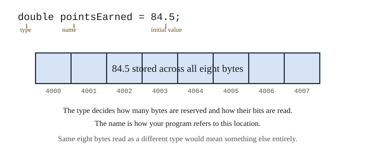

# Chapter 3 — Values, Variables, and Data Types

## Learning Objectives

When you finish this chapter you will be able to:

- Declare and initialize variables of C++'s fundamental types. *(SLO 1.3)*
- Explain what a type determines about a variable, and connect that to the bit patterns of Chapter 1. *(SLO 1.1, 1.3)*
- Choose an appropriate type for a given quantity and justify the choice. *(SLO 1.3)*
- State the range of each integer type and predict what happens when a value exceeds it. *(SLO 1.1)*
- Explain the difference between an integer and a floating-point type, and when each is appropriate. *(SLO 1.1, 1.3)*
- Use `const` to name values that must not change. *(SLO 1.3)*
- Read text and numbers from the user with `std::cin` and `std::getline`. *(SLO 1.3)*
- Build Grade Calculator v0.2.

---

## 3.1 Literal Values

Chapter 2's program printed a fixed piece of text. To calculate anything, a program needs to hold values and work with them.

The simplest values are **literals** — values written directly in your source code:

```cpp
42          // an integer literal
84.5        // a floating-point literal
'A'         // a character literal, in single quotes
"Midterm"   // a string literal, in double quotes
true        // a boolean literal
```

Note the quotation marks carefully, because the difference is real and will bite you. **Single quotes make a character; double quotes make a string.** `'A'` is one character. `"A"` is a string that happens to contain one character. They are different types, they are stored differently, and they are not interchangeable.

Literals alone are not enough. A program that only ever prints `84.5` is not a grade calculator. It needs to hold a value that changes.

---

## 3.2 Variables and Assignment

A **variable** is a named location in memory that holds a value of a particular type.

You bring one into existence with a **declaration**:

```cpp
double pointsEarned = 84.5;
```



**Figure 3.1 — A variable declaration and what it reserves.**

*Description of Figure 3.1.* The declaration `double pointsEarned = 84.5;` is shown with three labels: `double` is the type, `pointsEarned` is the name, and `84.5` is the initial value. Below, eight shaded memory cells at addresses 4000 through 4007 hold the value. Notes explain that the type decides how many bytes are reserved and how their bits are read, that the name is how the program refers to this location, and that the same eight bytes read as a different type would mean something else entirely.

That last note is Chapter 1 Section 1.7 restated. A bit pattern carries no information about its own meaning. **The type is the meaning.** This is why C++ makes you state a type for every variable, and it is the single idea that makes the rest of this chapter cohere.

### Assignment

Once declared, a variable's value can change:

```cpp
double pointsEarned = 84.5;
pointsEarned = 91.0;         // the old value is gone
pointsEarned = pointsEarned + 5.0;   // now 96.0
```

The `=` sign is **assignment**, not mathematical equality. Read it as "gets" or "becomes." The line `pointsEarned = pointsEarned + 5.0;` is nonsense as an equation and perfectly sensible as an instruction: work out the right-hand side, then store the result in the variable on the left.

### Always initialize

A variable declared without a value holds whatever happened to be in that memory:

```cpp
double total;              // no. holds garbage.
double total = 0.0;        // yes.
```

An uninitialized variable produces bugs that behave differently each time you run the program, which makes them among the hardest to find. Appendix D Section D.6 states the rule without exception: **initialize every variable where you declare it.**

---

## 3.3 Identifiers and Naming

An **identifier** is a name you choose. C++ requires that it:

- contain only letters, digits, and underscores
- not begin with a digit
- not be a reserved keyword such as `int`, `return`, or `class`

C++ is **case-sensitive**: `total`, `Total`, and `TOTAL` are three different names. This is the source of a common early error, and you saw the compiler's response to it in Chapter 2.

Beyond the rules, this book follows the conventions in Appendix D Section D.2:

| Kind | Convention | Example |
|---|---|---|
| Variable | `camelCase` | `pointsEarned` |
| Constant | `SCREAMING_SNAKE_CASE` | `A_CUTOFF` |

Choose names that say what the value *means*. `pointsEarned` is better than `pe`, `x`, or `dblPoints`. The compiler already knows the type; the reader needs the meaning.

---

## 3.4 Integer Types

An **integer** type holds a whole number — no fractional part.

The everyday choice is `int`. On the machines this book targets it occupies 4 bytes, which by Chapter 1's rule means 2³² = 4,294,967,296 distinct patterns, split between negative and positive:

```cpp
int assignmentCount = 12;
int studentId = 1001;
```

C++ provides several integer types of different sizes. These are the real measurements from the machine used to prepare this book:

| Type | Bytes | Range |
|---|---|---|
| `short` | 2 | −32,768 to 32,767 |
| `int` | 4 | −2,147,483,648 to 2,147,483,647 |
| `long long` | 8 | about −9.2 × 10¹⁸ to 9.2 × 10¹⁸ |
| `unsigned int` | 4 | 0 to 4,294,967,295 |

You can print these yourself; Try It Yourself example 1 shows how.

Notice that `unsigned int` uses all 32 bits for magnitude, since it gives up negative values. Same number of patterns, different split — exactly the two's complement trade-off from Chapter 1 Section 1.5.

### Overflow

What happens when a value exceeds its type's range? Not an error. Not a warning at runtime. The value **wraps around**:

```cpp
short small = 32767;      // the largest short
++small;                  // add one
```

```text
short at max: 32767
after adding 1: -32768
```

Adding 1 to the largest `short` produces the *smallest* one. This is not a malfunction; it is exactly what two's complement arithmetic does when it runs out of bits, and it is the direct consequence of Chapter 1's counting rule.

The practical defense is simple: **use `int` unless you have a specific reason not to.** Its range is large enough for anything in this book. Reach for `long long` when you genuinely need bigger numbers, and reach for `short` almost never — saving two bytes is not worth the risk.

---

## 3.5 Floating-Point Types

A **floating-point** type holds a number with a fractional part.

```cpp
double pointsEarned = 84.5;
double percentage = 91.25;
```

| Type | Bytes | Approximate decimal digits of precision |
|---|---|---|
| `float` | 4 | 6 |
| `double` | 8 | 15 |

**Use `double`.** The name means "double precision," and its extra range and accuracy cost nothing you will notice. `float` exists for situations where memory is genuinely scarce, which will not arise in this book.

### The precision problem, again

Chapter 1 Section 1.5 warned that many decimal fractions cannot be represented exactly in binary. That warning becomes concrete now that you can write the code:

```cpp
double a = 0.1;
double b = 0.2;
// a + b is 0.30000000000000004, not 0.3
```

This is not a flaw in C++ or in your machine. One-tenth in binary is a repeating fraction, exactly as one-third is a repeating decimal. The stored value is the closest representable one, which is very close and not equal.

Two rules follow, and they are worth adopting now rather than after they cost you an evening:

**Never compare floating-point values with `==`.** Chapter 9 shows the correct technique.

**Use an integer type when the quantity is genuinely whole.** A count of assignments is an `int`. A number of students is an `int`. Points earned is a `double`, because partial credit exists.

---

## 3.6 Characters

A `char` holds a single character, in one byte:

```cpp
char letterGrade = 'A';
char separator = ',';
char newline = '\n';
```

Chapter 1 Section 1.6 explained that characters are stored as numbers under the ASCII convention. In C++ that is not a metaphor — a `char` *is* a small integer, and you can see it:

```cpp
char c = 'A';
std::cout << "'A' as char: " << c
          << "  as int: " << static_cast<int>(c) << "\n";
std::cout << "'A' + 32 as char: " << static_cast<char>(c + 32) << "\n";
```

```text
'A' as char: A  as int: 65
'A' + 32 as char: a
```

There it is: `'A'` is 65, and adding 32 gives `'a'`, because Chapter 1's ASCII table put uppercase and lowercase exactly 32 apart. `static_cast<int>(...)` is a **cast** — an explicit instruction to interpret the value as a different type. The same bits, read differently, which is Section 1.7's lesson made executable.

### Escape sequences

Some characters cannot be typed directly, so they are written with a backslash:

| Sequence | Meaning |
|---|---|
| `\n` | newline |
| `\t` | tab |
| `\\` | a literal backslash |
| `\'` | a single quote |
| `\"` | a double quote |

Each is **one** character, despite taking two keystrokes.

### Text: `std::string`

A `char` holds one character. For text, use `std::string`, which requires including `<string>`:

```cpp
#include <string>

std::string studentName = "Ada Lovelace";
std::string assignmentName = "Midterm Exam";
```

A `std::string` holds as many characters as you need and grows automatically. Chapter 12 covers it properly. For now you need only declare one, assign to it, and print it.

---

## 3.7 Boolean Values

A `bool` holds one of exactly two values, `true` or `false`:

```cpp
bool capAt100 = true;
bool dropLowest = false;
```

Booleans are the foundation of every decision your program makes, and Chapter 6 is built on them. Note that although a `bool` needs only one bit of information, it occupies a whole byte — memory is addressed in bytes, so a byte is the smallest thing that can have an address.

---

## 3.8 Constants

Some values must not change. Mark them `const`:

```cpp
const double A_CUTOFF = 90.0;
const int MAX_STUDENTS = 40;
```

Attempting to assign to a `const` is a compile-time error — the compiler stops you at your desk rather than letting a bug reach a user.

`const` earns its place for two reasons. It **prevents accidental modification**, and more importantly it **names a value**. Compare:

```cpp
if (percentage >= 90.0) { ... }        // 90.0 means what, exactly?
if (percentage >= A_CUTOFF) { ... }    // now it is obvious
```

Appendix D Section D.6 calls unnamed values *magic numbers* and asks you to avoid them. A named constant also means a policy change is one edit rather than a search through the whole program.

---

## 3.9 Enumerated Types

When a value should be one of a small fixed set, an **enumerated type** says so:

```cpp
enum class Category { Exam, Homework, Participation };

Category kind = Category::Exam;
```

This is better than using an `int` where 0 means exam and 1 means homework, because the compiler will reject `Category::Quiz` if you never defined it, whereas it would happily accept the integer 7.

You will use enumerations lightly until Chapter 20, where assignment categories become central. `enum class` is the modern form; older code uses a plain `enum` that is more error-prone.

---

## 3.10 Type Inference with `auto`

If the compiler can work out a type from the initial value, `auto` lets it:

```cpp
auto count = 12;          // int
auto points = 84.5;       // double
auto letter = 'A';        // char
```

`auto` is genuinely useful when a type is long and adds nothing — you will be grateful for it in Chapter 23. It is a poor choice when the explicit type carries meaning a reader needs:

```cpp
auto total = 0;      // is this an int or a double? It is an int, and that
                     // may not be what you meant. Say what you mean.
double total = 0.0;  // no ambiguity
```

Appendix D Section D.6 states the rule: use `auto` where the type is obvious from the right-hand side and the name still carries the meaning. Until Chapter 23, write types out.

---

## 3.11 Choosing the Right Type

This is a design decision, not a lookup. For each quantity, ask what values it can take.

| Quantity | Type | Why |
|---|---|---|
| Points earned | `double` | Partial credit exists — 8.5 out of 10 |
| Points possible | `double` | Same reason |
| Bonus points | `double` | Same reason |
| Number of assignments | `int` | You cannot have 2.5 assignments |
| Student ID | `int` | An identifier, never used in arithmetic |
| Letter grade | `char` | Exactly one character |
| Student name | `std::string` | Text of any length |
| Assignment name | `std::string` | Text of any length |
| Whether to cap at 100 | `bool` | Yes or no |
| The A cutoff | `const double` | A fixed policy value with a name |

Two of these repay a second look.

**Student ID is `int`, not `double`.** IDs are counted and compared, never averaged. Using a floating-point type would invite meaningless operations and expose you to the precision problems of Section 3.5 for no benefit.

**A name cannot be a `char`.** A `char` is one character. `"Ada Lovelace"` is twelve. This sounds obvious and is a real early mistake.

---

## 3.12 Console Input

Chapter 2 covered output. Input is the mirror image, using `std::cin` and the **extraction operator** `>>`:

```cpp
double pointsEarned = 0.0;
std::cout << "Points earned: ";
std::cin >> pointsEarned;
```

The arrows again point in the direction data flows — out of `std::cin`, into the variable.

Always **prompt before reading.** A program that waits silently looks broken.

### Reading text with `std::getline`

`>>` stops at the first whitespace, which makes it useless for names:

```cpp
std::string name;
std::cin >> name;      // "Ada Lovelace" gives you just "Ada"
```

For a whole line, use `std::getline`:

```cpp
std::string name;
std::getline(std::cin, name);   // gets "Ada Lovelace"
```

### Mixing `>>` and `getline`

Here is a trap that catches nearly everyone, and it is worth meeting deliberately.

When you type `42` and press Enter, two things go into the input buffer: the characters `42` and a newline. `>>` reads the number and **leaves the newline behind**. The next `getline` then finds that leftover newline, concludes the line is over, and hands you an empty string — without waiting for you to type anything.

```cpp
int count = 0;
std::cin >> count;              // reads 42, leaves "\n" behind

std::string name;
std::getline(std::cin, name);   // finds "\n" immediately, returns ""
```

The fix is to discard the leftover newline:

```cpp
#include <limits>

std::cin >> count;
std::cin.ignore(std::numeric_limits<std::streamsize>::max(), '\n');
std::getline(std::cin, name);   // now works
```

That line says: discard characters until you have consumed a newline. It looks like an incantation, and for now you may treat it as one — but the reason is exactly as described, and knowing the reason means you will recognize the symptom when it appears in your own code.

**The symptom to remember: a `getline` that returns an empty string without waiting for input means a stray newline was left behind by an earlier `>>`.**

---

## Common Errors and Warnings

| What you see or observe | Cause | Fix |
|---|---|---|
| `error: 'x' was not declared in this scope` | Used before declaring, or misspelled | Declare it first; check capitalization |
| `error: expected ';'` | Missing semicolon | Add `;` to the **previous** line |
| `error: assignment of read-only variable 'X'` | Assigned to a `const` | Remove `const`, or do not assign |
| `warning: unused variable 'x'` | Declared but never used | Use it or remove it |
| A `getline` returns nothing and does not wait | Leftover newline from an earlier `>>` | Add `std::cin.ignore(...)` — Section 3.12 |
| `7 / 2` gives `3`, not `3.5` | Both operands are `int`, so this is integer division | Make one a `double`; Chapter 4 covers this fully |
| A large value becomes negative | Integer overflow | Use a wider type, or check the range |
| Two equal-looking `double`s compare unequal | Floating-point imprecision | Never use `==` on floating-point values |

---

## Design Notes

**Justify your types.** For each variable in the Grade Calculator, you should be able to say in one sentence why it has the type it has. Section 3.11 is the model. This is a habit worth forming while programs are small.

**Name constants immediately.** The moment you write a number with meaning, give it a name. It costs one line and saves you from a program full of unexplained values.

**Declare where you initialize.** Do not declare a block of variables at the top of `main` and fill them in later. A variable that exists for twenty lines before it means anything is twenty lines of opportunity to misuse it.

---

## Grade Calculator v0.2 — Naming and Storing an Assignment

### What v0.2 does

Prompts for a student name, an assignment name, points earned, and points possible, then prints them back in a formatted summary. No calculation yet — Chapter 4 adds that.

### The program

```cpp
// Grade Calculator v0.2 - Chapter 3
// Reads one named assignment and echoes a formatted summary.
// New this version: typed variables, std::getline for names.
// Run: click Run in StudySite and use the embedded Terminal.

#include <iostream>
#include <string>

int main() {
    std::cout << "=== GRADE CALCULATOR v0.2 ===\n\n";

    // Names may contain spaces, so getline is required here.
    std::string studentName;
    std::cout << "Student name: ";
    std::getline(std::cin, studentName);

    std::string assignmentName;
    std::cout << "Assignment name: ";
    std::getline(std::cin, assignmentName);

    // Points are double, not int: partial credit such as 8.5 is common.
    double pointsEarned = 0.0;
    std::cout << "Points earned: ";
    std::cin >> pointsEarned;

    double pointsPossible = 0.0;
    std::cout << "Points possible: ";
    std::cin >> pointsPossible;

    std::cout << "\n--- Summary ---\n";
    std::cout << "Student:    " << studentName << "\n";
    std::cout << "Assignment: " << assignmentName << "\n";
    std::cout << "Score:      " << pointsEarned << " / " << pointsPossible << "\n";
    return 0;
}
```

### Expected output

With input `Ada Lovelace`, `Midterm Exam`, `84`, `100`:

```text
=== GRADE CALCULATOR v0.2 ===

Student name: Assignment name: Points earned: Points possible: 
--- Summary ---
Student:    Ada Lovelace
Assignment: Midterm Exam
Score:      84 / 100
```

### What to notice

**Both `getline` calls come before both `>>` calls.** That ordering is deliberate. Reading the two names first, then the two numbers, means no `getline` ever follows a `>>` — so v0.2 sidesteps the trap in Section 3.12 by design rather than by patching it. Chapter 7 adds a loop that forces the two to interleave, and that is where `std::cin.ignore` appears in the project for real.

**Every type is justified in a comment.** Appendix D Section D.3 asks comments to explain *why*, and "points are `double` because partial credit exists" is exactly that.

**No calculation yet.** v0.2 reads and echoes. It is a complete program that does a small thing correctly, which is the pattern for every version in this book.

### Your StudySite Lab — Store an Assignment

- **Course:** COSC 1436 — Programming Fundamentals
- **Project checkpoint:** v0.2
- **Starting point:** The working Chapter 2 `main.cpp`.

> **One-repository rule:** Continue in the same COSC 1436 Grade Calculator
> repository through Chapter 12. Do not create a chapter folder or a new
> repository. Each chapter replaces or extends the current working program.

#### Required work

1. Prompt for a student name and assignment name using `std::string` and `std::getline`.
2. Prompt for points earned and points possible using `double` variables.
3. Add a `double` bonus-points variable and a `const double` A cutoff of `90.0`.
4. Print a labeled summary containing every value. Do not calculate the percentage yet.


#### Verification

- Names containing spaces are read completely.
- Decimal point values are accepted.
- The summary echoes all entered data and the A cutoff.

#### StudySite workflow

1. Confirm that your previous chapter is committed on GitHub, then open this
   chapter's **coding panel on the StudySite main stage**.
2. Close stale project tabs from an earlier session before loading. This
   avoids creating files with names such as `_imported` when the same path
   is already open.
3. Click **Load from GitHub**, select
   **COSC1436F26-Grade-Calculator-YourLastName**, and click each source,
   header, or documentation file needed for this chapter. Confirm the editor
   shows the expected file paths before editing.
4. Continue the existing project in StudySite's internal editor. For a
   multi-file program, keep every source and header file needed by the build
   open in the editor.
5. Click **Run**. Read compiler messages and program output in the embedded
   Terminal, and type program input there when prompted.
6. Fix every compiler error and warning, then complete the verification
   list.
7. Use the Tutor with the current code or Terminal output when you need
   help.

#### Save this checkpoint

> **IMPORTANT — commit to save your work:** StudySite autosaves editor tabs
> locally on this device, but local autosave is not a durable GitHub backup.
> Your work is not safely saved in your repository until **Save to GitHub**
> finishes a successful **Commit**.

1. Keep every project file that belongs in this checkpoint open in the
   editor. **Save to GitHub includes every open editor file**, so close
   scratch files and accidental `_imported` duplicates first.
2. Click **Save to GitHub**.
3. Select **COSC1436F26-Grade-Calculator-YourLastName** and the existing
   **main** branch.
4. Enter the commit message **Complete Chapter 3 Grade Calculator v0.2**.
5. Click **Commit** and wait for StudySite's confirmation.
6. Open the commit link, or open the repository on GitHub, and confirm the
   new commit and expected files are present before leaving StudySite.

#### Complete when

- The verification list passes.
- **COSC1436F26-Grade-Calculator-YourLastName** contains the Chapter 3
  checkpoint.
- The GitHub commit is visible; StudySite's local autosave alone is not
  completion.

---

## Try It Yourself

### 1. Discover your machine's types

```cpp
#include <iostream>
#include <limits>

int main() {
    std::cout << "int    " << sizeof(int) << " bytes  "
              << std::numeric_limits<int>::min() << " to "
              << std::numeric_limits<int>::max() << "\n";
    std::cout << "double " << sizeof(double) << " bytes  ~"
              << std::numeric_limits<double>::digits10 << " digits\n";
    std::cout << "char   " << sizeof(char) << " byte\n";
    std::cout << "bool   " << sizeof(bool) << " byte\n";
    return 0;
}
```

**Expected output:**

```text
int    4 bytes  -2147483648 to 2147483647
double 8 bytes  ~15 digits
char   1 byte
bool   1 byte
```

*Try:* Add `short` and `long long`. Confirm that `int`'s range matches 2³² split between negative and positive, as Chapter 1 predicted.

### 2. Watch an integer overflow

```cpp
#include <iostream>

int main() {
    short small = 32767;
    std::cout << "short at max:   " << small << "\n";
    ++small;
    std::cout << "after adding 1: " << small << "\n";
    return 0;
}
```

**Expected output:**

```text
short at max:   32767
after adding 1: -32768
```

*Try:* Predict what happens if you start at `-32768` and subtract 1. Then check.

### 3. Characters are numbers

```cpp
#include <iostream>

int main() {
    char c = 'A';
    std::cout << "'A' as char: " << c
              << "  as int: " << static_cast<int>(c) << "\n";
    std::cout << "'A' + 32 as char: " << static_cast<char>(c + 32) << "\n";
    return 0;
}
```

**Expected output:**

```text
'A' as char: A  as int: 65
'A' + 32 as char: a
```

*Try:* Print `'Z'` as an int. Convert `'m'` to uppercase using the same 32 difference — do you add or subtract?

### 4. Integer division surprises

```cpp
#include <iostream>

int main() {
    int a = 7;
    int b = 2;
    std::cout << "7 / 2 as int:  " << a / b << "\n";
    std::cout << "7 % 2 as int:  " << a % b << "\n";
    std::cout << "7.0 / 2 mixed: " << 7.0 / b << "\n";
    return 0;
}
```

**Expected output:**

```text
7 / 2 as int:  3
7 % 2 as int:  1
7.0 / 2 mixed: 3.5
```

*Try:* Predict `9 / 4`, `9 % 4`, and `9.0 / 4` before running them. This is the bug you will deliberately create in Chapter 4.

### 5. The getline trap

```cpp
#include <iostream>
#include <string>

int main() {
    int count = 0;
    std::cout << "How many assignments? ";
    std::cin >> count;

    std::string name;
    std::cout << "Your name: ";
    std::getline(std::cin, name);

    std::cout << "count=" << count << " name=[" << name << "]\n";
    return 0;
}
```

Run it and type `3`, then try to type your name.

**What happens:** the program never waits for your name, and prints `name=[]`.

*Try:* Add `#include <limits>` and insert this line after the `>>`:

```cpp
std::cin.ignore(std::numeric_limits<std::streamsize>::max(), '\n');
```

Rebuild and confirm it now waits.

### 6. Reason about types

For each, name a type and give one sentence of justification:

- The number of students in a class
- A student's grade point average
- Whether a student has submitted an assignment
- A course code such as `CS101`
- The letter grade for one assignment
- The maximum number of assignments a course may have, fixed at 20

### 7. Predict the errors

Do not build these first. Write down what the compiler will say.

```cpp
#include <iostream>

int main() {
    const double A_CUTOFF = 90.0;
    A_CUTOFF = 93.0;
    std::cout << A_CUTOFF << "\n";
    return 0;
}
```

```cpp
#include <iostream>

int main() {
    char name = "Ada Lovelace";
    std::cout << name << "\n";
    return 0;
}
```

---

## Summary

- A **literal** is a value written directly in source. Single quotes make a `char`; double quotes make a string.
- A **variable** is a named memory location holding a value of a stated type. **The type is the meaning** — it decides how many bytes are reserved and how their bits are interpreted.
- `=` is **assignment**, not equality. Read it as "gets."
- **Always initialize where you declare.** Uninitialized variables hold garbage and produce bugs that differ every run.
- Identifiers are case-sensitive. Use `camelCase` for variables, `SCREAMING_SNAKE_CASE` for constants.
- **Use `int` for whole numbers** and `double` for values with fractional parts. Exceeding an integer's range causes **overflow**, which wraps around silently.
- Floating-point values are **approximations**. Never compare them with `==`.
- A `char` is one character and *is* a small integer — `'A'` is 65.
- `std::string` holds text of any length. A name cannot be a `char`.
- `const` names a value and prevents modification. Name your magic numbers.
- `std::cin >>` reads a value and stops at whitespace. `std::getline` reads a whole line. **Mixing them leaves a stray newline**, which makes the next `getline` return nothing — clear it with `std::cin.ignore`.

---

## Key Terms

**assignment** — storing a new value in an existing variable, written with `=`.

**bool** — a type holding exactly `true` or `false`.

**cast** — an explicit conversion of a value to another type, written `static_cast<Type>(value)`.

**char** — a type holding one character in one byte; also a small integer.

**const** — a qualifier marking a variable as unmodifiable.

**declaration** — a statement bringing a variable into existence with a name and type.

**double** — the standard floating-point type, 8 bytes, about 15 digits of precision.

**enumerated type** — a type whose values are a small fixed named set.

**escape sequence** — a backslash followed by a character, representing one character that cannot be typed directly.

**extraction operator** — `>>`, which reads a value from an input stream.

**float** — a smaller floating-point type, 4 bytes, about 6 digits of precision.

**getline** — a function reading an entire line of text, including spaces.

**identifier** — a programmer-chosen name.

**initialization** — giving a variable a value at the moment it is declared.

**int** — the standard integer type, 4 bytes.

**literal** — a value written directly in source code.

**magic number** — an unexplained numeric value in code; avoid by naming it.

**overflow** — what happens when a value exceeds its type's range; the value wraps around.

**std::cin** — the standard input stream, normally the keyboard.

**std::string** — a type holding text of any length.

**type** — the property of a variable determining what values it can hold, how many bytes it occupies, and how its bits are interpreted.

**unsigned** — an integer type with no negative values, using all its bits for magnitude.

**variable** — a named memory location holding a value of a particular type.

---

**Next:** Chapter 4 puts these values to work. You will calculate a percentage, meet the difference between integer and floating-point division the hard way, add bonus points, and decide what your calculator should do when a bonus pushes a score past 100. Grade Calculator v0.3.
