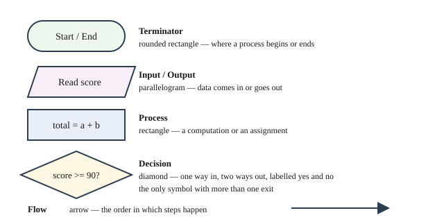
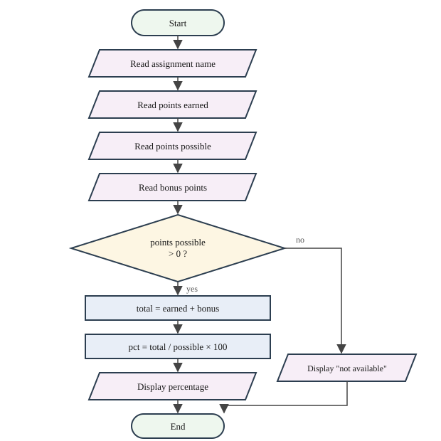
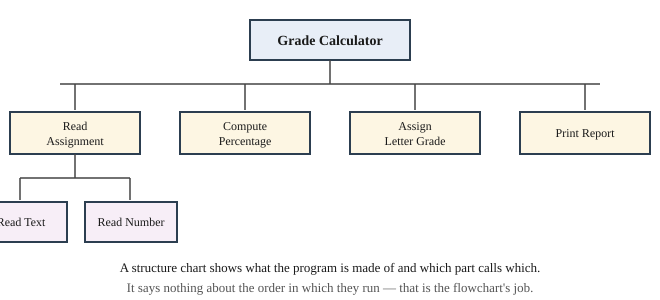

# Chapter 5 — Algorithmic Design and Program Documentation

## Learning Objectives

When you finish this chapter you will be able to:

- Define an algorithm and state the properties every algorithm must have. *(SLO 1.3)*
- Turn a requirements statement into a written specification. *(SLO 1.5)*
- Write pseudocode for a process before writing any code. *(SLO 1.4)*
- Draw a flowchart using the standard symbols, and read one written by someone else. *(SLO 1.4)*
- Draw a structure chart decomposing a program into parts. *(SLO 1.4)*
- Desk-check an algorithm with a trace table. *(SLO 1.4, 1.6)*
- Explain the three structures of structured programming. *(SLO 1.3, 1.4)*
- Apply basic user interface design to a console program. *(SLO 1.3)*
- Produce the design document you will carry, and revise, for the rest of both courses. *(SLO 1.5, 1.6)*
- Build Grade Calculator v0.4.

---

## 5.1 What Makes an Algorithm

You have written three programs by thinking about the code. That works while a program fits on one screen. It stops working shortly after.

This chapter is a deliberate pause. No new C++ appears in it. Instead you will learn to design a program before writing it — and produce a design document for the Grade Calculator that you will revise in Chapter 13, build against in Chapter 20, and formally reconcile in Chapter 24.

An **algorithm** is a finite sequence of unambiguous steps that solves a problem. Four properties are required:

**Finite.** It must end. A procedure that never finishes is not an algorithm, however sensible each step looks.

**Unambiguous.** Every step must have exactly one interpretation. "Adjust the grade appropriately" is not a step. "Add the bonus points to the points earned" is.

**Effective.** Each step must be something the machine can actually do.

**Correct.** It must produce the right answer for every valid input — not just the one you tried.

That last one is where most of the work lives. A recipe that works for 84 out of 100 and fails for 0 out of 0 is not correct, and you already met that exact case in Chapter 4.

### Why design before coding

There is a temptation to skip this chapter and keep typing. Three arguments against it.

**Mistakes are cheapest when they are found earliest.** Fixing a design flaw on paper takes a minute. Fixing it after two hundred lines of code takes an afternoon.

**Design forces the questions code lets you avoid.** What should happen when points possible is zero? What if the user types a letter where a number belongs? Code lets you postpone those. A specification does not.

**You cannot build what you have not described.** By Chapter 24 the Grade Calculator has multiple grading schemes, custom scales, file storage, and error handling. Nobody holds that in their head. It gets built because it was written down.

---

## 5.2 From Requirements to Specification

In Chapter 1 you wrote a **requirements statement** — plain sentences describing what the calculator must do, including the scope boundary that deferred weighted grading.

A **specification** is the next step: precise enough to build from and to test against. The difference is checkability.

| Requirement | Specification |
|---|---|
| "Report the grade" | "Report the percentage to one decimal place, followed by a single letter grade" |
| "Handle bonus points" | "Add bonus points to points earned; do not add them to points possible" |
| "Deal with bad input" | "If points possible is zero, display 'not available' and no percentage" |

Every specification line answers a question a builder would otherwise have to guess.

### A specification for Grade Calculator v0.4

**Purpose.** Compute and report a points-based grade for a single assignment.

**Inputs.**

| Input | Type | Constraint |
|---|---|---|
| Student name | text | may contain spaces; may not be empty |
| Assignment name | text | may contain spaces; may not be empty |
| Points earned | number | zero or greater |
| Points possible | number | zero or greater |
| Bonus points | number | zero or greater; zero means none |

**Processing.**

1. Total earned = points earned + bonus points.
2. If points possible is greater than zero, percentage = total earned ÷ points possible × 100.
3. If points possible is zero, no percentage exists.

**Outputs.** A report showing student name, assignment name, points earned, bonus points, total earned, points possible, and either the percentage to one decimal place or an explanation of why none is available.

**Out of scope.** Weighted-category grading. Letter grades (Chapter 6). Multiple assignments (Chapter 7). Multiple students (Chapter 11).

Notice that the out-of-scope section names *when* each deferred item arrives. That turns a list of absences into a plan.

---

## 5.3 Writing Pseudocode

**Pseudocode** describes an algorithm in structured English. It has no official syntax, which is the point — it lets you think about the process without fighting a compiler.

```text
BEGIN
    DISPLAY "Student name: "
    READ studentName
    DISPLAY "Assignment name: "
    READ assignmentName
    DISPLAY "Points earned: "
    READ pointsEarned
    DISPLAY "Points possible: "
    READ pointsPossible
    DISPLAY "Bonus points: "
    READ bonusPoints

    SET totalEarned = pointsEarned + bonusPoints

    IF pointsPossible > 0 THEN
        SET percentage = totalEarned / pointsPossible * 100
        DISPLAY report WITH percentage
    ELSE
        DISPLAY report WITH "percentage not available"
    END IF
END
```

Conventions this book uses, for consistency rather than because any authority requires them:

| Word | Meaning |
|---|---|
| `READ` | get a value from the user |
| `DISPLAY` | show something to the user |
| `SET` | store a value in a variable |
| `IF … THEN … ELSE … END IF` | choose between paths |
| `WHILE … END WHILE` | repeat while a condition holds |
| `FOR EACH … END FOR` | repeat over a collection |

Two rules make pseudocode worth writing.

**Indent to show structure.** Everything inside an `IF` is indented. This is the same discipline as Appendix D's four-space rule, and for the same reason.

**Describe the process, not the language.** Write `SET percentage = total / possible * 100`, not `double percentage = total / possible * 100.0;`. The moment pseudocode becomes C++ with the semicolons removed, it stops helping you think and starts being a slower way to write code.

---

## 5.4 Flowcharting

A **flowchart** shows an algorithm as a diagram. Where pseudocode is easier to write, a flowchart is easier to *see* — branches and loops become visible shapes rather than indentation you have to track.

### The symbols



**Figure 5.1 — The five flowchart symbols used in this book.**

*Description of Figure 5.1.* Five symbols are shown with names and meanings. A **rounded rectangle** is a *terminator*, marking where a process begins or ends. A **parallelogram** is *input or output*, where data comes in or goes out. A **rectangle** is a *process*, a computation or an assignment. A **diamond** is a *decision*, with one way in and two ways out labelled yes and no — the only symbol with more than one exit. An **arrow** shows *flow*, the order in which steps happen.

Four rules govern their use:

1. Every flowchart has exactly one **Start** and at least one **End**.
2. Every symbol except Start has at least one arrow in; every symbol except End has at least one arrow out.
3. A decision diamond has exactly **two** exits, and both are labelled.
4. Arrows never trail off. Every path reaches an End.

Rule 4 catches real design errors. A path that leads nowhere on paper is a program that hangs or crashes in practice.

### A complete flowchart



**Figure 5.2 — Flowchart for computing one assignment grade.**

*Description of Figure 5.2.* Execution begins at **Start**. Four input steps follow in sequence: read the assignment name, read points earned, read points possible, and read bonus points. A **decision** then asks whether points possible is greater than zero.

If **no**, flow moves right to an output step displaying "not available", then down and left to **End**.

If **yes**, flow continues down through two process steps — `total = earned + bonus`, then `pct = total / possible × 100` — to an output step displaying the percentage, and then to **End**.

Both paths reach End, satisfying rule 4. Compare this with the pseudocode in Section 5.3: they describe the same algorithm, and the branch that is two indented blocks in pseudocode is two visible paths here.

---

## 5.5 Structure Charts and Top-Down Decomposition

A flowchart shows *order*. A **structure chart** shows *composition* — what a program is made of, and which part uses which.



**Figure 5.3 — Structure chart for the Grade Calculator.**

*Description of Figure 5.3.* At the top is **Grade Calculator**. Below it are four parts: **Read Assignment**, **Compute Percentage**, **Assign Letter Grade**, and **Print Report**. Below Read Assignment are two further parts: **Read Text** and **Read Number**. The chart shows what the program is made of and which part calls which. It says nothing about the order in which they run — that is the flowchart's job.

### Top-down decomposition

A structure chart is built by **top-down decomposition**: start with the whole problem, break it into parts, and break those parts down until each is small enough to write directly.

Ask of each box: *can I describe what this does in one sentence, without using the word "and"?* If yes, it is small enough. If you need "and", it is really two boxes.

"Read an assignment and compute its percentage" is two boxes. "Read an assignment" is one.

This chart is not decoration. In Chapter 9 you will convert each box into a C++ function, and the functions you write there — `readAssignment`, `computePercentage`, `assignLetterGrade`, `printReport` — are exactly these boxes. Designing the structure now means Chapter 9's rebuild is transcription rather than invention.

---

## 5.6 Desk Checking and Trace Tables

Before writing code, you can test a design by hand. A **desk check** means walking through your algorithm with specific values and recording what happens at each step, in a **trace table**.

Trace the Section 5.3 pseudocode with points earned 84, points possible 100, bonus 5:

| Step | pointsEarned | pointsPossible | bonusPoints | totalEarned | percentage | Output |
|---|---|---|---|---|---|---|
| Read inputs | 84 | 100 | 5 | — | — | prompts |
| SET totalEarned | 84 | 100 | 5 | 89 | — | — |
| IF 100 > 0 | 84 | 100 | 5 | 89 | — | true, take yes |
| SET percentage | 84 | 100 | 5 | 89 | 89.0 | — |
| DISPLAY | 84 | 100 | 5 | 89 | 89.0 | `Percentage: 89.0%` |

Now trace the case that broke Chapter 4 — points possible 0:

| Step | pointsEarned | pointsPossible | bonusPoints | totalEarned | percentage | Output |
|---|---|---|---|---|---|---|
| Read inputs | 0 | 0 | 0 | — | — | prompts |
| SET totalEarned | 0 | 0 | 0 | 0 | — | — |
| IF 0 > 0 | 0 | 0 | 0 | 0 | — | false, take no |
| DISPLAY | 0 | 0 | 0 | 0 | never set | `not available` |

The second trace confirms the design never divides by zero. **Always desk-check the boundary cases**, not just the ordinary one — zero, the largest value, the empty input, exactly the cutoff. Chapter 16 turns this instinct into systematic testing, and Chapter 6 will show you that "exactly the cutoff" is where letter grades go wrong.

---

## 5.7 Structured Programming

**Structured programming** is the discipline of building programs from exactly three control structures. Every algorithm can be expressed with them, which is a genuine mathematical result and not a style preference.

**Sequence** — steps in order, one after another.

```text
SET totalEarned = pointsEarned + bonusPoints
SET percentage = totalEarned / pointsPossible * 100
```

**Selection** — choosing between paths based on a condition. The diamond in a flowchart. Chapter 6.

```text
IF pointsPossible > 0 THEN
    ...
ELSE
    ...
END IF
```

**Repetition** — doing something more than once. Chapter 7.

```text
WHILE more assignments remain
    ...
END WHILE
```

Everything you write in Course I is these three, nested inside one another. That is why Chapters 6 and 7 cover selection and repetition and then Course I is essentially complete as a language matter — the remaining chapters organize what you can already express.

The historical significance is worth a sentence. Early languages relied on `goto`, which could jump anywhere and produced programs no one could follow. Structured programming's claim was that three structures suffice, and that constraining yourself to them makes programs readable and checkable. Appendix D Section D.11 excludes `goto` for exactly this reason.

---

## 5.8 User Interface Design for Console Programs

Your program's entire interface is text. That is a narrow channel, and narrow channels reward care.

### Prompts

A prompt should say what is wanted, and any restriction on it:

```text
Points possible: 
Points possible (must be greater than 0): 
```

The second tells the user the rule *before* they break it. Prompts should end with a space so typed input does not touch the text.

### Reports

Aligned columns are scannable; ragged ones are not:

```text
Student         Ada Lovelace
Assignment      Midterm Exam
Points earned   84.0
Bonus points    5.0
Total earned    89.0
Points possible 100.0
Percentage      89.0%
```

Group related values, label everything, and use consistent decimal places. `std::setw` from Chapter 4 does the alignment.

### Messages when something is missing

Do not print a misleading value. Explain:

```text
Percentage      not available
  An assignment worth 0 points has no percentage,
  because a score cannot be divided by zero.
```

A user who sees `0.0%` concludes the student scored zero. A user who sees this understands what happened. This principle scales all the way to Chapter 24's exception messages.

### Accessibility in text interfaces

Your output may be read by a screen reader, so:

**Do not use layout alone to carry meaning.** Label every value. A number in a column with no label means nothing when read aloud.

**Do not use color or symbols as the only signal.** No ANSI color codes — Appendix D Section D.10 forbids them anyway for portability, and the same rule serves accessibility.

**Keep output linear.** Text is read top to bottom. Do not build anything that depends on visual scanning.

**Use ordinary words in messages.** "Points possible must be greater than zero" beats "invalid input: err 3".

---

## 5.9 Documenting Your Design

Your design document has five parts. You will revise it repeatedly; keep it in a file beside your code.

| Part | Contents |
|---|---|
| Requirements statement | Plain sentences: what it must do, from Chapter 1 |
| Specification | Precise inputs, processing, outputs, constraints |
| Pseudocode | The algorithm in structured English |
| Flowchart | The algorithm as a diagram |
| Structure chart | What the program is made of |

**Date every revision and say what changed.** By Chapter 24 this document will have a history, and that history is the evidence for SLO 2.1.

---

## Common Design Errors

| Error | Why it matters | How to catch it |
|---|---|---|
| An ambiguous step | Two builders produce two programs | Read each step aloud — could it mean two things? |
| A path that reaches no End | The program hangs or crashes | Trace every arrow to an End |
| A decision with an unlabelled exit | Nobody knows which way is which | Label both exits, always |
| No boundary cases considered | Fails on zero, empty, or exactly-at-cutoff | Desk-check at least three cases |
| Pseudocode written in C++ | You are coding, not designing | Remove all syntax; describe the process |
| A structure chart box needing "and" | The box is really two boxes | Split it |
| A specification that cannot be checked | You cannot tell whether you succeeded | Rewrite until each line is testable |

---

## Design Notes

**Design is not a phase you finish.** You will revise this document in Chapter 13, extend it in Chapter 20, and reconcile it in Chapter 24. A design that never changes usually means nobody consulted it.

**Record what you decided not to do.** The out-of-scope section is what makes weighted grading a scope decision rather than an oversight — a distinction Chapter 13 will make you defend.

**Test the design before the code.** A desk check costs minutes. Finding the same flaw after implementation costs an afternoon.

---

## Grade Calculator v0.4 — Designed Interface

This chapter produces two deliverables. One is documents. The other is a running program, because every chapter ships one.

### Deliverable 1 — the design document

Produce all five parts from Section 5.9 for the full points-based Grade Calculator you will build across Course I. Use the specification in Section 5.2 as your model and extend it to cover:

- a user-defined letter grade scale (arriving in Chapter 11)
- multiple assignments per student (Chapter 7)
- multiple students (Chapter 11)

Your out-of-scope section must still contain the weighted-grading paragraph from Chapter 1, unchanged. You will not resolve it until Chapter 21.

### Deliverable 2 — the program

v0.4 computes exactly what v0.3 did. What changes is the interface, applying Section 5.8 to the parts you can already control.

```cpp
// Grade Calculator v0.4 - Chapter 5
// Same computation as v0.3, redesigned interface.
// New this version: prompts state units and ranges, aligned report columns,
// a plain-language message when points possible is zero.
// Run: click Run in StudySite and use the embedded Terminal.

#include <iostream>
#include <iomanip>
#include <string>

int main() {
    std::cout << "=====================================\n";
    std::cout << "  GRADE CALCULATOR  v0.4\n";
    std::cout << "  Points-based grading\n";
    std::cout << "=====================================\n\n";
    std::cout << "Enter the assignment details below.\n\n";

    std::string studentName;
    std::cout << "Student name                : ";
    std::getline(std::cin, studentName);

    std::string assignmentName;
    std::cout << "Assignment name             : ";
    std::getline(std::cin, assignmentName);

    double pointsEarned = 0.0;
    std::cout << "Points earned (e.g. 42.5)   : ";
    std::cin >> pointsEarned;

    double pointsPossible = 0.0;
    std::cout << "Points possible (must be >0): ";
    std::cin >> pointsPossible;

    double bonusPoints = 0.0;
    std::cout << "Bonus points (0 for none)   : ";
    std::cin >> bonusPoints;

    double totalEarned = pointsEarned + bonusPoints;

    std::cout << "\n-------------------------------------\n";
    std::cout << "  GRADE REPORT\n";
    std::cout << "-------------------------------------\n";
    std::cout << std::left << std::setw(16) << "Student"    << studentName << "\n";
    std::cout << std::left << std::setw(16) << "Assignment" << assignmentName << "\n";
    std::cout << std::left << std::setw(16) << "Points earned"
              << std::fixed << std::setprecision(1) << pointsEarned << "\n";
    std::cout << std::left << std::setw(16) << "Bonus points" << bonusPoints << "\n";
    std::cout << std::left << std::setw(16) << "Total earned" << totalEarned << "\n";
    std::cout << std::left << std::setw(16) << "Points possible" << pointsPossible << "\n";
    std::cout << "-------------------------------------\n";

    // A zero denominator is explained, not silently reported as 0%.
    if (pointsPossible > 0.0) {
        double percentage = totalEarned / pointsPossible * 100.0;
        std::cout << std::left << std::setw(16) << "Percentage"
                  << percentage << "%\n";
    } else {
        std::cout << "Percentage      not available\n";
        std::cout << "  An assignment worth 0 points has no percentage,\n";
        std::cout << "  because a score cannot be divided by zero.\n";
    }
    std::cout << "-------------------------------------\n";
    return 0;
}
```

### Expected output

With input `Ada Lovelace`, `Midterm Exam`, `84`, `100`, `5`:

```text
-------------------------------------
  GRADE REPORT
-------------------------------------
Student         Ada Lovelace
Assignment      Midterm Exam
Points earned   84.0
Bonus points    5.0
Total earned    89.0
Points possible 100.0
-------------------------------------
Percentage      89.0%
-------------------------------------
```

With points possible `0`:

```text
-------------------------------------
Percentage      not available
  An assignment worth 0 points has no percentage,
  because a score cannot be divided by zero.
-------------------------------------
```

### What to notice

**Each prompt states its rule.** `(must be >0)` and `(0 for none)` tell the user the constraint before they violate it.

**Every value is labelled.** `std::setw(16)` with `std::left` aligns the labels; the label is what makes the report readable aloud as well as on screen.

**The zero case is explained in sentences.** Compare with printing `0.0%`, which is not merely unhelpful but actively misleading.

**The computation is unchanged from v0.3.** Design work is real work even when the arithmetic does not move.

### Your StudySite Lab — Design the Interface

- **Course:** COSC 1436 — Programming Fundamentals
- **Project checkpoint:** v0.4
- **Starting point:** The working Chapter 4 program.

> **One-repository rule:** Continue in the same COSC 1436 Grade Calculator
> repository through Chapter 12. Do not create a chapter folder or a new
> repository. Each chapter replaces or extends the current working program.

#### Required work

1. Create `design.md` containing the program purpose, inputs, processing, outputs, pseudocode, and a test table.
2. Keep the weighted-grading scope statement from `requirements.md` unchanged.
3. Redesign prompts so each states the expected value or constraint.
4. Print a labeled, aligned report and explain the zero-points-possible case.
5. Print a note that bonus points are added to earned points, not possible points.


#### Verification

- The calculation still matches Chapter 4.
- Labels are readable and aligned.
- `design.md` matches the program that will be built through Chapter 12.

#### StudySite workflow

1. Confirm that your previous chapter is committed on GitHub, then open this
   chapter's **coding panel on the StudySite main stage**.
2. Close stale project tabs from an earlier session before loading. This avoids
   creating files with names such as `_imported` when the same path is already
   open.
3. Click **Load from GitHub**, select **grade-calculator-1436**, and click each source, header,
   or documentation file needed for this chapter. Confirm the editor shows the
   expected file paths before editing.
4. Continue the existing project in StudySite's internal editor. For a
   multi-file program, keep every source and header file needed by the build
   open in the editor.
5. Click **Run**. Read compiler messages and program output in the embedded
   Terminal, and type program input there when prompted.
6. Fix every compiler error and warning, then complete the verification list.
7. Use the Tutor with the current code or Terminal output when you need help.

#### Save this checkpoint

> **IMPORTANT — commit to save your work:** StudySite autosaves editor tabs
> locally on this device, but local autosave is not a durable GitHub backup.
> Your work is not safely saved in your repository until **Save to GitHub**
> finishes a successful **Commit**.

1. Keep every project file that belongs in this checkpoint open in the editor.
   **Save to GitHub includes every open editor file**, so close scratch files
   and accidental `_imported` duplicates first.
2. Click **Save to GitHub**.
3. Select **grade-calculator-1436** and the existing **main** branch.
4. Enter the commit message **Complete Chapter 5 Grade Calculator v0.4**.
5. Click **Commit** and wait for StudySite's confirmation.
6. Open the commit link, or open the repository on GitHub, and confirm the new
   commit and expected files are present before leaving StudySite.

#### Complete when

- The verification list passes.
- **grade-calculator-1436** contains the Chapter 5 checkpoint.
- The GitHub commit is visible; StudySite's local autosave alone is not
  completion.


---

## Try It Yourself

These are design exercises. Only the last needs a compiler.

### 1. Ambiguous or unambiguous?

For each, say whether it could be an algorithm step. Rewrite the bad ones.

- Add the bonus points to the points earned.
- Give partial credit if the answer is close.
- If the percentage is 90 or above, the letter grade is A.
- Handle invalid input appropriately.
- Divide the total points earned by the total points possible.
- Round the result nicely.

### 2. Pseudocode for a letter grade

Write pseudocode that takes a percentage and displays a letter grade: A for 90 and above, B for 80–89.9, C for 70–79.9, D for 60–69.9, F below 60.

Then desk-check it with 95, 90, 89.9, 60, and 59.9. **The value 90 is the interesting one** — does your pseudocode give it an A or a B? Chapter 6 shows that this exact boundary is where letter-grade code most often goes wrong.

### 3. Flowchart the same thing

Draw a flowchart for your Exercise 2 pseudocode. Use the five symbols from Figure 5.1, label both exits of every decision, and verify every path reaches End.

How many decisions did you need for five letter grades? Why not five?

### 4. Decompose a problem

Draw a structure chart for a program that reads a class roster from a file, computes each student's grade, sorts by grade, and prints a report.

Aim for three levels. Check each box against the one-sentence-without-"and" test.

### 5. Trace a design flaw

This pseudocode is wrong. Find the error by desk-checking it with a percentage of 85.

```text
BEGIN
    READ percentage
    IF percentage >= 60 THEN
        SET letter = "D"
    ELSE IF percentage >= 70 THEN
        SET letter = "C"
    ELSE IF percentage >= 80 THEN
        SET letter = "B"
    ELSE IF percentage >= 90 THEN
        SET letter = "A"
    ELSE
        SET letter = "F"
    END IF
    DISPLAY letter
END
```

What letter does 85 get? What should it get? What is wrong, and what is the smallest fix?

### 6. Rewrite a bad interface

This program's output is technically correct and hard to use:

```text
Enter: 
84
Enter: 
100
Result: 84
```

Rewrite the prompts and the report following Section 5.8. State what each change improves.

### 7. Specify before you build

Write a specification — inputs with constraints, processing, outputs, and out-of-scope — for a program that computes the average of several test scores and reports whether the student passed, where passing is 60%.

Then answer: what should it do if no scores are entered at all? Your specification must say. That question is the whole point of the exercise.

---

## Summary

- An **algorithm** is a finite sequence of unambiguous, effective steps that solves a problem correctly for **every** valid input.
- A **requirements statement** says what a program must do. A **specification** says it precisely enough to build from and test against.
- **Pseudocode** describes an algorithm in structured English. Indent to show structure; describe the process, not the language.
- A **flowchart** uses five symbols: terminator, input/output, process, decision, and flow. Decisions have exactly two labelled exits, and every path must reach an End.
- A **structure chart** shows what a program is made of and which part calls which — composition, not order. It is built by **top-down decomposition**, and in Chapter 9 each box becomes a function.
- A **desk check** with a **trace table** tests a design by hand. Always trace the boundary cases.
- **Structured programming** builds everything from **sequence**, **selection**, and **repetition**.
- Console interface design: prompts state their constraints, reports use aligned labelled columns, missing values are explained rather than faked, and output stays plain, linear, and labelled so a screen reader can convey it fully.
- The design document has five parts, and it gets revised — in Chapters 13, 20, and 24.

---

## Key Terms

**algorithm** — a finite sequence of unambiguous, effective steps that solves a problem.

**decision** — a flowchart symbol, drawn as a diamond, with one entry and two labelled exits.

**desk check** — testing an algorithm by hand with specific values.

**flowchart** — a diagram showing the steps of an algorithm and the order in which they run.

**process** — a flowchart symbol, drawn as a rectangle, representing a computation or assignment.

**pseudocode** — a description of an algorithm in structured English.

**repetition** — a control structure that performs steps more than once.

**requirements statement** — a plain-language description of what a program must do.

**selection** — a control structure that chooses between paths based on a condition.

**sequence** — a control structure in which steps happen one after another in order.

**specification** — a precise, checkable description of inputs, processing, and outputs.

**structure chart** — a diagram showing what a program is composed of and which part calls which.

**structured programming** — building programs from sequence, selection, and repetition only.

**terminator** — a flowchart symbol, drawn as a rounded rectangle, marking a start or end.

**top-down decomposition** — breaking a problem into parts, and those parts into smaller parts.

**trace table** — a table recording the value of each variable at each step of a desk check.

---

**Next:** Chapter 6 gives you the C++ for **selection** — the diamond in your flowchart. You will write the letter-grade logic you designed here, and discover exactly what goes wrong at a boundary such as 90.0. Grade Calculator v0.5.
