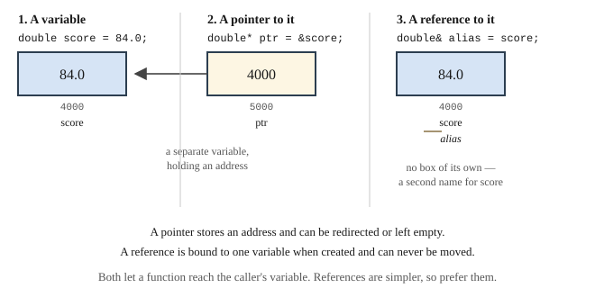

# Chapter 10 — Managing Functions and Data

## Learning Objectives

When you finish this chapter you will be able to:

- Explain why global variables are avoided, and when `static` is appropriate. *(SLO 1.4)*
- Write overloaded functions and default arguments. *(SLO 1.4, 1.7)*
- Write a simple recursive function and identify its base case. *(SLO 1.4)*
- Explain what a pointer holds, and use the address-of and dereference operators. *(SLO 1.1, 1.4)*
- Use reference parameters so a function can modify its caller's variable. *(SLO 1.4)*
- Explain why large objects are passed by `const` reference. *(SLO 1.4)*
- Split a program across a header and two implementation files, with a header guard. *(SLO 1.4, 1.6)*
- Build Grade Calculator v1.1 — three files, and input that cannot crash.

---

## 10.1 Global and Static Variables

Chapter 9 gave you functions with local variables. This chapter is about the machinery that makes a *program* out of a collection of functions.

A **global variable** is declared outside every function and visible to all of them:

```cpp
#include <iostream>

double totalEarned = 0.0;    // global — avoid this

void addPoints(double p) {
    totalEarned += p;        // no parameter needed
}
```

It looks convenient. It is not.

**Any function can change a global**, so no function can be understood alone. When `totalEarned` holds a wrong value, the suspects are every function in the program. Testing one function in isolation becomes impossible, because its behavior depends on state some other function may have left behind.

Appendix D Section D.11 excludes globals. **Pass what a function needs and return what it produces.** The `const` values at the top of the Grade Calculator — `A_CUTOFF`, `CAP_AT_100` — are not exceptions to this rule: they cannot be modified, so they cannot be the source of a surprise.

### `static` local variables

A `static` local keeps its value between calls:

```cpp
int nextId() {
    static int counter = 1000;    // initialized once, ever
    return ++counter;
}
```

Each call returns 1001, 1002, 1003. The variable is created once and survives after the function returns, but remains invisible outside it.

This is a narrower and safer tool than a global — the state is hidden inside the one function that uses it. Use it sparingly. A function with `static` state is not testable in isolation either, because calling it twice gives different answers.

---

## 10.2 Overloaded Functions

C++ allows several functions with the same name, provided their **parameter lists differ**:

```cpp
int overloaded(int a)       { return a * 2; }
double overloaded(double a) { return a * 2.5; }
```

```text
overloaded(3)   = 6
overloaded(3.0) = 7.5
```

The compiler chooses by the argument types. This is **overload resolution**, and it happens entirely at compile time.

Overloading earns its place when several functions do conceptually the same thing to different types:

```cpp
std::string formatGrade(double percentage);   // "89.1%"
std::string formatGrade(char letter);         // "B"
```

One name, one idea, two representations. The caller does not have to remember `formatGradeAsPercentage` and `formatGradeAsLetter`.

> **The return type is not part of the signature.** Two functions differing *only* in return type will not compile — the compiler has no way to tell which one a call means.

---

## 10.3 Default Arguments

A parameter may have a default the caller can omit:

```cpp
double applyBonus(double pointsEarned, double bonusPoints = 0.0) {
    return pointsEarned + bonusPoints;
}
```

```cpp
applyBonus(84.0, 5.0);    // 89.0
applyBonus(84.0);         // 84.0 — bonus defaults to 0.0
```

Two rules govern them. **Defaults must come last** — you cannot default a parameter and then require one after it, because a caller omitting the first would have no way to supply the second. And **the default belongs in the declaration**, which means in the header when a function is declared there, not repeated in the definition.

Default arguments are how you extend an interface without breaking existing calls. Adding `bonusPoints = 0.0` to a function that previously took one argument leaves every old call compiling and behaving exactly as before. v1.1 uses this.

---

## 10.4 Recursion

A **recursive** function calls itself. Every recursive function needs two things:

- a **base case** that returns without recursing, and
- a **recursive case** that moves closer to the base case.

```cpp
int factorial(int n) {
    return (n <= 1) ? 1 : n * factorial(n - 1);
}
```

```text
factorial(5) = 120
```

Trace it: `factorial(5)` needs `factorial(4)`, which needs `factorial(3)`, down to `factorial(1)`, which returns 1 without recursing. The results then multiply back up: 1, 2, 6, 24, 120.

**Omit the base case and the function recurses forever**, consuming memory until the program crashes with a *stack overflow*. That is the recursive equivalent of Chapter 7's infinite loop, and it fails harder.

Recursion suits problems that are naturally self-similar — tree structures, and the merge sort in Chapter 17. For anything a loop expresses naturally, use a loop: it is clearer and cheaper. The Grade Calculator never needs recursion, and this section exists because it appears throughout computing and you should recognize it.

---

## 10.5 Pointers

Chapter 1 Section 1.3 said that every value in memory has an **address**, and that the address is itself a number that can be stored. A **pointer** is a variable that stores one.

```cpp
double score = 84.0;
double* ptr = &score;      // ptr holds the address of score
```

Two operators:

| Operator | Name | Meaning |
|---|---|---|
| `&` | address-of | gives the address of a variable |
| `*` | dereference | gives the value at an address |

```cpp
std::cout << score;      // 84 — the value
std::cout << ptr;        // an address, e.g. 0x7ffd4c
std::cout << *ptr;       // 84 — the value at that address
```

`*` appears in two roles, which is a genuine source of confusion. In a *declaration*, `double* ptr` means "ptr is a pointer to double." In an *expression*, `*ptr` means "the value ptr points at." Same symbol, different jobs.

> **A pointer that points at nothing should be `nullptr`.** Dereferencing a null or uninitialized pointer is a run-time error that usually crashes the program. Chapter 22 covers pointer safety properly.

---

## 10.6 Reference Variables

A **reference** is another name for an existing variable:

```cpp
double score = 84.0;
double& alias = score;     // alias IS score

alias = 91.0;
std::cout << score;        // 91 — they are the same variable
```

```text
score  = 84
*ptr   = 84
alias  = 84
after alias = 91.0, score = 91
```



**Figure 10.1 — A variable, a pointer to it, and a reference to it.**

*Description of Figure 10.1.* Three panels. **Panel 1** shows a variable `score` at address 4000 holding 84.0. **Panel 2** shows a pointer `ptr`, itself a variable at address 5000, holding the value 4000, with an arrow pointing back to `score` — a separate variable that stores an address. **Panel 3** shows a reference `alias` with no box of its own, drawn as a second label attached to the same box at address 4000 — another name for an existing variable, occupying no storage. Notes record that a pointer stores an address and can be redirected or left empty, while a reference is bound to one variable when created and can never be moved. Both let a function reach the caller's variable; references are simpler, so prefer them.

| | Pointer | Reference |
|---|---|---|
| Is a separate variable | yes | no |
| Must be initialized | no | **yes** |
| Can be reassigned to another variable | yes | no |
| Can be empty | yes, `nullptr` | no |
| Syntax to use the value | `*ptr` | just the name |

A reference is simpler in every respect that matters here, which is why it is the tool for the next section.

---

## 10.7 Pass by Reference

Chapter 9 Section 9.3 showed the limitation: pass by value gives a function a copy, so it cannot change the caller's variable. Here is the fix.

### Via references

Add `&` to the parameter type:

```cpp
void byReference(double& p) { p = 999.0; }

double s = 84.0;
byReference(s);
std::cout << s;      // 999
```

```text
after byValue:     84
after byPointer:   999
after byReference: 999
```

The parameter `p` is not a copy — it is another name for `s`. The call site looks identical to a pass-by-value call, which is worth noting: **you cannot tell from the call whether a function may modify its argument.** You have to read the signature. That is a real cost, and the reason a function that modifies a parameter should say so in its name and its documentation.

### Via pointers

The same job with a pointer requires more punctuation:

```cpp
void byPointer(double* p) { *p = 999.0; }

byPointer(&s);       // the & is required here
```

**Prefer references.** Use a pointer only when the argument might legitimately be absent, since a pointer can be `nullptr` and a reference cannot.

### `const` references for large objects

There is a second, more common reason to use a reference — efficiency:

```cpp
void printReport(const std::string& student, double percentage);
```

Passing a `std::string` by value copies every character. Passing by reference copies nothing. The `const` promises the function will not modify it, so you get the speed of a reference with the safety of a copy.

Appendix D Section D.5 gives the rule: **pass large objects by `const` reference; pass small values — `int`, `double`, `char`, `bool` — by value.** A reference to a `double` is no cheaper than the `double` itself.

You have been using `const std::string&` since v1.0 without explanation. This is it.

---

## 10.8 Splitting a Program Across Files

One file works until it does not. Splitting a program lets you find things, compile only what changed, and reuse code across projects.

The standard division is **declarations in a header, definitions in an implementation file.**

### The header — `gradelib.h`

```cpp
#ifndef GRADELIB_H
#define GRADELIB_H

#include <string>

const double A_CUTOFF = 90.0;

/** Adds bonus points to a raw score. Bonus defaults to none. */
double applyBonus(double pointsEarned, double bonusPoints = 0.0);

/** Maps a percentage to a letter grade. */
char assignLetterGrade(double percentage);

#endif
```

### The implementation — `gradelib.cpp`

```cpp
#include "gradelib.h"

double applyBonus(double pointsEarned, double bonusPoints) {
    return pointsEarned + bonusPoints;      // no default repeated here
}

char assignLetterGrade(double percentage) {
    if (percentage >= A_CUTOFF) { return 'A'; }
    return 'F';
}
```

### The user — `main.cpp`

```cpp
#include "gradelib.h"
#include <iostream>

int main() {
    std::cout << assignLetterGrade(95.0) << "\n";
    return 0;
}
```

### Building it

```text
g++ -std=c++17 -Wall -Wextra main.cpp gradelib.cpp -o gradecalc
```

Both `.cpp` files are named. Headers are never compiled directly — they are pulled in by `#include`, exactly as Chapter 2 Section 2.2.1 described.

### Header guards

Every header is wrapped in a **header guard**:

```cpp
#ifndef GRADELIB_H
#define GRADELIB_H
// ...
#endif
```

The first time the preprocessor sees this file, `GRADELIB_H` is not defined, so it defines it and includes the contents. Any later time, `GRADELIB_H` *is* defined, so everything between is skipped.

Without a guard, a header included twice — easily done indirectly — declares everything twice, and the compiler reports errors about redefinition that point at a file you never edited.

Appendix D Section D.4 names the guard after the file in capitals, and prefers guards to `#pragma once` because guards are standard C++ and `#pragma once` is not.

### Include order

Appendix D Section D.4 groups includes, most specific first, with blank lines between:

```cpp
#include "gradelib.h"      // the header this file implements

#include <iostream>        // standard library
#include <string>
```

Putting the file's own header first is deliberate: if that header is missing an include it needs, this order makes the compiler say so immediately rather than hiding the problem.

---

## 10.9 Making Functions Reusable

A function is reusable when it depends only on its parameters. That means:

- **No globals.** Its behavior must not depend on hidden state.
- **No input or output**, unless that is its job. A function that computes *and* prints can only be used where you want both.
- **A clear contract**, documented with `@param`, `@return`, and `@pre`.
- **A general name.** `computePercentage` travels; `doTheMidtermThing` does not.

Compare:

```cpp
// Not reusable: prints, and depends on a global.
void showGrade() {
    std::cout << totalEarned / totalPossible * 100.0 << "\n";
}

// Reusable: takes what it needs, returns what it computes.
double computePercentage(double earned, double possible);
```

The second can be tested with hand-computed values, called from a report, called from a test harness, and moved into another program unchanged.

---

## Common Errors and Warnings

| What you see | Cause | Fix |
|---|---|---|
| `undefined reference to 'f'` | Declared in the header, not defined; or the `.cpp` was left off the build | Define it; list every `.cpp` on the command line |
| `error: redefinition of 'X'` | Header included twice without a guard | Add a header guard |
| `error: 'A_CUTOFF' was not declared` | Header not included where needed | `#include "gradelib.h"` |
| `error: default argument given for parameter 1` | Default repeated in the definition | Put it only in the declaration |
| The caller's variable is unchanged | Passed by value | Add `&` to the parameter type |
| `error: invalid initialization of reference` | Passed a literal to a non-`const` reference | Pass a variable, or take `const&` |
| Program crashes on dereference | Null or uninitialized pointer | Initialize; check for `nullptr` |
| Stack overflow | Recursion with no reachable base case | Add or fix the base case |
| `error: call of overloaded 'f(...)' is ambiguous` | Argument types match two overloads equally | Cast the argument, or rename one |

---

## Design Notes

**No globals.** Pass what a function needs; return what it produces.

**Prefer references to pointers.** Use a pointer only when the value may legitimately be absent.

**`const` reference for anything large, by value for anything small.**

**Name a function that modifies its argument so the modification is expected.** `readAssignment(totalEarned, ...)` reads as changing something. `check(x)` does not.

**One header, one implementation file, one purpose.** Related functions together; unrelated functions apart.

---

## Grade Calculator v1.1 — Multi-File and Reusable

### What v1.1 does

Everything v1.0 did, split across three files, with input validation that no typed input can defeat.

### The header — `gradelib.h`

```cpp
// gradelib.h - Grade Calculator v1.1 - Chapter 10
// Declarations for the grading library. Separating declarations from
// definitions lets main.cpp use these functions without seeing their code.
#ifndef GRADELIB_H
#define GRADELIB_H

#include <string>

const double A_CUTOFF = 90.0;
const double B_CUTOFF = 80.0;
const double C_CUTOFF = 70.0;
const double D_CUTOFF = 60.0;
const bool CAP_AT_100 = true;

/** Adds bonus points to a raw score. Bonus defaults to none. */
double applyBonus(double pointsEarned, double bonusPoints = 0.0);

/** Converts points to a capped, rounded percentage. Requires possible > 0. */
double computePercentage(double earned, double possible);

/** Maps a percentage to a letter grade on the fixed course scale. */
char assignLetterGrade(double percentage);

/** Overload 1: formats a percentage for display, e.g. "89.1%". */
std::string formatGrade(double percentage);

/** Overload 2: formats a letter grade for display, e.g. "B". */
std::string formatGrade(char letter);

/**
 * Reads a non-negative number from the user, re-prompting until valid.
 * @param  prompt  text shown to the user
 * @param  value   receives the validated number
 * @return true if a value was read, false if input closed unexpectedly
 */
bool readNonNegative(const std::string& prompt, double& value);

/** Reads a whole line of text, re-prompting if it is empty. */
std::string readNonEmptyLine(const std::string& prompt);

#endif
```

### The implementation — `gradelib.cpp`

```cpp
// gradelib.cpp - Grade Calculator v1.1 - Chapter 10
// Definitions for the grading library declared in gradelib.h.
#include "gradelib.h"

#include <cmath>
#include <iomanip>
#include <iostream>
#include <limits>
#include <sstream>

double applyBonus(double pointsEarned, double bonusPoints) {
    return pointsEarned + bonusPoints;
}

double computePercentage(double earned, double possible) {
    double raw = earned / possible * 100.0;
    double reported = CAP_AT_100 ? std::min(raw, 100.0) : raw;
    return std::round(reported * 10.0) / 10.0;
}

char assignLetterGrade(double percentage) {
    if (percentage >= A_CUTOFF) { return 'A'; }
    if (percentage >= B_CUTOFF) { return 'B'; }
    if (percentage >= C_CUTOFF) { return 'C'; }
    if (percentage >= D_CUTOFF) { return 'D'; }
    return 'F';
}

std::string formatGrade(double percentage) {
    std::ostringstream out;
    out << std::fixed << std::setprecision(1) << percentage << "%";
    return out.str();
}

std::string formatGrade(char letter) {
    return std::string(1, letter);
}

bool readNonNegative(const std::string& prompt, double& value) {
    while (true) {
        std::cout << prompt;
        if (!(std::cin >> value)) {
            if (std::cin.eof()) {
                return false;   // input closed; caller decides what to do
            }
            // Not a number. Clear the error state and discard the bad input,
            // otherwise every later read fails too.
            std::cin.clear();
            std::cin.ignore(std::numeric_limits<std::streamsize>::max(), '\n');
            std::cout << "  That is not a number. Please try again.\n";
            continue;
        }
        std::cin.ignore(std::numeric_limits<std::streamsize>::max(), '\n');
        if (value < 0.0) {
            std::cout << "  Points cannot be negative. Please try again.\n";
            continue;
        }
        return true;
    }
}

std::string readNonEmptyLine(const std::string& prompt) {
    std::string line;
    while (true) {
        std::cout << prompt;
        if (!std::getline(std::cin, line)) {
            return "";
        }
        if (!line.empty()) {
            return line;
        }
        std::cout << "  This cannot be blank. Please try again.\n";
    }
}
```

### The program — `main.cpp`

```cpp
// main.cpp - Grade Calculator v1.1 - Chapter 10
// Same behavior as v1.0, now split across three files with validated input.
// Run: click Run in StudySite and use the embedded Terminal.
#include "gradelib.h"

#include <iomanip>
#include <iostream>
#include <string>

void readAssignment(double& totalEarned, double& totalPossible, int& count) {
    std::string name = readNonEmptyLine("  Assignment name : ");

    double earned = 0.0;
    double possible = 0.0;
    double bonus = 0.0;
    if (!readNonNegative("  Points earned   : ", earned))   { return; }
    if (!readNonNegative("  Points possible : ", possible)) { return; }
    if (!readNonNegative("  Bonus points    : ", bonus))    { return; }

    totalEarned += applyBonus(earned, bonus);
    totalPossible += possible;
    ++count;
    std::cout << "  Recorded: " << name << "\n\n";
}

void printReport(const std::string& student, double earned, double possible, int count) {
    std::cout << "\n--- COURSE REPORT ---\n";
    std::cout << "Student:     " << student << "\n";
    std::cout << "Assignments: " << count << "\n";
    std::cout << std::fixed << std::setprecision(1);
    std::cout << "Total:       " << earned << " / " << possible << "\n";

    if (count == 0 || possible <= 0.0) {
        std::cout << "No course grade is available yet.\n\n";
        return;
    }
    double percentage = computePercentage(earned, possible);
    std::cout << "Percentage:  " << formatGrade(percentage) << "\n";
    std::cout << "Grade:       " << formatGrade(assignLetterGrade(percentage)) << "\n\n";
}

int main() {
    std::cout << "=== GRADE CALCULATOR v1.1 ===\n\n";
    std::string studentName = readNonEmptyLine("Student name: ");
    std::cout << "\n";

    double totalEarned = 0.0;
    double totalPossible = 0.0;
    int assignmentCount = 0;
    bool running = true;

    while (running) {
        std::cout << "1) Add assignment   2) View report   3) Quit\nChoice: ";
        std::string line;
        if (!std::getline(std::cin, line)) { break; }
        char choice = line.empty() ? '?' : line[0];

        switch (choice) {
            case '1': readAssignment(totalEarned, totalPossible, assignmentCount); break;
            case '2': printReport(studentName, totalEarned, totalPossible, assignmentCount); break;
            case '3': running = false; break;
            default:  std::cout << "Please enter 1, 2, or 3.\n\n"; break;
        }
    }

    printReport(studentName, totalEarned, totalPossible, assignmentCount);
    std::cout << "Goodbye.\n";
    return 0;
}
```

### Expected output

Keep `main.cpp`, `gradelib.h`, and `gradelib.cpp` all open in the editor so
**Run** compiles the whole program.

With `Ada`, then `1` and `Homework 1` with `abc` typed for points earned, then `9`, `10`, `0`, then `2`, then `3`:

```text
  That is not a number. Please try again.

--- COURSE REPORT ---
Student:     Ada
Assignments: 1
Total:       9.0 / 10.0
Percentage:  90.0%
Grade:       A

Goodbye.
```

The `abc` was rejected, the prompt repeated, and the program carried on. **No typed input can crash v1.1.**

### What to notice

**`readNonNegative` takes `double& value` and returns `bool`.** This is the pattern for a function that must produce two things: the value comes back through the reference, and success or failure comes back as the return value. It is exactly the case Section 9.3 said pass by value could not handle.

**`std::cin.clear()` then `std::cin.ignore(...)`.** When `>>` fails on non-numeric input, the stream enters a failed state and **stays there** — every later read fails instantly. `clear()` resets the state; `ignore()` discards the offending characters. Omit either one and the program spins forever printing the error message. Try it.

**`formatGrade` is overloaded**, once for `double` and once for `char`. One name, one idea.

**`applyBonus` has a default argument in the header only.** Repeating it in `gradelib.cpp` is an error, which is a rule people forget exactly once.

**Every function parameter that is a `std::string` is `const std::string&`.** No copying, no modification.

**`gradelib.cpp` has no `main`, and `main.cpp` has no grading logic.** Either file could be replaced without touching the other, which is what Section 10.9 means by reusable.

### Your StudySite Lab — Organize Reusable Functions

- **Course:** COSC 1436 — Programming Fundamentals
- **Project checkpoint:** v1.1
- **Starting point:** The working Chapter 9 program.

> **One-repository rule:** Continue in the same COSC 1436 Grade Calculator
> repository through Chapter 12. Do not create a chapter folder or a new
> repository. Each chapter replaces or extends the current working program.

#### Required work

1. Move reusable declarations to `gradelib.h` and definitions to `gradelib.cpp`; keep application flow in `main.cpp`.
2. Add an include guard to `gradelib.h`.
3. Add validated numeric input that recovers after invalid text.
4. Pass output values by reference where a function must update the caller.
5. Add `readInRange` and use it to keep points possible between `0` and `1000`.


#### Verification

- All source files build together.
- Typing `abc` for a number does not trap the program in a loop or crash it.
- The existing menu and grade calculations still work.

#### StudySite workflow

1. Confirm that your previous chapter is committed on GitHub, then open this
   chapter's **coding panel on the StudySite main stage**.
2. Close stale project tabs from an earlier session before loading. This avoids
   creating files with names such as `_imported` when the same path is already
   open.
3. Click **Load from GitHub**, select **grade-calculator-1436**, and click each source, header,
   or documentation file needed for this chapter. Confirm the editor shows the
   expected file paths before editing.
4. Continue the existing project in StudySite's internal editor. For a
   multi-file program, keep every source and header file needed by the build
   open in the editor.
5. Click **Run**. Read compiler messages and program output in the embedded
   Terminal, and type program input there when prompted.
6. Fix every compiler error and warning, then complete the verification list.
7. Use the Tutor with the current code or Terminal output when you need help.

#### Save this checkpoint

> **IMPORTANT — commit to save your work:** StudySite autosaves editor tabs
> locally on this device, but local autosave is not a durable GitHub backup.
> Your work is not safely saved in your repository until **Save to GitHub**
> finishes a successful **Commit**.

1. Keep every project file that belongs in this checkpoint open in the editor.
   **Save to GitHub includes every open editor file**, so close scratch files
   and accidental `_imported` duplicates first.
2. Click **Save to GitHub**.
3. Select **grade-calculator-1436** and the existing **main** branch.
4. Enter the commit message **Complete Chapter 10 Grade Calculator v1.1**.
5. Click **Commit** and wait for StudySite's confirmation.
6. Open the commit link, or open the repository on GitHub, and confirm the new
   commit and expected files are present before leaving StudySite.

#### Complete when

- The verification list passes.
- **grade-calculator-1436** contains the Chapter 10 checkpoint.
- The GitHub commit is visible; StudySite's local autosave alone is not
  completion.


---

## Try It Yourself

### 1. Three ways to pass an argument

```cpp
#include <iostream>

void byValue(double p) {
    p = 999.0;                     // the copy changes; the caller's does not
    (void)p;                       // tell the compiler the assignment is the point
}
void byPointer(double* p)   { *p = 999.0; }
void byReference(double& p) {  p = 999.0; }

int main() {
    double s = 84.0;
    byValue(s);     std::cout << "after byValue:     " << s << "\n";
    byPointer(&s);  std::cout << "after byPointer:   " << s << "\n";
    s = 84.0;
    byReference(s); std::cout << "after byReference: " << s << "\n";
    return 0;
}
```

**Expected output:**

```text
after byValue:     84
after byPointer:   999
after byReference: 999
```

*Try:* Which call site tells you the function might modify the argument? What does that suggest about naming such functions?

### 2. Pointers and references side by side

```cpp
#include <iostream>

int main() {
    double score = 84.0;
    double* ptr = &score;
    double& alias = score;

    std::cout << "score = " << score << "\n";
    std::cout << "*ptr  = " << *ptr << "\n";
    std::cout << "alias = " << alias << "\n";

    alias = 91.0;
    std::cout << "after alias = 91.0, score = " << score << "\n";
    return 0;
}
```

**Expected output:**

```text
score = 84
*ptr  = 84
alias = 84
after alias = 91.0, score = 91
```

*Try:* Add `std::cout << ptr;` — you will see an address. Then set `*ptr = 100.0;` and print `score` and `alias`. All three names refer to one location.

### 3. Overloading

```cpp
#include <iostream>

int overloaded(int a)       { return a * 2; }
double overloaded(double a) { return a * 2.5; }

int main() {
    std::cout << "overloaded(3)   = " << overloaded(3) << "\n";
    std::cout << "overloaded(3.0) = " << overloaded(3.0) << "\n";
    return 0;
}
```

**Expected output:**

```text
overloaded(3)   = 6
overloaded(3.0) = 7.5
```

*Try:* Add `char overloaded(char a);` and call `overloaded('A')`. Then try adding a version differing only in return type and read the error.

### 4. Default arguments

```cpp
#include <iostream>

double applyBonus(double pointsEarned, double bonusPoints = 0.0) {
    return pointsEarned + bonusPoints;
}

int main() {
    std::cout << applyBonus(84.0, 5.0) << "\n";
    std::cout << applyBonus(84.0) << "\n";
    return 0;
}
```

**Expected output:**

```text
89
84
```

*Try:* Move the default to the *first* parameter instead and read the error. Why must defaults come last?

### 5. Recursion

```cpp
#include <iostream>

int factorial(int n) {
    return (n <= 1) ? 1 : n * factorial(n - 1);
}

int main() {
    std::cout << "factorial(5) = " << factorial(5) << "\n";
    return 0;
}
```

**Expected output:**

```text
factorial(5) = 120
```

*Try:* Write the same thing as a loop. Which is clearer? Now remove the base case, rebuild, and run — be ready to see it crash.

### 6. Split a program yourself

Take any single-file program from Chapter 9 and split it into `mathlib.h`, `mathlib.cpp`, and `main.cpp`. Include a header guard.

Then, deliberately:

- Build with only `main.cpp` and identify which stage produced the error.
- Remove the header guard and include the header twice.
- Repeat a default argument in both the header and the `.cpp`.

Three errors, three distinct messages. Being able to recognize them on sight is worth ten minutes now.

### 7. Reason about design

For each, say whether it should take its parameter by value, by reference, or by `const` reference — and why.

- A function computing the square root of a number
- A function printing a student's name
- A function that fills a name with input from the user
- A function checking whether a percentage is passing
- A function adding an assignment to a running total

---

## Summary

- **Avoid global variables.** Any function can change them, so no function can be reasoned about alone. Pass what a function needs; return what it produces.
- A **`static` local** keeps its value between calls, hidden inside one function. Use it sparingly.
- **Overloaded** functions share a name and differ in parameters. The return type is not part of the signature.
- **Default arguments** must come last and belong in the declaration only. They extend an interface without breaking existing calls.
- A **recursive** function calls itself and needs a **base case**. Prefer a loop where a loop is natural.
- A **pointer** stores an address. `&` takes an address; `*` dereferences one. A pointer may be `nullptr`.
- A **reference** is another name for an existing variable. It must be initialized and can never be rebound.
- **Pass by reference** lets a function modify its caller's variable. Prefer references to pointers.
- **Pass large objects by `const` reference; small values by value.**
- Split a program into a **header** with declarations and an **implementation file** with definitions. Guard every header. List every `.cpp` on the build command.
- A function is **reusable** when it depends only on its parameters, does one thing, and documents its contract.

---

## Key Terms

**address-of operator** — `&`, giving the address of a variable.

**base case** — the condition under which a recursive function returns without recursing.

**dereference operator** — `*`, giving the value stored at an address.

**global variable** — a variable declared outside every function, visible to all.

**header guard** — `#ifndef`/`#define`/`#endif` preventing a header from being processed twice.

**null pointer** — a pointer holding `nullptr`, pointing at nothing.

**overload resolution** — the compiler's choice among overloaded functions based on argument types.

**overloading** — defining several functions with one name and different parameter lists.

**pass by reference** — passing a reference so a function can modify the caller's variable.

**pointer** — a variable holding the address of another variable.

**recursion** — a function calling itself.

**reference** — an alternative name for an existing variable.

**stack overflow** — a crash caused by recursion that never reaches its base case.

**static local variable** — a local variable retaining its value between calls.

---

**Next:** Chapter 11 finally gives your calculator more than one student. Arrays hold a whole roster — and, more importantly, they let the hard-coded grade cutoffs from Chapter 6 become **data the user supplies**, collapsing that conditional chain into a short loop. Grade Calculator v1.2.
