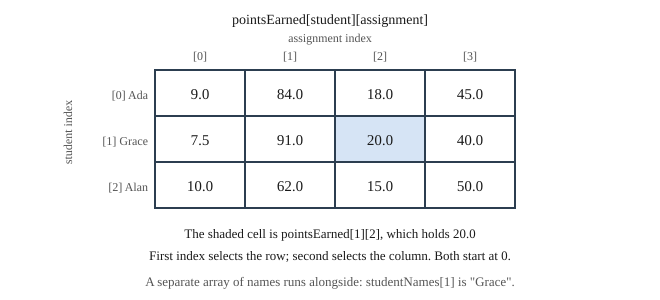

# Chapter 11 — Arrays

## Learning Objectives

When you finish this chapter you will be able to:

- Declare, initialize, and index an array. *(SLO 2.6)*
- Traverse an array with a loop and explain the standard idiom. *(SLO 1.4, 2.6)*
- Pass an array to a function together with its size. *(SLO 1.4, 2.6)*
- Use parallel arrays to associate related values. *(SLO 2.6)*
- Declare and traverse a two-dimensional array. *(SLO 2.6)*
- Explain what happens when an index goes out of bounds. *(SLO 1.6)*
- Replace a hard-coded conditional chain with a table-driven loop. *(SLO 1.7)*
- Build Grade Calculator v1.2 — a class roster, and a grade scale the user defines.

---

## 11.1 Why Collections Are Needed

Your calculator handles one student and keeps running totals. To handle a class, you would need a variable per student — and you do not know how many students there are when you write the program.

```cpp
double student1 = 0.0;
double student2 = 0.0;
double student3 = 0.0;      // and then what?
```

An **array** holds many values of one type under a single name, reached by number.

There is a second problem this chapter solves, and it is the more interesting one. In Chapter 6 you built a letter-grade chain and the chapter ended by pointing out its limitation: every cutoff is compiled into the program, so no user can define their own scale. That limitation is not fixed by writing a longer chain. It is fixed by turning the cutoffs into **data**, and arrays are what make data-driven code possible.

---

## 11.2 Declaring and Initializing Arrays

```cpp
double scores[5];                                   // 5 doubles, uninitialized
double scores[5] = {9.0, 84.0, 18.0, 45.0, 30.0};   // 5 doubles, initialized
double scores[5] = {0.0};                           // all five set to 0.0
double scores[] = {9.0, 84.0, 18.0};                // size 3, deduced
```

The number in brackets is the **size**, and it must be a compile-time constant:

```cpp
const int MAX_STUDENTS = 40;
double totals[MAX_STUDENTS];      // fine

int count = 0;
std::cin >> count;
double totals[count];             // NOT standard C++
```

That last restriction is a real limitation — you must decide a maximum in advance and hope it is enough. Chapter 12 removes it with `std::vector`.

**Always initialize.** `double scores[5];` contains garbage, and Section 3.2's warning applies with five times the force.

---

## 11.3 Indexing and Bounds

Reach an element with a **subscript**:

```cpp
double scores[5] = {9.0, 84.0, 18.0, 45.0, 30.0};

std::cout << scores[0];      // 9.0  — the FIRST element
std::cout << scores[4];      // 30.0 — the LAST element
scores[2] = 20.0;            // assign to the third
```

**Indices start at 0.** An array of size 5 has valid indices 0, 1, 2, 3, 4. There is no `scores[5]`.

This is why Chapter 7 Section 7.4 taught you to count from zero with `<`:

```cpp
for (int k = 0; k < 5; ++k)      // visits 0,1,2,3,4 — every element, exactly once
```

### Out of bounds

C++ does not check subscripts. Reading or writing past the end compiles, runs, and does something undefined:

```cpp
double scores[5];
scores[5] = 100.0;      // one past the end — no error, no warning
```

It may appear to work. It may corrupt another variable. It may crash. It may behave differently on different days.

**This is the single most dangerous thing in this chapter.** An out-of-bounds write is the first seeded defect in Chapter 16's debugging lab, precisely because it is invisible until it is catastrophic.

Two defenses. **Use `< size`, never `<= size`.** And **check any index that came from outside your program** before using it.

---

## 11.4 Traversing an Array

The standard idiom:

```cpp
const int COUNT = 5;
double scores[COUNT] = {9.0, 84.0, 18.0, 45.0, 30.0};

double total = 0.0;
for (int k = 0; k < COUNT; ++k) {
    total += scores[k];
}
```

This is Chapter 7's accumulator pattern with an array supplying the values. The loop and the array fit together so naturally that the pairing is worth memorizing: **`for (int k = 0; k < size; ++k)` visits every element exactly once.**

Finding the largest follows the same shape:

```cpp
double highest = scores[0];              // start with the first, not with 0.0
for (int k = 1; k < COUNT; ++k) {        // start at 1 — element 0 is already in
    if (scores[k] > highest) {
        highest = scores[k];
    }
}
```

Starting `highest` at `scores[0]` rather than `0.0` matters: with all-negative data, starting at zero gives an answer that is not in the array at all.

---

## 11.5 Arrays and Functions

An array does **not** carry its size. Pass both:

```cpp
double sum(const double values[], int count) {
    double total = 0.0;
    for (int k = 0; k < count; ++k) {
        total += values[k];
    }
    return total;
}

double total = sum(scores, COUNT);
```

Two things differ from every other parameter you have met.

**Arrays are passed by reference automatically** — the function receives the array's address, not a copy. So a function *can* modify the caller's array, unlike the `double` in Chapter 9 Section 9.3. That is efficient and slightly dangerous.

**`const` prevents modification.** `const double values[]` promises the function will not change it, and the compiler enforces the promise. Use `const` on every array parameter you do not intend to modify.

Because the size does not travel with the array, `count` must be correct. Pass the wrong count and the function walks off the end.

---

## 11.6 Parallel Arrays

To associate several pieces of information about the same thing, use **parallel arrays** — separate arrays where the same index refers to the same item:

```cpp
std::string studentNames[3] = {"Ada", "Grace", "Alan"};
double studentTotals[3]     = {89.0, 91.5, 72.0};
char studentLetters[3]      = {'B', 'A', 'C'};

// index 1 is Grace, 91.5, 'A'
```

This works and has a real weakness: **nothing enforces the correspondence.** Sort one array and not the others and every student gets someone else's grade. Add a student to two of the three and the arrays drift out of step permanently.

Chapter 14 replaces parallel arrays with a `struct`, which makes that class of bug structurally impossible. For Course I, parallel arrays are the tool available — and knowing exactly why they are risky is what makes Chapter 14 land.

---

## 11.7 Two-Dimensional Arrays

A roster is naturally a grid: students down, assignments across.

```cpp
const int MAX_STUDENTS = 3;
const int MAX_ASSIGNMENTS = 4;

double pointsEarned[MAX_STUDENTS][MAX_ASSIGNMENTS] = {{0.0}};

pointsEarned[1][2] = 20.0;     // student 1, assignment 2
```



**Figure 11.1 — A two-dimensional array of points earned.**

*Description of Figure 11.1.* A grid with three rows and four columns. Rows are students, indexed 0 (Ada), 1 (Grace), and 2 (Alan). Columns are assignments, indexed 0 through 3.

| | [0] | [1] | [2] | [3] |
|---|---|---|---|---|
| **[0] Ada** | 9.0 | 84.0 | 18.0 | 45.0 |
| **[1] Grace** | 7.5 | 91.0 | **20.0** | 40.0 |
| **[2] Alan** | 10.0 | 62.0 | 15.0 | 50.0 |

The highlighted cell is `pointsEarned[1][2]`, holding 20.0. The first index selects the row, the second the column, and both start at 0. A separate array of names runs alongside: `studentNames[1]` is `"Grace"`.

### Traversing with nested loops

Chapter 7 Section 7.6 introduced nested loops. This is what they were for:

```cpp
for (int s = 0; s < studentCount; ++s) {
    double total = 0.0;
    for (int a = 0; a < assignmentCount; ++a) {
        total += pointsEarned[s][a];
    }
    std::cout << studentNames[s] << ": " << total << "\n";
}
```

The outer loop walks students; the inner walks that student's assignments. Reverse them and you total per assignment instead — same data, different question.

**Arrays are stored in row-major order**, meaning row 0 sits entirely in memory before row 1 begins. That matters for performance in large programs and not at all here.

### Higher dimensions

C++ allows more:

```cpp
double scores[4][30][10];      // sections, students, assignments
```

Three dimensions is occasionally useful and rapidly hard to reason about. Two is enough for this book.

---

## 11.8 Replacing Code with Data

This section is the chapter's real lesson.

Here is the letter-grade logic from Chapter 6:

```cpp
char letter = 'F';
if (percentage >= 90.0)      { letter = 'A'; }
else if (percentage >= 80.0) { letter = 'B'; }
else if (percentage >= 70.0) { letter = 'C'; }
else if (percentage >= 60.0) { letter = 'D'; }
```

The cutoffs and letters are **written into the control flow**. To use a different scale you must edit and recompile.

Now put the same information in parallel arrays:

```cpp
double cutoffs[5] = {90.0, 80.0, 70.0, 60.0, 0.0};
char letters[5]   = {'A',  'B',  'C',  'D',  'F'};
int tierCount = 5;

char letterFor(double percentage, const double cutoffs[], const char letters[], int count) {
    for (int k = 0; k < count; ++k) {
        if (percentage >= cutoffs[k]) {
            return letters[k];
        }
    }
    return '?';
}
```

Compare them honestly:

| | Chapter 6 chain | Table-driven loop |
|---|---|---|
| Lines of logic | grows with every tier | 5, always |
| Adding a tier | edit code, recompile | add one array element |
| A plus-minus scale | rewrite the chain | supply different data |
| **A scale the user types in** | **impossible** | just fill the arrays |
| Testing | test every branch | test one loop |

The loop is shorter, it never grows, and — decisively — **the data can come from anywhere**, including the user.

That last row is what makes this a turning point rather than a tidying-up. There is no arrangement of `if/else if` that accepts a grading scale at run time. The moment the cutoffs became an array, an entire category of feature became possible.

**This pattern — replacing branching code with a table of data — recurs throughout the book.** In Chapter 14 the two parallel arrays become one array of `struct`. In Chapter 18 that becomes a `GradeScale` class that validates itself. The idea does not change; only the container does.

---

## 11.9 C-Style Strings

Before `std::string`, C++ inherited C's approach: an array of `char` ending with a **null terminator**, the character `'\0'`.

```cpp
char name[6] = {'A', 'd', 'a', '\0'};
char name[] = "Ada";                    // same thing; the '\0' is added for you
```

`"Ada"` occupies four bytes, not three. Every string literal you have written since Chapter 2 has been a C string.

They are awkward. The size is fixed, `=` does not copy them, `==` compares addresses rather than contents, and forgetting the terminator makes functions read off the end of the array.

**Use `std::string`.** C strings are covered because you will meet them in older code and in library interfaces, and because they explain what a string literal actually is.

---

## 11.10 Command-Line Arguments *(reference only)*

A program can receive information from the command line through a different form of `main`:

```cpp
#include <iostream>

int main(int argc, char* argv[]) {
    for (int k = 0; k < argc; ++k) {
        std::cout << "argv[" << k << "] = " << argv[k] << "\n";
    }
    return 0;
}
```

`argc` is the number of arguments and `argv` is an array of C strings holding them. `argv[0]` is always the program's own name.

```text
./gradecalc period3 --verbose

argv[0] = ./gradecalc
argv[1] = period3
argv[2] = --verbose
```

This belongs in the arrays chapter because `argv` is an array of C strings — both concepts from this chapter, combined.

**It is reference material only.** Every program in this book is menu-driven and reads its input interactively from `std::cin`. The Grade Calculator never reads command-line arguments, and no exercise requires them. You should recognize `int main(int argc, char* argv[])` when you see it elsewhere, and that is all this section is for.

---

## 11.11 Common Array Errors

| What you see or observe | Cause | Fix |
|---|---|---|
| Values are garbage | Array not initialized | `double a[5] = {0.0};` |
| The program crashes, or a nearby variable changes | Index out of bounds | Use `< size`, never `<= size` |
| The loop misses the last element | Started at 1, or used `< size - 1` | Start at 0, test `< size` |
| The loop runs one time too many | `<= size` | Use `< size` |
| The wrong grade goes to the wrong student | Parallel arrays out of step | Update all of them together; Chapter 14 fixes this properly |
| `error: array must be initialized with a brace-enclosed initializer` | Assigned an array with `=` | Copy element by element |
| `error: array bound is not an integer constant` | Size from a variable | Use a `const int`, or `std::vector` |
| A function sums the wrong number of elements | Wrong count passed | Pass the same constant used to declare it |
| Comparing two C strings with `==` is always false | Comparing addresses | Use `std::string` |

---

## Design Notes

**Always pass the size with the array.** An array does not know how big it is, and a function that guesses is a defect waiting for the wrong input.

**Mark array parameters `const` unless you intend to modify them.** Arrays pass by reference, so without `const` any function can rewrite your data.

**Prefer data to branching.** If a conditional chain encodes a table, make it a table. The code shrinks and the capability grows.

**Treat parallel arrays as a known risk.** Every operation must touch all of them. Write a comment saying so, and look forward to Chapter 14.

---

## Grade Calculator v1.2 — Class Roster and Custom Letter Scale

### What v1.2 does

Two features arrive together, because both are the same idea: replacing code with data.

A **multi-student roster**, stored in a two-dimensional array of points with parallel arrays of names. And a **user-defined letter grade scale** — an instructor can now type in A/B/C/D/F, a plus-minus scale, or pass/fail, without the program changing.

### The program

```cpp
// Grade Calculator v1.2 - Chapter 11
// Multi-student roster on arrays, plus a USER-DEFINED letter grade scale.
// New this version: 2D arrays, parallel arrays, table-driven grade lookup.
//
// Central lesson: the hard-coded if/else chain of v1.1 becomes a loop over a
// table of data. Changing the grading scheme no longer means changing code.
//
// Build: g++ -std=c++17 -Wall -Wextra main.cpp -o gradecalc

#include <cmath>
#include <iomanip>
#include <iostream>
#include <limits>
#include <string>

const int MAX_STUDENTS = 40;
const int MAX_ASSIGNMENTS = 20;
const int MAX_TIERS = 12;
const bool CAP_AT_100 = true;

// ---------- input helpers ----------

double readNonNegative(const std::string& prompt) {
    double value = 0.0;
    while (true) {
        std::cout << prompt;
        if (!(std::cin >> value)) {
            if (std::cin.eof()) { return 0.0; }
            std::cin.clear();
            std::cin.ignore(std::numeric_limits<std::streamsize>::max(), '\n');
            std::cout << "  That is not a number. Please try again.\n";
            continue;
        }
        std::cin.ignore(std::numeric_limits<std::streamsize>::max(), '\n');
        if (value < 0.0) {
            std::cout << "  Value cannot be negative. Please try again.\n";
            continue;
        }
        return value;
    }
}

std::string readLine(const std::string& prompt) {
    std::cout << prompt;
    std::string line;
    std::getline(std::cin, line);
    return line;
}

// ---------- grade scale (parallel arrays) ----------

/**
 * Reads a custom grade scale from the user into two parallel arrays.
 * Tiers must be entered highest cutoff first. Validated on entry.
 * @return the number of tiers actually read
 */
int readGradeScale(double cutoffs[], char letters[]) {
    std::cout << "\n--- Define your grade scale ---\n";
    std::cout << "Enter tiers from highest to lowest. The last tier should be 0.\n";
    std::cout << "Example: A 90, B 80, C 70, D 60, F 0\n\n";

    int count = 0;
    while (count < MAX_TIERS) {
        std::string prompt = "Tier " + std::to_string(count + 1) + " letter (or 'done'): ";
        std::string letterText = readLine(prompt);
        if (letterText == "done" || letterText.empty()) { break; }

        double cutoff = readNonNegative("  Minimum percentage for this tier: ");

        // Validation: cutoffs must strictly descend, or lookup breaks.
        if (count > 0 && cutoff >= cutoffs[count - 1]) {
            std::cout << "  Cutoff must be lower than the previous tier ("
                      << cutoffs[count - 1] << "). Tier not added.\n";
            continue;
        }
        letters[count] = letterText[0];
        cutoffs[count] = cutoff;
        ++count;
    }

    // A scale that does not reach 0 leaves low scores unclassified.
    if (count == 0 || cutoffs[count - 1] > 0.0) {
        std::cout << "\nNote: your scale did not reach 0, so an 'F' at 0 was added.\n";
        if (count < MAX_TIERS) {
            letters[count] = 'F';
            cutoffs[count] = 0.0;
            ++count;
        }
    }
    return count;
}

void useDefaultScale(double cutoffs[], char letters[], int& count) {
    const char defLetters[] = {'A', 'B', 'C', 'D', 'F'};
    const double defCutoffs[] = {90.0, 80.0, 70.0, 60.0, 0.0};
    count = 5;
    for (int i = 0; i < count; ++i) {
        letters[i] = defLetters[i];
        cutoffs[i] = defCutoffs[i];
    }
}

/**
 * Table-driven lookup. Compare with the if/else chain in v1.1: this version
 * works for any scale the user defines, and is shorter.
 */
char letterFor(double percentage, const double cutoffs[], const char letters[], int count) {
    for (int i = 0; i < count; ++i) {
        if (percentage >= cutoffs[i]) {
            return letters[i];
        }
    }
    return '?';
}

double computePercentage(double earned, double possible) {
    if (possible <= 0.0) { return 0.0; }
    double raw = earned / possible * 100.0;
    double reported = CAP_AT_100 ? std::min(raw, 100.0) : raw;
    return std::round(reported * 10.0) / 10.0;
}

// ---------- main ----------

int main() {
    std::cout << "=== GRADE CALCULATOR v1.2 ===\n";

    // Parallel arrays: names[i] belongs with scores[i][...]
    std::string studentNames[MAX_STUDENTS];
    std::string assignmentNames[MAX_ASSIGNMENTS];
    double pointsEarned[MAX_STUDENTS][MAX_ASSIGNMENTS] = {{0.0}};
    double pointsPossible[MAX_ASSIGNMENTS] = {0.0};
    int studentCount = 0;
    int assignmentCount = 0;

    double cutoffs[MAX_TIERS] = {0.0};
    char letters[MAX_TIERS] = {'\0'};
    int tierCount = 0;

    std::string useCustom = readLine("Define a custom grade scale? (y/n): ");
    if (!useCustom.empty() && (useCustom[0] == 'y' || useCustom[0] == 'Y')) {
        tierCount = readGradeScale(cutoffs, letters);
    } else {
        useDefaultScale(cutoffs, letters, tierCount);
        std::cout << "Using the default scale: A 90, B 80, C 70, D 60, F 0.\n";
    }

    std::cout << "\n--- Enter assignments ---\n";
    while (assignmentCount < MAX_ASSIGNMENTS) {
        std::string name = readLine("Assignment name (or 'done'): ");
        if (name == "done" || name.empty()) { break; }
        assignmentNames[assignmentCount] = name;
        pointsPossible[assignmentCount] = readNonNegative("  Points possible: ");
        ++assignmentCount;
    }

    std::cout << "\n--- Enter students ---\n";
    while (studentCount < MAX_STUDENTS) {
        std::string name = readLine("Student name (or 'done'): ");
        if (name == "done" || name.empty()) { break; }
        studentNames[studentCount] = name;
        for (int a = 0; a < assignmentCount; ++a) {
            std::string prompt = "  " + assignmentNames[a] + " points earned (incl. bonus): ";
            pointsEarned[studentCount][a] = readNonNegative(prompt);
        }
        ++studentCount;
    }

    // ---------- report ----------
    std::cout << "\n=====================================\n";
    std::cout << "  CLASS REPORT\n";
    std::cout << "=====================================\n";
    std::cout << std::fixed << std::setprecision(1);

    double classTotal = 0.0;
    for (int s = 0; s < studentCount; ++s) {
        double earned = 0.0;
        double possible = 0.0;
        for (int a = 0; a < assignmentCount; ++a) {
            earned += pointsEarned[s][a];
            possible += pointsPossible[a];
        }
        double pct = computePercentage(earned, possible);
        classTotal += pct;
        std::cout << std::left << std::setw(20) << studentNames[s]
                  << std::right << std::setw(8) << pct << "%   "
                  << letterFor(pct, cutoffs, letters, tierCount) << "\n";
    }

    if (studentCount > 0) {
        std::cout << "-------------------------------------\n";
        std::cout << std::left << std::setw(20) << "CLASS AVERAGE"
                  << std::right << std::setw(8) << classTotal / studentCount << "%\n";
    } else {
        std::cout << "No students entered.\n";
    }

    std::cout << "\nPer-assignment averages:\n";
    for (int a = 0; a < assignmentCount; ++a) {
        double sum = 0.0;
        for (int s = 0; s < studentCount; ++s) { sum += pointsEarned[s][a]; }
        double avg = (studentCount > 0) ? sum / studentCount : 0.0;
        std::cout << "  " << std::left << std::setw(20) << assignmentNames[a]
                  << avg << " / " << pointsPossible[a] << "\n";
    }
    return 0;
}
```

### Expected output

With a custom scale of A 93, B 85, C 77, F 0; assignments `Homework 1` (10 points) and `Midterm` (100 points); students Ada (10, 90) and Alan (8, 70):

```text
=====================================
  CLASS REPORT
=====================================
Ada                     90.9%   B
Alan                    70.9%   F
-------------------------------------
CLASS AVERAGE           80.9%

Per-assignment averages:
  Homework 1          9.0 / 10.0
  Midterm             80.0 / 100.0
```

Note Alan's F. Under the default scale, 70.9% is a C. Under the custom scale, where C requires 77, it is an F. **The program did not change — the data did.**

### What to notice

**`letterFor` is five lines and never grows.** It handles a five-tier scale, a twelve-tier plus-minus scale, and a two-tier pass/fail scale identically. Put it beside the chain in v1.1 and the difference in *capability*, not just length, is the point.

**Validation moved from the compiler to run time.** When cutoffs were code, a wrong order was a bug you introduced. Now a user can type them out of order, so `readGradeScale` checks that each is lower than the last and rejects the ones that are not. **Data from outside the program must be validated inside it.**

**The scale is repaired if it does not reach 0.** Without a bottom tier, a low percentage matches nothing and `letterFor` returns `'?'`. Rather than let that happen, the program adds an F at 0 and says so.

**Two nested loops, two different questions.** Students-outer gives per-student totals; assignments-outer gives per-assignment averages. Same array, transposed traversal.

**Every array parameter that is not modified is `const`.**

**The fixed maxima are a real limitation.** `MAX_STUDENTS = 40` means a class of 41 does not fit. Chapter 12 removes the limit entirely.

### Your task

1. Build and run with the default scale, then with a custom one. Confirm that the same scores produce different letters.

2. **Enter the cutoffs out of order** — A 90, then B 95. Confirm the tier is rejected and the message explains why. Then remove the validation, rebuild, and try again. What letter does a 92 receive now, and why?

3. **Define a pass/fail scale**: P at 60, F at 0. Confirm it works with no code change. This is the payoff — write one sentence explaining why the v1.1 chain could not have done this.

4. **Trigger an out-of-bounds write deliberately**, in a scratch file rather than your project:

   ```cpp
   double a[5] = {0.0};
   for (int k = 0; k <= 5; ++k) { a[k] = 99.0; }    // note <=
   ```

   Run it several times. Does it crash? Does it appear to work? Whatever happens, that is undefined behavior, and it is Chapter 16's first seeded defect.

5. Add a "highest and lowest score in the class" line to the report. Remember Section 11.4: initialize from the first element, not from zero.

6. Try to enter 41 students. What happens? Write one sentence on why a fixed maximum is unsatisfying.

---

## Try It Yourself

### 1. Declaring, indexing, traversing

```cpp
#include <iostream>

int main() {
    const int COUNT = 5;
    double scores[COUNT] = {9.0, 84.0, 18.0, 45.0, 30.0};

    std::cout << "first: " << scores[0] << "\n";
    std::cout << "last:  " << scores[COUNT - 1] << "\n";

    double total = 0.0;
    for (int k = 0; k < COUNT; ++k) {
        total += scores[k];
    }
    std::cout << "total: " << total << "\n";
    return 0;
}
```

**Expected output:**

```text
first: 9
last:  30
total: 186
```

*Try:* Change `k < COUNT` to `k <= COUNT` and run it several times. Does the total change between runs? What does that tell you?

### 2. Finding the largest

```cpp
#include <iostream>

int main() {
    const int COUNT = 5;
    double scores[COUNT] = {9.0, 84.0, 18.0, 45.0, 30.0};

    double highest = scores[0];
    for (int k = 1; k < COUNT; ++k) {
        if (scores[k] > highest) { highest = scores[k]; }
    }
    std::cout << "highest: " << highest << "\n";
    return 0;
}
```

**Expected output:**

```text
highest: 84
```

*Try:* Change all five values to negative numbers, then change `highest = scores[0]` to `highest = 0.0`. What answer do you get, and why is it wrong?

### 3. Arrays and functions

```cpp
#include <iostream>

double sum(const double values[], int count) {
    double total = 0.0;
    for (int k = 0; k < count; ++k) { total += values[k]; }
    return total;
}

int main() {
    double scores[4] = {10.0, 20.0, 30.0, 40.0};
    std::cout << "sum: " << sum(scores, 4) << "\n";
    std::cout << "wrong count: " << sum(scores, 6) << "\n";
    return 0;
}
```

**Expected output:** the first line is `sum: 100`. The second reads past the end and prints an unpredictable value.

*Try:* Remove `const` from the parameter and add `values[0] = 0.0;` inside `sum`. Print `scores[0]` in `main` afterward. What does that tell you about how arrays are passed?

### 4. Two-dimensional traversal

```cpp
#include <iomanip>
#include <iostream>

int main() {
    const int STUDENTS = 3;
    const int ASSIGNMENTS = 2;
    double points[STUDENTS][ASSIGNMENTS] = {{9.0, 84.0}, {7.5, 91.0}, {10.0, 62.0}};

    for (int s = 0; s < STUDENTS; ++s) {
        double total = 0.0;
        for (int a = 0; a < ASSIGNMENTS; ++a) { total += points[s][a]; }
        std::cout << "student " << s << " total: " << total << "\n";
    }
    for (int a = 0; a < ASSIGNMENTS; ++a) {
        double total = 0.0;
        for (int s = 0; s < STUDENTS; ++s) { total += points[s][a]; }
        std::cout << "assignment " << a << " total: " << total << "\n";
    }
    return 0;
}
```

**Expected output:**

```text
student 0 total: 93
student 1 total: 98.5
student 2 total: 72
assignment 0 total: 26.5
assignment 1 total: 237
```

*Try:* Add a per-student average. Which loop does that belong in?

### 5. Table-driven grade lookup

```cpp
#include <iostream>

char letterFor(double percentage, const double cutoffs[], const char letters[], int count) {
    for (int k = 0; k < count; ++k) {
        if (percentage >= cutoffs[k]) { return letters[k]; }
    }
    return '?';
}

int main() {
    double cutoffs[5] = {90.0, 80.0, 70.0, 60.0, 0.0};
    char letters[5]   = {'A',  'B',  'C',  'D',  'F'};

    double tests[5] = {95.0, 85.0, 75.0, 65.0, 30.0};
    for (int k = 0; k < 5; ++k) {
        std::cout << tests[k] << " -> " << letterFor(tests[k], cutoffs, letters, 5) << "\n";
    }
    return 0;
}
```

**Expected output:**

```text
95 -> A
85 -> B
75 -> C
65 -> D
30 -> F
```

*Try:* Change the arrays to a plus-minus scale with eight tiers, updating the count. **You did not touch `letterFor`.** Now do the same to the Chapter 6 chain and compare the effort.

### 6. Parallel arrays drift

```cpp
#include <iostream>
#include <string>

int main() {
    std::string names[3] = {"Ada", "Grace", "Alan"};
    double totals[3]     = {89.0, 91.5, 72.0};

    // Someone "fixes" the order of one array and not the other.
    std::string temp = names[0];
    names[0] = names[2];
    names[2] = temp;

    for (int k = 0; k < 3; ++k) {
        std::cout << names[k] << ": " << totals[k] << "\n";
    }
    return 0;
}
```

**Expected output:**

```text
Alan: 89
Grace: 91.5
Ada: 72
```

*Try:* Every grade is now attached to the wrong student, and the program reported it confidently. Write one sentence describing what would have to be true for this bug to be impossible. Chapter 14 makes it so.

### 7. Reason about arrays

- An array is declared `double a[8];`. What are the valid indices? What is `a[8]`?
- Why must a function receiving an array also receive its size?
- Why does adding `const` to an array parameter matter more than adding it to a `double` parameter?
- A grading scale has 12 tiers. How many lines does the table-driven lookup need? How many does an `if/else if` chain need?
- Give one thing parallel arrays cannot guarantee that a single array of records could.

---

## Summary

- An **array** holds many values of one type under one name, reached by **index**. Indices start at **0**; an array of size *n* has valid indices 0 through *n*−1.
- The size must be a **compile-time constant**. Always initialize.
- **C++ does not check bounds.** Going past the end is undefined behavior — it may work, corrupt data, or crash. Use `< size`, never `<= size`.
- `for (int k = 0; k < size; ++k)` visits every element exactly once.
- **Arrays pass by reference automatically** and do not carry their size, so always pass the count. Mark array parameters `const` unless you intend to modify them.
- **Parallel arrays** associate values by shared index and are fragile: nothing enforces the correspondence. Chapter 14 replaces them with `struct`.
- A **two-dimensional array** is a grid; nested loops traverse it, and swapping the loops answers a different question.
- **Replacing a conditional chain with a table of data** shrinks the code and, decisively, allows the data to come from the user. This is the chapter's central lesson and it recurs in Chapters 14 and 18.
- **Data from outside the program must be validated inside it.** What the compiler used to guarantee is now your job.
- **C strings** are `char` arrays ending in `'\0'`. Use `std::string`. **Command-line arguments** are reference material only.

---

## Key Terms

**array** — a collection of values of one type, stored under one name and reached by index.

**bounds** — the valid range of indices for an array, 0 through size−1.

**C string** — a `char` array terminated by the null character `'\0'`.

**element** — one value stored in an array.

**index** — the number identifying an element's position; also called a subscript.

**null terminator** — the `'\0'` character marking the end of a C string.

**out of bounds** — an index outside the valid range; undefined behavior.

**parallel arrays** — separate arrays in which the same index refers to related values.

**row-major order** — the layout in which each row of a two-dimensional array is stored contiguously.

**subscript** — the bracketed index used to reach an element.

**table-driven** — organized so that behavior is determined by data rather than by branching code.

**two-dimensional array** — an array of arrays, forming a grid.

---

**Next:** Chapter 12 removes the fixed maxima. `std::vector` grows to fit any number of students, assignments, or grade tiers, `std::string` replaces the last of the fixed-length text, and the calculator gains a drop-lowest feature. That version is the Course I capstone. Grade Calculator v1.3.
