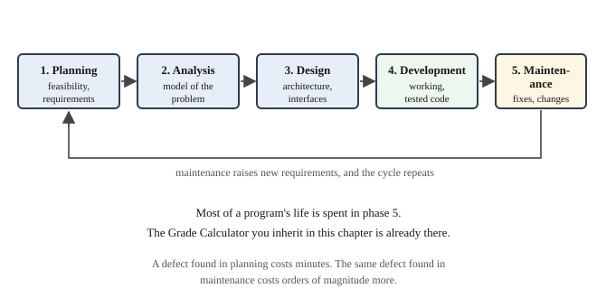

# Chapter 13 — The Software Development Lifecycle

## Learning Objectives

When you finish this chapter you will be able to:

- Identify and explain the five phases of a software development lifecycle. *(SLO 2.1)*
- Describe the inputs and outputs of each phase. *(SLO 2.1)*
- Compare waterfall, iterative, and agile lifecycle models. *(SLO 2.1)*
- Distinguish procedural, structured, and object-oriented programming methodologies. *(SLO 2.8)*
- Explain why coding standards matter and apply one to an existing codebase. *(SLO 2.4)*
- Explain why a behavior-preserving refactor must be verified, not assumed. *(SLO 2.1, 2.4)*
- Describe what version control provides and why it matters in maintenance.
- Build Grade Calculator v2.0 and write a maintenance plan for the code you inherited.

---

## 13.1 Why Process Matters

Course I taught you to write programs. Course II is about building **software** — which differs in ways that only become visible at a certain size.

A program is something you write, run, and are finished with. Software is something that gets used, misunderstood, extended, fixed, handed to someone else, and still running years later. The techniques in this course — structs, classes, inheritance, polymorphism, exceptions — exist because of that difference. They cost effort up front and repay it in change.

Course II opens here rather than with a new language feature because that framing changes what the rest of the material is *for*.

### You are now in maintenance

Look at your position honestly. You have inherited a working application — Grade Calculator v1.3 — written by someone who is no longer available: yourself, twelve chapters ago. You did not write it recently. You do not remember every decision. There is a design document, of unknown accuracy.

**That is the normal condition of professional software work.** Most programmers spend most of their time changing code they did not write. This chapter is about doing that deliberately.

---

## 13.2 The Five Phases



**Figure 13.1 — The five phases of the software development lifecycle.**

*Description of Figure 13.1.* Five phases connected in order, with an arrow returning from the last to the first.

| Phase | Question it answers | Output |
|---|---|---|
| 1. Planning | Should this be built at all? | Feasibility assessment, requirements |
| 2. Analysis | What exactly must it do? | A model of the problem |
| 3. Design | How will it be built? | Architecture, interfaces, data structures |
| 4. Development | Build it | Working, tested code |
| 5. Maintenance | Keep it working and current | Fixes and enhancements |

Maintenance raises new requirements, so the cycle repeats. Most of a program's life is spent in phase 5 — and the Grade Calculator is already there. A defect found in planning costs minutes; the same defect found in maintenance costs orders of magnitude more.

### Planning

Decide whether the work is worth doing. Gather requirements from the people who will use the thing. Estimate cost and time.

Your Chapter 1 requirements statement was planning. So was the sentence deferring weighted grading — **a scope decision is a planning decision**, and recording it is what separates a decision from an oversight.

### Analysis

Understand the problem thoroughly before deciding on a solution. What are the real-world things involved? What rules govern them? What can go wrong?

For a gradebook: what is an assignment? Can points possible be zero? Can a percentage exceed 100? Every one of those questions cost you a chapter when it arrived late.

Analysis describes the **problem**, not the solution. That distinction is easy to lose and worth guarding.

### Design

Decide how to build it. Chapter 5's structure charts and pseudocode were design. In Course II design also means deciding what the **objects** are — which is Chapter 18.

### Development

Write the code, integrate the pieces, test as you go. This is what Course I taught, and it is one phase of five.

### Maintenance

Four kinds of work happen here, and they are worth naming because people tend to think only of the first:

| Kind | Meaning | Example |
|---|---|---|
| Corrective | Fixing defects | The 89.95 boundary problem |
| Adaptive | Responding to a changed environment | A new compiler, a new file format |
| Perfective | Adding capability users want | Weighted grading |
| Preventive | Making future change easier | Refactoring; converting to classes |

**Perfective and preventive work dominate.** Most maintenance is not fixing what is broken; it is changing what works.

---

## 13.3 Lifecycle Models

The phases are the same. The models differ in how you move through them.

### Waterfall

Each phase completes before the next begins. Simple to plan and to audit.

It assumes you know all the requirements at the start, which is rarely true. And a mistake in analysis is not discovered until development, by which point it is expensive. Waterfall suits work where requirements genuinely are fixed and the cost of failure is high.

### Iterative

Go through all five phases, produce something working, then go through them again adding more.

**This book is iterative.** Every chapter produces a complete running program that does less than the next one. That is not a teaching convenience — it is a lifecycle model, and the completeness rule stated in the front matter is what makes it one. Twenty-three working versions, each a full pass through design, development, and test.

### Agile

Iterative, with short cycles, continuous user feedback, and a willingness to change requirements as understanding improves. Favors working software over documentation, and responding to change over following a plan.

**Agile does not mean no design.** It means designing continuously rather than once. The mistake agile is often used to justify — skipping analysis and design entirely — produces exactly the code Chapter 20 will show you the cost of.

| | Waterfall | Iterative | Agile |
|---|---|---|---|
| Requirements fixed up front | yes | mostly | no |
| Working software available | at the end | after each cycle | continuously |
| Cost of a late change | very high | moderate | low |
| Suits | fixed, well-understood work | most projects | evolving requirements |

---

## 13.4 Programming Methodologies

SLO 2.8 asks you to distinguish these, and Course II turns on the difference.

### Unstructured

Early programs used `goto` to jump anywhere. Control flow became impossible to follow — the term was "spaghetti code." Appendix D Section D.11 excludes `goto` for this reason.

### Procedural

Organize as a sequence of steps grouped into procedures operating on data passed to them. **Data and the code acting on it are separate.**

Course I is procedural. `computePercentage` receives points and returns a percentage; the points live elsewhere.

### Structured

Procedural, restricted to **sequence, selection, and repetition** — Chapter 5 Section 5.7. Every program in this book is structured.

### Object-oriented

Organize as **objects**, each bundling data with the operations on that data. Rather than passing a student's information to a grading function, you ask a student object for its grade.

Course II is object-oriented, and Chapters 14 and 18 make the transition concrete.

### Which is better?

Neither, and the question is worth resisting.

**Procedural code is appropriate when the data structures are simple and the operations are few.** Course I's calculator is genuinely well served by it. Nothing in v1.3 would be improved by classes.

**Object-oriented code earns its cost when a program has many kinds of thing, or when behavior must vary by kind.** That second condition is precisely what weighted grading introduces, and it is why Course II's payoff arrives in Chapter 20 rather than being asserted in Chapter 14.

---

## 13.5 Coding Standards

A **coding standard** is a written agreement about how code will be formatted, named, and documented. Appendix D is this book's.

Consistency is not aesthetics. It is about **where your attention goes.** In a codebase with one style, an unusual construct stands out because it is unusual. In a codebase with five styles, everything looks unusual and nothing stands out.

This is SLO 2.4, and it is assessed by a style audit at every milestone from here on.

### Refactoring

**Refactoring** means changing a program's internal structure without changing what it does. Every conversion in Course II is a refactor: parallel arrays to structs, structs to classes, one file to many.

The defining property is what makes it dangerous:

> **A refactor that changes behavior is a defect.**

And the only way to know whether behavior changed is to check. Not to be careful — to *check*. That is why v2.0's task is to make a substantial change and then prove, by comparing output, that nothing observable moved.

This is the discipline behind Chapter 9's rule about extracting one function at a time, and it becomes essential as the changes get larger.

### Technical debt

**Technical debt** is the accumulated cost of shortcuts. Code that works but is hard to change is borrowed time, and the interest is paid by every future modification.

Some debt is worth taking deliberately. The Grade Calculator has carried an explicit debt since Chapter 1 — the deferred weighted-grading requirement — and it was the right call, because taking it on early would have cost Course I its clarity. The distinction that matters is between debt you chose and recorded, and debt you accumulated without noticing.

---

## 13.6 Version Control

A **version control system** records every change to a codebase, with who made it and why.

It gives you four things maintenance depends on:

- **History.** What changed, when, and by whom.
- **Undo.** Return to any earlier working state.
- **Branching.** Try a change without endangering working code.
- **Collaboration.** Several people editing without overwriting each other.

Git is the dominant system, and GitHub Codespaces has it available. Three commands cover most use:

```text
git add .                        # stage your changes
git commit -m "Add drop-lowest"  # record them with a message
git log --oneline                # see the history
```

**Commit each Grade Calculator version separately, with a message saying what changed.** By Chapter 24 you will have a history of twelve versions — which is itself evidence for SLO 2.1, and considerably more convincing than a claim that you followed a process.

A good commit message says *why*, not *what*. The difference is exactly the one Appendix D Section D.3 draws about comments.

---

## Common Process Failures

| Failure | Consequence | Prevention |
|---|---|---|
| Coding before analyzing | Building the wrong thing correctly | Write a specification first |
| Undocumented scope decisions | Later readers cannot tell omission from choice | Record what is out of scope, and why |
| Refactoring without verifying | Silent behavior changes | Compare output before and after |
| Refactoring and adding features at once | You cannot tell which change broke it | Refactor, verify, *then* add |
| Ignoring the coding standard | Nothing looks unusual, so nothing stands out | Audit at every milestone |
| Undocumented technical debt | Shortcuts become permanent | Write down what you deferred |
| No version control | No undo, no history, no evidence | Commit every version |

---

## Design Notes

**Analysis describes the problem; design describes the solution.** Mixing them produces a solution to a problem nobody confirmed.

**A scope decision is only a decision if it is written down.** Otherwise it is an omission with a story attached.

**Verify behavior-preserving changes.** "I was careful" is not evidence.

**Separate refactoring from feature work.** Two changes at once means two candidate causes when something breaks.

---

## Grade Calculator v2.0 — Inherited Codebase

Two deliverables. One is a document; one is a running program, because every chapter ships one.

### Deliverable 1 — the maintenance plan

You have inherited v1.3. Write a maintenance and enhancement plan containing:

**1. What it does.** A summary of current capability, written by reading the code, not by remembering.

**2. What it does not do.** Current limitations, including the deferred weighted-grading requirement from Chapter 1.

**3. A prioritized backlog** for the term, each item classified as corrective, adaptive, perfective, or preventive:

| Item | Kind | Why |
|---|---|---|
| Conform to Appendix D | preventive | Consistency makes everything else cheaper |
| Replace parallel arrays with records | preventive | Removes a class of bug — Chapter 14 |
| Save and load gradebooks | perfective | Work is lost when the program exits |
| Fix defects found by testing | corrective | Chapter 16 |
| Sort and search the roster | perfective | Chapter 17 |
| Convert to classes | preventive | Chapter 18 |
| **Add weighted grading** | **perfective** | **The deferred requirement — Chapters 20–21** |

**4. An analysis of weighted grading.** This is the substantial part. Answer, in writing:

- What is weighted-category grading, precisely?
- How does it differ from points-based grading, arithmetically?
- Which parts of v1.3 would have to change, and which would not?
- What could go wrong — what if weights do not total 100%, or a category has no assignments yet?

Write this **before** you know how you will implement it. That is the position a maintenance programmer occupies, and doing analysis without a solution in hand is a skill worth practicing deliberately.

Chapter 20 will show you the answer. Compare it with what you wrote.

### Deliverable 2 — the program

v2.0 brings the entire Course I codebase into conformance with **Appendix D**, and adds an About screen.

**The behavior is deliberately unchanged.**

### What conforming involves

Work through Appendix D Section D.12's checklist:

- Four-space indentation, no tabs
- Braces on every block, opening brace on the same line
- No line over 90 characters
- `camelCase` variables, `SCREAMING_SNAKE_CASE` constants
- No magic numbers
- A file header with purpose and build command
- Documentation comments with `@param`, `@return`, `@pre`
- Comments explaining *why*, not *what*
- No commented-out code
- Compiles clean under `-Wall -Wextra`

### The About screen

One small visible addition, so you finish the chapter with something new you can see:

```cpp
// -----------------------------------------------------------------------------
//  showAbout - prints version and build information.
// -----------------------------------------------------------------------------
void showAbout() {
    std::cout << "\n-------------------------------------\n";
    std::cout << "  Grade Calculator\n";
    std::cout << "  Version : 2.0\n";
    std::cout << "  Course  : Object-Oriented Programming\n";
    std::cout << "  Built   : " << __DATE__ << " " << __TIME__ << "\n";
    std::cout << "  Scheme  : points-based only\n";
    std::cout << "-------------------------------------\n\n";
}
```

`__DATE__` and `__TIME__` are filled in by the **preprocessor** — Chapter 2 Section 2.2.1 — so the banner reports when the executable was built. That is genuinely useful when someone reports a bug in a version you cannot identify.

Note the last line: `Scheme : points-based only`. The program tells its user what it does not do.

### Verifying that nothing changed

This is the chapter's real lesson, and it is a procedure, not an intention.

1. Build v1.3 and v2.0 as separate executables.
2. Write a file of test input covering every case in your Chapter 12 test plan.
3. Run **both** with that input, capturing output to two files.
4. **Compare the two files.** They must be identical apart from the banner.

On the command line:

```text
printf 'n\nHomework 1\n10\nMidterm\n100\ndone\nAda\n9\n90\ndone\nn\n' > testinput.txt

./gradecalc13 < testinput.txt | tail -9 > out13.txt
./gradecalc20 < testinput.txt | tail -9 > out20.txt
diff out13.txt out20.txt
```

`diff` printing nothing means the files match. **That silence is your evidence.**

If they differ, you introduced a defect while "only" reformatting. Find it. That is the entire point of the exercise — and it is why "a refactor that changes behavior is a defect" is a rule rather than a slogan.

### Your task

1. Bring v1.3 into full conformance with Appendix D, function by function. Rebuild after each file.
2. Add the About screen as a menu option.
3. **Run the diff comparison and confirm the output is identical.** Keep the two output files as evidence.
4. Write the maintenance plan, including the weighted-grading analysis.
5. **Put the project under version control.** Commit v1.3 first, then v2.0 as a separate commit with a message explaining what changed and why.
6. Answer in writing: your conformance pass changed many lines and no behavior. What made that safe to do? What would have made it unsafe?

---

## Try It Yourself

No new C++ this chapter. These exercises are the professional skills SLO 2.1 and 2.8 name.

### 1. Classify maintenance work

Corrective, adaptive, perfective, or preventive?

- Fixing the 89.95 boundary problem from Chapter 6
- Adding weighted-category grading
- Converting parallel arrays to structs
- Updating the build command for a new compiler version
- Renaming variables to match Appendix D
- Adding a save-to-file feature
- Fixing a crash when the roster is empty

### 2. Which model?

Waterfall, iterative, or agile — and why?

- Flight control software, certified before deployment
- A startup's first product, with requirements still being discovered
- A university gradebook replacing a spreadsheet, with a fixed August deadline
- This textbook's Grade Calculator

### 3. Analysis without solution

Without writing any code, answer for weighted grading:

- Given Exams 50%, Homework 30%, Participation 20%, how is a course percentage computed from a list of assignments?
- What happens if a student has no participation assignments yet?
- What if the weights total 90% instead of 100%?
- What if an assignment has no category?
- Does bonus grading still work the same way? Does drop-lowest?

**Your answers are the analysis phase.** Keep them; Chapter 20 will let you check your reasoning.

### 4. Audit a codebase

Take one of your Chapter 11 or 12 programs and audit it against Appendix D Section D.12. List every violation. Do not fix them yet — just count them.

How many did you find? Would you have noticed any of them without the checklist?

### 5. Practice a verified refactor

Take a working program of your own. Rename every variable to be more descriptive. Change nothing else.

Then prove behavior did not change: capture output before and after with identical input, and `diff` them.

Now do it again, but deliberately introduce one small behavior change — swap two output lines. Confirm `diff` catches it. **The technique is only valuable if you have seen it detect something.**

### 6. Write a commit history

Initialize a Git repository containing your Grade Calculator. Commit v1.3, then v2.0.

Write both messages saying *why* rather than *what*. Then read them and ask: would these tell a stranger — or you in six months — what happened?

### 7. Procedural or object-oriented?

For each, say which methodology suits it better and why:

- Converting temperatures between Celsius and Fahrenheit
- A game with many kinds of character sharing some behavior
- Computing statistics for a list of numbers
- A drawing program handling circles, rectangles, and polygons
- Grade Calculator v1.3, with one grading scheme
- Grade Calculator v3.1, with three grading schemes

**The last two are the same application.** What changed between them, and why does that change the answer?

---

## Summary

- **Software** differs from a program in that it is maintained, extended, and outlives its author's memory. Course II's techniques exist for that difference.
- The **lifecycle** has five phases: **planning**, **analysis**, **design**, **development**, and **maintenance**. Most of a program's life is maintenance.
- **Analysis describes the problem; design describes the solution.** Keeping them separate prevents solving a problem nobody confirmed.
- Maintenance is **corrective**, **adaptive**, **perfective**, or **preventive**. Most is not fixing defects.
- **Waterfall** completes each phase before the next. **Iterative** repeats all phases, producing working software each cycle. **Agile** shortens the cycle and expects requirements to change. **This book is iterative.**
- Methodologies: **procedural** separates data from the code acting on it; **structured** restricts control flow to sequence, selection, and repetition; **object-oriented** bundles data with its operations. Procedural is genuinely appropriate for simple data and few operations — which is why Course I is not a straw man.
- A **coding standard** matters because consistency is what lets unusual code stand out.
- **A refactor that changes behavior is a defect** — and the only way to know is to compare output, not to be careful.
- **Technical debt** you chose and recorded is a decision. Debt you accumulated without noticing is a problem.
- **Version control** provides history, undo, branching, and collaboration. Commit each version with a message saying why.

---

## Key Terms

**adaptive maintenance** — changes responding to a changed environment.

**agile** — a lifecycle model with short cycles, continuous feedback, and changing requirements.

**analysis** — the phase that models the problem precisely.

**coding standard** — a written agreement on formatting, naming, and documentation.

**corrective maintenance** — fixing defects.

**design** — the phase deciding how a system will be built.

**development** — the phase in which code is written, integrated, and tested.

**iterative model** — a lifecycle repeating all phases, producing working software each cycle.

**maintenance** — the phase in which working software is kept correct and current.

**object-oriented programming** — organizing a program as objects bundling data with operations.

**perfective maintenance** — adding capability users want.

**planning** — the phase deciding whether and what to build.

**preventive maintenance** — changes making future modification easier.

**procedural programming** — organizing a program as procedures operating on separately held data.

**refactoring** — changing internal structure without changing behavior.

**software development lifecycle** — the phases through which software is planned, built, and maintained.

**structured programming** — restricting control flow to sequence, selection, and repetition.

**technical debt** — the accumulated future cost of shortcuts taken now.

**version control** — a system recording every change to a codebase.

**waterfall model** — a lifecycle completing each phase before beginning the next.

---

**Next:** Chapter 14 begins the technical work of Course II. Every parallel-array pair in your calculator collapses into a single record, and the class of bug where a grade attaches to the wrong student becomes structurally impossible rather than merely unlikely. Grade Calculator v2.1.
