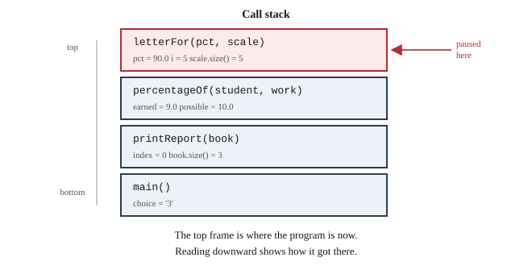

# Chapter 16 — Debugging and Testing

## Learning Objectives

When you finish this chapter you will be able to:

- Follow a systematic debugging process rather than guessing. *(SLO 2.7)*
- Set breakpoints and step through a running program. *(SLO 2.7)*
- Inspect variables and read the call stack. *(SLO 2.7)*
- Use conditional breakpoints and watch expressions. *(SLO 2.7)*
- Diagnose run-time and logic errors with a debugger. *(SLO 2.7)*
- Use assertions and diagnostic output appropriately. *(SLO 2.7)*
- Write test cases that target boundaries rather than ordinary values. *(SLO 2.1, 2.4)*
- Write a defect report and a regression test. *(SLO 2.4)*
- Build Grade Calculator v2.3 by finding and fixing three seeded defects.

---

## 16.1 Categories of Defects, Revisited

Chapter 4 Section 4.9 named four ways programs go wrong. That was a taxonomy. This chapter is the tooling.

Debugging is promoted to a full chapter here, before the object-oriented material, because you will need it for the rest of the book. A debugger is not a last resort for desperate situations. It is the ordinary way to find out what a program is actually doing rather than what you assume it is doing.

Recall the four categories:

| Kind | Found by | Difficulty |
|---|---|---|
| Compile-time | the compiler tells you the line | easiest |
| Run-time | the program crashes at a specific point | moderate |
| Logic | nothing announces it | **hardest** |
| Warning | the compiler tells you | easy, if you read them |

**Logic errors are what this chapter is really about.** The program compiles, runs, finishes, and reports a wrong grade. No message, no crash, no clue.

---

## 16.2 A Systematic Debugging Process

The instinct when something is wrong is to change code and see whether it helps. That is guessing, and it fails in a specific way: you often "fix" the symptom by breaking something else, and you never learn what was wrong.

Six steps instead:

**1. Reproduce it.** Find input that produces the fault reliably. A defect you cannot reproduce cannot be verified as fixed.

**2. Narrow it.** Find the smallest input that still fails. If a 30-student roster misreports, does a 2-student roster? Does one student?

**3. Form a hypothesis.** State what you think is wrong, specifically enough to test. "Something is wrong with the grade scale" is not a hypothesis. "`letterFor` returns the wrong letter when the percentage exactly equals a cutoff" is.

**4. Test the hypothesis.** Use the debugger to check. This is where breakpoints go.

**5. Fix it.** Change the cause, not the symptom.

**6. Verify, and write a regression test.** Confirm the fix works, confirm nothing else broke, and write a test that would have caught it — so it cannot come back silently.

Step 3 is where the discipline lives. **Before you look, predict what you will see.** If the debugger shows what you expected, your hypothesis survives and you move on. If it shows something else, you have learned something real. Either way you have made progress, which is more than guessing offers.

---

## 16.3 The Symbolic Debugger

A **symbolic debugger** runs your program under supervision, letting you pause it and inspect it in terms of *your* names — your variables, your functions, your line numbers. "Symbolic" is that last part: without it you would be reading machine registers.

This book uses the debugger in **GitHub Codespaces**, which is VS Code. The concepts transfer to any debugger; only the keystrokes differ.

### Build with debug information

The debugger needs a map from machine code back to your source. Add `-g`:

```text
g++ -std=c++17 -Wall -Wextra -g main.cpp -o gradecalc
```

Without `-g`, you can still run the program but the debugger cannot show you your variable names or lines. **A build you intend to debug must include `-g`.**

### 16.3.1 Breakpoints

A **breakpoint** tells the debugger to pause when execution reaches a particular line.

To set one in VS Code, click in the narrow gutter to the left of a line number; a red dot appears. Start debugging with **F5**. The program runs normally until it reaches that line, then stops with everything still in memory and available to inspect.

**Set a breakpoint where you can first observe the problem**, not at the top of `main`. If a grade is wrong, break at the line that computes it.

### 16.3.2 Stepping

Once paused, four commands move you forward:

| Command | Key | Does |
|---|---|---|
| Continue | F5 | run until the next breakpoint |
| Step Over | F10 | execute this line; do not enter functions it calls |
| Step Into | F11 | execute this line, entering the first function it calls |
| Step Out | Shift+F11 | finish the current function and return to its caller |

The distinction that matters is **Step Over** versus **Step Into**. If a line calls `computePercentage` and you trust it, step *over* — the call happens and you stay put. If you suspect it, step *into* and watch it work.

**A useful strategy:** step over everything until you see a value go wrong, then rerun and step *into* the call that produced it. Repeating this narrows the fault to one function quickly, without reading the whole program.

### 16.3.3 Inspecting Variables

Paused, you can see everything:

- The **Variables** panel lists locals and their current values automatically.
- **Hovering** over a name in the editor shows its value.
- The **Watch** panel evaluates expressions you supply, updating as you step.

Watch expressions are the underused one. You can watch `scale.size()`, or `earned / possible`, or a comparison such as `pct >= 90.0` — and see it as `true` or `false` at each step. **Watching the exact condition you suspect is often faster than reasoning about it.**

### 16.3.4 The Call Stack

The **call stack** shows how execution reached the current line: which function called which.



**Figure 16.1 — The call stack when a defect is reached.**

*Description of Figure 16.1.* Four **stack frames**, drawn bottom to top. At the bottom is `main()`, holding `choice = '3'`. Above it is `printReport(book)`, holding `index = 0` and `book.size() = 3`. Above that is `percentageOf(student, work)`, holding `earned = 9.0` and `possible = 10.0`. At the top, where execution is paused, is `letterFor(pct, scale)`, holding `pct = 90.0`, `i = 5`, and `scale.size() = 5`. The top frame is where the program is now; reading downward shows how it got there.

Each **frame** holds one function call's local variables. Clicking a frame switches the Variables panel to *that* function's locals, so you can inspect the caller's state without restarting.

The call stack answers a question that is otherwise very hard: **"how did I get here?"** When a function misbehaves only sometimes, the stack shows which caller produced the bad call — and looking at that caller's variables usually explains why.

Look closely at the top frame in Figure 16.1. The loop index `i` is 5 and `scale.size()` is also 5. That is a valid index range of 0 to 4, and `i` is 5. **The defect is visible in the frame**, without reading a line of code.

### 16.3.5 Conditional Breakpoints and Watchpoints

A plain breakpoint inside a loop over 300 students fires 300 times. A **conditional breakpoint** fires only when a condition holds.

In VS Code, right-click a breakpoint and choose *Edit Breakpoint*, then enter a condition:

```text
student.id == 1042
percentage >= 89.0 && percentage <= 91.0
i >= scale.size()
```

That last one is a debugging technique worth remembering: **break when the thing you believe is impossible happens.** If the breakpoint never fires, your belief was right. If it fires, you are standing exactly where the defect is.

A **watchpoint**, or data breakpoint, pauses when a *variable changes* rather than when a line is reached. It answers the other hard question — "what changed this?" — which is otherwise a search through everything that could touch it.

---

## 16.4 Debugging Run-Time Errors

A crash gives you a location for free. Run under the debugger and the program stops at the failing line with the call stack intact.

Common causes and what to look for:

| Symptom | Likely cause | Check |
|---|---|---|
| Crash on `v[k]` | index out of range | `k` and `v.size()` in the Variables panel |
| Crash on `*ptr` | null or dangling pointer | is `ptr` `nullptr` or nonsense? |
| Crash on division | integer division by zero | the denominator |
| Crash deep in library code | bad argument from your code | the call stack — find *your* nearest frame |

That last row is worth emphasizing. A crash inside `std::vector`'s internals is almost never a bug in `std::vector`. **Walk down the call stack to the first frame that is your code**, and look at what it passed.

---

## 16.5 Debugging Logic Errors

No crash, no location. The technique is bisection.

1. Identify a place where a value is definitely **right** — usually just after input.
2. Identify a place where it is definitely **wrong** — usually the report.
3. Set a breakpoint halfway between, and check.
4. Whichever half contains the transition, repeat there.

Each step halves the search. A fault anywhere in a thousand lines is located in about ten checks.

Section 16.2's discipline applies at every step: **predict the value before you look.** A value that matches your expectation moves the boundary. A value that does not is the answer.

---

## 16.6 Assertions and Diagnostic Output

Not every problem needs a debugger.

### Assertions

An **assertion** states something you believe must be true. If it is not, the program stops immediately and tells you where:

```cpp
#include <cassert>

double computePercentage(double earned, double possible) {
    assert(possible > 0.0);          // the caller's precondition
    return earned / possible * 100.0;
}
```

Assertions document assumptions **and check them**. Chapter 9 Section 9.8 had you write `@pre possible > 0` in a comment; an assertion is the same statement, enforced.

They are removed when the program is compiled with `NDEBUG` defined, so they cost nothing in a release build. **Assert what must never happen; do not assert on user input** — bad input is expected, and belongs in validation or, from Chapter 24, in an exception.

### Diagnostic output

Printing values is legitimate and sometimes faster than a debugger, especially for a fault that appears once in a thousand iterations:

```cpp
std::cout << "[debug] pct=" << pct << " i=" << i
          << " size=" << scale.size() << "\n";
```

Two rules. **Mark it clearly** — a `[debug]` prefix makes it findable. And **remove it before you commit**; Appendix D Section D.11 excludes leftover debugging output for the same reason it excludes commented-out code.

A debugger is better when you need to look around; printing is better when you need to see a pattern over many iterations.

---

## 16.7 Writing Test Cases

A **test case** is an input with a known expected result, worked out independently of the program.

That last clause is the whole discipline. If you compute the expected answer *by running the program*, you have tested nothing — you have recorded what it does.

### Boundary testing

**Bugs live at boundaries.** Ordinary values almost never find them.

For a grade cutoff of 90:

| Test | Why |
|---|---|
| 89.9 | just below |
| **90.0** | **exactly at** |
| 90.1 | just above |
| 89.95 | rounds to 90.0 — Chapter 6's problem |

For a roster:

| Test | Why |
|---|---|
| 0 students | empty case |
| 1 student | minimum non-empty |
| many students | ordinary |

For points possible:

| Test | Why |
|---|---|
| 0 | division by zero |
| positive | ordinary |
| earned > possible | bonus pushing past 100 |

**Every one of these has already caused a problem in this book.** That is not coincidence — it is what boundary means.

### A simple test harness

You do not need a framework:

```cpp
int checksRun = 0;
int checksFailed = 0;

void check(bool condition, const std::string& label) {
    ++checksRun;
    if (condition) {
        std::cout << "  PASS  " << label << "\n";
    } else {
        ++checksFailed;
        std::cout << "  FAIL  " << label << "\n";
    }
}
```

Then state each expectation as a line of code:

```cpp
check(letterFor(90.0, scale) == 'A', "90.0 is an A, not a B");
check(letterFor(0.0, scale)  == 'F', "0.0 is an F, no out-of-range read");
```

Two dozen of these run in a second and are worth more than an hour of manual clicking.

### Regression tests

A **regression test** is a test written in response to a specific defect, which fails before the fix and passes after.

Its purpose is not to find the bug — the bug is already found. Its purpose is to ensure the bug **cannot return unnoticed**. Defects have a way of coming back when someone later "simplifies" the fix without knowing why it was there.

**Every defect you fix should leave a regression test behind.** That is step 6 of Section 16.2, and it is the step people skip.

---

## 16.8 Documenting Defects

A **defect report** records what was wrong so the work is not repeated. Six fields:

| Field | Contents |
|---|---|
| Symptom | What was observed |
| Reproduction | The exact input that triggers it |
| Diagnosis | The actual cause, in the code |
| Fix | What changed |
| Verification | How the fix was confirmed |
| Regression test | The test that would have caught it |

An example, from a defect you are about to find:

> **Symptom.** A student with exactly 90.0% receives a B instead of an A.
> **Reproduction.** One assignment, 9 points earned out of 10, default scale.
> **Diagnosis.** `letterFor` compares with `>` instead of `>=`, so a percentage exactly at a cutoff falls through to the next tier.
> **Fix.** Changed `>` to `>=` in `letterFor`.
> **Verification.** 90.0 now returns A; 89.9 still returns B.
> **Regression test.** `check(letterFor(90.0, scale) == 'A', "90.0 is an A, not a B");`

---

## Common Debugging Mistakes

| Mistake | Why it fails | Instead |
|---|---|---|
| Changing code before understanding | Fixes the symptom, hides the cause | Form a hypothesis first |
| Debugging without `-g` | No names, no line numbers | Rebuild with `-g` |
| Breaking at the top of `main` | Hundreds of steps to reach the fault | Break where you can observe it |
| Ignoring the call stack | Missing how you got here | Read it every time you pause |
| Testing only ordinary values | Boundaries are where bugs are | Test at and beside every boundary |
| Computing expected results with the program | Tests only what it does, not what is right | Work them out by hand |
| Fixing without a regression test | The defect returns silently | Write the test |
| Leaving debug output in | Clutter, and it eventually ships | Remove before committing |

---

## Design Notes

**Predict before you look.** A debugger that confirms your expectation moves you forward; one that surprises you has found something.

**Break on the impossible.** A conditional breakpoint on a condition you believe cannot occur is free if you are right and decisive if you are wrong.

**Test at boundaries.** Ordinary values are the least informative input you can choose.

**Every fix leaves a test behind.** Otherwise you are relying on nobody ever touching that line again.

---

## Grade Calculator v2.3 — Defect Hunt

### The lab

You will seed **three defects into your own working v2.2**, one at a time, observe
each failure, and then restore the correct code. These are the only intentionally
broken lines in the book, and you introduce them deliberately so that you know
what a correct program looked like ten seconds earlier.

Work on a copy of your v2.2 code in the StudySite editor, and do not commit a
seeded defect to GitHub. The three defects are:

1. change a grade-cutoff comparison from `>=` to `>`;
2. add bonus points to *possible* points as well as earned points; and
3. allow the grade-scale loop to read index `size()`.

Each defect is invisible on ordinary input and obvious on boundary input. That is precisely why they are worth finding with a debugger rather than by reading.

### Symptoms

Seed a defect, click **Run**, and try these in the Terminal:

1. Enter one assignment worth 10 points, and a student earning **exactly 9** with no bonus. The percentage shows 90.0%. What letter?

2. Enter a student earning **8 points with 2 bonus** on a 10-point assignment. What percentage is reported? Compute it by hand first.

3. Enter a grade scale with **no tier at 0** — say A at 90 and B at 80 only — then a student scoring 50%. What happens?

### Your StudySite Lab — Debug and Add Regression Tests

- **Course:** COSC 1437 — Object-Oriented Programming
- **Project checkpoint:** v2.3
- **Starting point:** The working Chapter 15 v2.2 program.

> **One-repository rule:** Continue in the same COSC 1437 Grade Calculator
> repository from Chapter 13 through Chapter 24. Do not create a chapter folder
> or a new repository. The supplied Chapter 12 solution is the foundation;
> your COSC 1437 work is what you add in Chapters 13–24.

#### Required work

1. Use the three supplied defect descriptions: change a grade cutoff comparison from `>=` to `>`; add bonus points to possible points; and allow a grade-scale loop to read index `size()`.
2. Observe each failure, then restore the correct code one defect at a time.
3. Add a small regression-test harness and a menu option that runs it.
4. Add tests for exact cutoffs, zero percent, below-scale input, bonus arithmetic, zero possible points, an empty roster, and a capped percentage.
5. Create `defect-reports.md` recording symptoms, reproduction steps, cause, correction, and regression test for all three defects.


#### Verification

- All seeded defects fail at least one test before correction.
- All regression tests pass after correction.
- Ordinary input and boundary input both produce correct results.
- The normal Grade Calculator menu still works.

#### StudySite workflow

1. Confirm that your previous chapter is committed on GitHub, then open this
   chapter's **coding panel on the StudySite main stage**.
2. Close stale project tabs from an earlier session before loading. This
   avoids creating files with names such as `_imported` when the same path
   is already open.
3. Click **Load from GitHub**, select
   **COSC1437F26-Grade-Calculator-YourLastName**, and click each source,
   header, or documentation file needed for this chapter. Confirm the editor
   shows the expected file paths before editing.
4. Continue the existing project in StudySite's internal editor. For a
   multi-file program, keep every source and header file needed by the build
   open in the editor.
5. Click **Run**. Read compiler messages and program output in the embedded
   Terminal, and type program input there when prompted.
6. Fix every compiler error and warning, then complete the verification
   list.
7. Use the Tutor with the current code or Terminal output when you need
   help.

#### Save this checkpoint

> **IMPORTANT — commit to save your work:** StudySite autosaves editor tabs
> locally on this device, but local autosave is not a durable GitHub backup.
> Your work is not safely saved in your repository until **Save to GitHub**
> finishes a successful **Commit**.

1. Keep every project file that belongs in this checkpoint open in the
   editor. **Save to GitHub includes every open editor file**, so close
   scratch files and accidental `_imported` duplicates first.
2. Click **Save to GitHub**.
3. Select **COSC1437F26-Grade-Calculator-YourLastName** and the existing
   **main** branch.
4. Enter the commit message **Complete Chapter 16 Grade Calculator v2.3**.
5. Click **Commit** and wait for StudySite's confirmation.
6. Open the commit link, or open the repository on GitHub, and confirm the
   new commit and expected files are present before leaving StudySite.

#### Complete when

- The verification list passes.
- **COSC1437F26-Grade-Calculator-YourLastName** contains the Chapter 16
  checkpoint.
- The GitHub commit is visible; StudySite's local autosave alone is not
  completion.

---

### The expected result

Your v2.3 should produce this from the test menu option:

```text
--- Regression tests ---
  PASS  D3 90.0 is an A, not a B
  PASS  D3 80.0 is a B, not a C
  PASS  D3 60.0 is a D, not an F
  PASS  D1 0.0 is an F, no out-of-range read
  PASS  D1 below scale returns '?', no crash
  PASS  D2 8+2 bonus of 10 is 100%, not 83.3%
  PASS  D2 8 of 10 with no bonus is 80%
  PASS  zero points possible does not crash
  8 of 8 checks passed.
```

### What to notice about these three defects

**All three pass ordinary input.** A student with 84 out of 100 and no bonus receives a B from the broken build and from the fixed one. Any amount of casual testing would miss all three.

**Two of them produce plausible wrong answers.** The bonus defect reports 83.3% instead of 100% — a number that looks like a grade, on a report that looks correct. Nothing announces it. This is the logic error of Chapter 4 Section 4.9.3, and it is why grades computed by software need tests rather than confidence.

**One of them is undefined behavior that may not crash.** The out-of-range read may return a plausible letter, a nonsense letter, or crash — possibly differently on different days. Chapter 11 Section 11.3 warned that this is the most dangerous thing in that chapter. Here it is.

### Additional exercises

4. **Find a defect by bisection.** Have a classmate change one character in your working v2.3 without telling you where. Locate it using Section 16.5's halving technique. Count the steps.

5. **Use a watchpoint.** Set one on `totalEarned` and run a three-assignment entry. How many times does it change? Is that what you expected?

6. **Add an assertion** to `computePercentage` stating its precondition. Deliberately violate it and observe what an assertion failure looks like.

7. **Extend the harness.** Add checks for: an empty roster, a student with no assignments, a bonus pushing past 100 with the cap on, and a percentage of exactly 89.95. All should pass; if any fails, you have found a fourth defect.

---

## Try It Yourself

### 1. A test harness

```cpp
#include <iostream>
#include <string>

int checksRun = 0;
int checksFailed = 0;

void check(bool condition, const std::string& label) {
    ++checksRun;
    if (condition) {
        std::cout << "  PASS  " << label << "\n";
    } else {
        ++checksFailed;
        std::cout << "  FAIL  " << label << "\n";
    }
}

int main() {
    check(2 + 2 == 4, "arithmetic works");
    check(2 + 2 == 5, "this one should fail");
    std::cout << "  " << (checksRun - checksFailed) << " of "
              << checksRun << " checks passed.\n";
    return 0;
}
```

**Expected output:**

```text
  PASS  arithmetic works
  FAIL  this one should fail
  1 of 2 checks passed.
```

*Try:* Make `main` return 1 when any check fails. Why would that matter to an automated build?

### 2. Boundary testing a grade scale

```cpp
#include <iostream>
#include <string>
#include <vector>

struct GradeTier { double cutoff = 0.0; char letter = 'F'; };

char letterFor(double pct, const std::vector<GradeTier>& scale) {
    for (const GradeTier& t : scale) {
        if (pct >= t.cutoff) { return t.letter; }
    }
    return '?';
}

int main() {
    std::vector<GradeTier> scale = {{90.0,'A'},{80.0,'B'},{70.0,'C'},{60.0,'D'},{0.0,'F'}};
    double tests[7] = {90.1, 90.0, 89.9, 80.0, 60.0, 0.0, -1.0};
    for (double t : tests) {
        std::cout << t << " -> " << letterFor(t, scale) << "\n";
    }
    return 0;
}
```

**Expected output:**

```text
90.1 -> A
90 -> A
89.9 -> B
80 -> B
60 -> D
0 -> F
-1 -> ?
```

*Try:* Change `>=` to `>` and rerun. Four lines change — every test that sits *exactly* on a cutoff, including 0.0, which now matches no tier at all and returns `?`. Identify all four and explain why the other three are unaffected.

### 3. Assertions

```cpp
#include <cassert>
#include <iostream>

double computePercentage(double earned, double possible) {
    assert(possible > 0.0);
    return earned / possible * 100.0;
}

int main() {
    std::cout << computePercentage(84.0, 100.0) << "\n";
    return 0;
}
```

**Expected output:**

```text
84
```

*Try:* Call it with `possible` of 0. Observe the assertion message — it names the file, line, and failed condition. Then rebuild with `-DNDEBUG` and call it again. What happens now, and what does that tell you about relying on assertions for user input?

### 4. Read a call stack

Build this with `-g`, set a breakpoint on the marked line, run it, and read the call stack.

```cpp
#include <iostream>

double level3(double x) {
    double result = x * 2.0;     // <-- breakpoint here
    return result;
}
double level2(double x) { return level3(x + 1.0); }
double level1(double x) { return level2(x * 10.0); }

int main() {
    std::cout << level1(4.0) << "\n";
    return 0;
}
```

**Expected output:** `82`

*Try:* When paused, how many frames are on the stack? Click each and note the value of `x`. Can you explain how 4.0 became 41.0 by reading only the stack?

### 5. Bisection in practice

Take a working program of at least 60 lines. Have someone change one character — a `<` to `<=`, a `+` to `-`.

Find it by bisection. Record how many breakpoints you needed. Then find it by reading the code, and compare the time.

### 6. Write a defect report

Using the six fields from Section 16.8, write a full report for the 89.95 problem from Chapter 6 Section 6.12 — including the regression test that would have caught it.

### 7. Design test cases from a specification

*A student passes if their course percentage is 60% or higher. Bonus points count toward the percentage. A student with no assignments has no grade.*

List every test case you would write. Aim for at least eight, and justify each in a few words. At minimum you should cover: exactly 60, just below 60, no assignments, one assignment worth zero points, and a bonus that pushes a failing score to passing.

---

## Summary

- Debugging is a **systematic process**: reproduce, narrow, hypothesize, test, fix, verify with a regression test. **Predict before you look.**
- A **symbolic debugger** pauses a running program and shows it in terms of your own names. Build with **`-g`**.
- A **breakpoint** pauses at a line. **Step Over** executes without entering calls; **Step Into** enters them; **Step Out** finishes the current function.
- The **Variables** panel and **Watch** expressions show current values. Watching the exact condition you suspect is often faster than reasoning about it.
- The **call stack** shows how execution reached here. Each **frame** holds one call's locals. When a crash is deep in library code, walk down to your nearest frame.
- **Conditional breakpoints** fire only when a condition holds — including conditions you believe are impossible.
- Find logic errors by **bisection** between a known-good point and a known-bad one.
- **Assertions** state and check what must never happen. Do not assert on user input.
- A **test case** has an expected result **worked out independently of the program**.
- **Bugs live at boundaries** — zero, empty, exactly at a cutoff, one past the end.
- A **regression test** fails before a fix and passes after, ensuring the defect cannot return silently. **Every fix leaves one behind.**

---

## Key Terms

**assertion** — a checked statement of something that must be true, removed in release builds.

**breakpoint** — an instruction to pause execution at a particular line.

**call stack** — the sequence of function calls leading to the current point.

**conditional breakpoint** — a breakpoint that pauses only when a condition holds.

**defect report** — a record of a fault's symptom, cause, fix, and verification.

**regression test** — a test written for a specific defect, failing before the fix and passing after.

**stack frame** — one function call's entry on the call stack, holding its local variables.

**step into** — execute the current line, entering any function it calls.

**step out** — finish the current function and return to its caller.

**step over** — execute the current line without entering functions it calls.

**symbolic debugger** — a debugger presenting a program in terms of its source names.

**test case** — an input paired with an independently determined expected result.

**watch expression** — an expression the debugger evaluates and displays as you step.

**watchpoint** — a breakpoint that fires when a variable's value changes.

---

**Next:** Chapter 17 puts your roster in order. Sorting and searching are the first real algorithms in this book, and you will implement them, trace them by hand, and measure the difference between a linear scan and a binary search on your own data. Grade Calculator v2.4.
