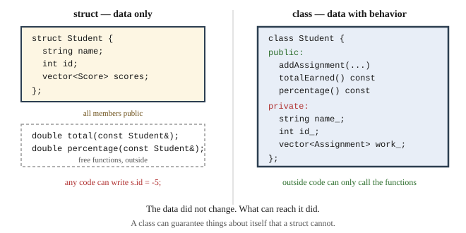

# Chapter 18 — Classes and Objects

## Learning Objectives

When you finish this chapter you will be able to:

- Explain the difference between a class and an object. *(SLO 2.2)*
- Declare a class with private data and public member functions. *(SLO 2.2)*
- Explain encapsulation and why data members are private. *(SLO 2.2, 2.3)*
- Write constructors, including a default and a parameterized one. *(SLO 2.2)*
- Write accessors and mutators, and mark non-modifying functions `const`. *(SLO 2.2)*
- State a class invariant and enforce it in the constructor. *(SLO 2.2, 2.8)*
- Identify candidate classes from a requirements statement. *(SLO 2.2)*
- Build Grade Calculator v2.5, in which an invalid grade scale becomes impossible to construct.

---

## 18.1 From Struct to Class

Chapter 14 gave you records. Chapter 14 Section 14.8 also named what they do not do:

- **Nothing protects the members.** Any code can write `s.id = -5;`.
- **The related functions live outside**, among every other function in the file.

A **class** fixes both. This is item six on your Chapter 13 backlog — *preventive* maintenance, making future change cheaper.



**Figure 18.1 — A struct compared with a class holding the same data.**

*Description of Figure 18.1.* The left panel shows `struct Student` with three public members — `name`, `id`, `scores` — and, drawn separately outside the struct in a dashed box, the free functions `total` and `percentage`. A note records that any code can write `s.id = -5;`.

The right panel shows `class Student` with the same information, arranged differently: a `public:` section listing `addAssignment`, `totalEarned`, and `percentage`, and a `private:` section holding `name_`, `id_`, and `work_`, all inside one boundary. A note records that outside code can only call the functions.

**The data did not change. What can reach it did.**

---

## 18.2 Objects, State, and Behavior

An **object** bundles **state** — the data it holds — with **behavior** — the operations on that data.

A **class** describes what objects of a kind look like and can do. An **object** is one actual instance:

```cpp
Student ada("Ada Lovelace", 1001);      // one object
Student grace("Grace Hopper", 1002);    // another, independent
```

A class is a blueprint; objects are the buildings. Each object has its own copy of the data.

You have used objects since Chapter 12. `std::vector<double> scores;` creates an object; `scores.push_back(9.0)` calls a member function on it; the vector's internal storage is state you never see. Everything in this chapter is how that was built.

---

## 18.3 Declaring a Class

```cpp
class Student {
public:
    Student() = default;
    Student(const std::string& name, int id);

    const std::string& name() const { return name_; }
    int id() const { return id_; }

    void addAssignment(const Assignment& a);
    double totalEarned() const;
    double percentage() const;

private:
    std::string name_;
    int id_ = 0;
    std::vector<Assignment> assignments_;
};
```

Three things to note.

**Access specifiers.** `public:` members are reachable by any code. `private:` members are reachable only from inside the class. Everything after a specifier has that access until the next one.

**Ordering.** Appendix D Section D.7 requires `public` first, then `protected`, then `private` — because the interface is what a reader wants and the implementation is what they can skip.

**Trailing underscores.** `name_`, `id_` — Appendix D Section D.2's convention, so you can tell a member from a local at every point of use, and so a constructor parameter can share its member's name without ambiguity.

> `struct` and `class` are the same construct in C++, differing only in default access: struct members are public, class members are private. Everything here could be written with `struct`. The convention this book follows is `struct` for plain data with no invariants, `class` when there is behavior or something to protect.

---

## 18.4 Member Functions

A **member function** is declared inside the class and operates on the object it is called on:

```cpp
double Student::totalEarned() const {
    double sum = 0.0;
    for (const Assignment& a : assignments_) {
        sum += a.totalEarned();
    }
    return sum;
}
```

`Student::` says which class this belongs to. Inside, `assignments_` refers to **this object's** member — no parameter needed, because the object is implicit.

Compare with the free function from Chapter 14:

```cpp
double total(const Student& s);      // Chapter 14: takes the student
double Student::totalEarned() const; // Chapter 18: is part of the student
```

Called as `ada.totalEarned()`, which reads as asking the object for something rather than performing an operation on it.

### `const` member functions

A member function that does not modify the object is marked `const`:

```cpp
double totalEarned() const;    // does not change the object
void addAssignment(const Assignment& a);   // does
```

This matters more than it looks. **A `const` object can only have its `const` member functions called.** Since Chapter 10 you have been passing things as `const Student&`, so without `const` member functions, a `const Student` would be nearly useless.

Appendix D Section D.5 asks you to do this from the start: retrofitting `const` onto a finished class is tedious, and until it is done, `const` references are unusable.

---

## 18.5 Encapsulation

**Encapsulation** is bundling data with the functions that operate on it, and restricting access to the data.

The word people reach for is "hiding," which undersells it. The point is not secrecy. **The point is that a class can guarantee things about itself that a struct cannot.**

With a struct:

```cpp
Student s;
s.id = -5;                    // nonsense, and nothing stops it
s.scores.clear();             // now scores and assignments disagree
```

With a class, those members are private. The only way to change a `Student` is through its member functions, and those can check.

Two practical consequences:

**You can change the implementation freely.** If `Student` stores a cached total instead of recomputing it, no calling code changes — the interface is the same. With public members, every user of `scores` is a user of your implementation.

**Bugs have a small number of suspects.** When a `Student` holds a wrong value, the only code that could have caused it is `Student`'s own member functions. That is a handful of functions instead of the whole program — the same argument Chapter 10 Section 10.1 made against globals, applied at a smaller scale.

---

## 18.6 Constructors

A **constructor** runs when an object is created, and its job is to leave the object in a valid state.

```cpp
class Student {
public:
    Student() = default;                                   // default constructor
    Student(const std::string& name, int id);              // parameterized
    // ...
};

Student::Student(const std::string& name, int id)
    : name_(name), id_(id) {}
```

The `: name_(name), id_(id)` is an **initializer list**, and it runs before the constructor body. Prefer it to assignment inside the body — it initializes members directly rather than default-constructing them and then overwriting.

`= default` asks the compiler to generate the obvious default constructor. Combined with member defaults declared in the class, that is usually all you need:

```cpp
private:
    std::string name_;
    int id_ = 0;
    std::vector<Assignment> assignments_;
```

### `explicit`

A single-argument constructor should usually be `explicit`:

```cpp
explicit GradeScale(const std::vector<Tier>& requested);
```

Without it, the compiler will silently convert a `std::vector<Tier>` into a `GradeScale` anywhere one is expected — including places you did not intend. Appendix D Section D.7 requires `explicit` unless the implicit conversion is genuinely wanted.

### Destructors

A **destructor** runs when an object is destroyed:

```cpp
~Student();
```

For a class holding only `std::string` and `std::vector`, you do not need one — those clean up after themselves. Destructors become essential in Chapter 22, when a class owns memory directly.

---

## 18.7 Accessors and Mutators

An **accessor** reads state; a **mutator** changes it:

```cpp
const std::string& name() const { return name_; }     // accessor
void setName(const std::string& n) { name_ = n; }     // mutator
```

A caution worth taking seriously: **an accessor and mutator for every member is a struct with extra steps.**

```cpp
// This class protects nothing.
class Student {
public:
    int getId() const { return id_; }
    void setId(int id) { id_ = id; }      // still allows id = -5
private:
    int id_ = 0;
};
```

Ask what the class is *for*. A `Student` needs `addAssignment` and `percentage` — operations meaningful in the problem. It does not need `setScores`, because nothing in the problem replaces a student's entire score list.

**Provide the operations the problem needs, not one pair per member.** That distinction is what separates object-oriented design from struct-with-ceremony.

---

## 18.8 Class Invariants

An **invariant** is something that is always true of an object, from construction until destruction.

This is the most valuable idea in the chapter.

Since Chapter 11, your grade scale has needed three properties: cutoffs strictly descending, no negative cutoffs, and a bottom tier at 0 so every percentage maps to a letter. You have been checking these by hand in `readGradeScale`, and every future path that builds a scale would need the same checks.

State it once, as an invariant, and enforce it in the constructor:

```cpp
/**
 * An ordered set of grade cutoffs.
 * INVARIANT: cutoffs strictly descend and the lowest tier is 0, so every
 * percentage from 0 upward maps to exactly one letter. The constructor
 * establishes this, and no member function can break it.
 */
class GradeScale {
public:
    struct Tier { double cutoff = 0.0; char letter = 'F'; };

    GradeScale() {
        tiers_ = { {90.0,'A'}, {80.0,'B'}, {70.0,'C'}, {60.0,'D'}, {0.0,'F'} };
    }

    explicit GradeScale(const std::vector<Tier>& requested) {
        for (const Tier& t : requested) {
            if (t.cutoff < 0.0) { continue; }
            if (!tiers_.empty() && t.cutoff >= tiers_.back().cutoff) { continue; }
            tiers_.push_back(t);
        }
        if (tiers_.empty() || tiers_.back().cutoff > 0.0) {
            tiers_.push_back({0.0, 'F'});
        }
    }

    char letterFor(double percentage) const {
        for (const Tier& t : tiers_) {
            if (percentage >= t.cutoff) { return t.letter; }
        }
        return tiers_.back().letter;
    }

private:
    std::vector<Tier> tiers_;
};
```

Feed it deliberate nonsense — out of order, negative, no floor tier:

```cpp
GradeScale bad({{90.0,'A'}, {95.0,'X'}, {-5.0,'Q'}, {85.0,'B'}});
```

```text
repaired tiers=3
  96 -> A
  90 -> A
  86 -> B
  10 -> F
```

The `X` tier was rejected because 95 is not below 90. The `Q` tier was rejected as negative. A floor tier was added. **What survived is a valid scale**, and there was never a moment when the object was invalid.

### What the invariant buys

Look at `letterFor` again. It has **no error handling**. No check that the scale is non-empty, no `'?'` return for a percentage below every tier, no defensive anything.

It does not need any, because the constructor guarantees the scale is usable. Compare with Chapter 11's version, which returned `'?'` when nothing matched — a value every caller then had to handle.

**An invariant established in the constructor is a fact the rest of your code may rely on without checking.** That is the entire return on encapsulation, and it is why the members must be private: if a caller could write `tiers_` directly, the guarantee would be worthless.

### Repair or reject?

This version *repairs* bad input. That is one policy. The alternative is to refuse — to make constructing an invalid `GradeScale` impossible rather than silently corrected.

Repair is friendlier and hides the fact that the user's input was wrong. Rejection is honest and requires a way to report the failure, which you do not have until Chapter 24.

**Chapter 24 switches this class to rejection**, throwing `InvalidScaleError`. Notice that the *invariant* does not change — only what happens when someone violates it. That is a sign the invariant was the right thing to state.

---

## 18.9 Identifying Classes from Requirements

Chapter 14 Section 14.7 found records by looking for **nouns**. Classes are found the same way, with an added question.

For each noun, ask: **does it have behavior, or rules about what values are valid?**

| Noun | Behavior or rules? | Verdict |
|---|---|---|
| Assignment | computes its own total and ratio | class |
| Student | accumulates work, computes a percentage | class |
| Grade scale | must be ordered and complete | class — the invariant demands it |
| Tier | a cutoff and a letter, nothing more | **struct**, nested inside `GradeScale` |
| Score | two numbers | struct — or fold into `Assignment` |

`GradeScale::Tier` staying a struct is deliberate. It has no behavior and no invariant of its own; it exists only as part of a scale. Making it a class would add ceremony and protect nothing. **Not everything should be a class.**

Note also that `Tier` is declared *inside* `GradeScale`. A tier has no meaning apart from a scale, and nesting says so — Appendix D Section D.4's guidance about small helper types.

---

## Common Errors and Warnings

| What you see | Cause | Fix |
|---|---|---|
| `error: 'name_' is private within this context` | Outside code touching a private member | Add an accessor, or a real operation |
| `error: passing 'const Student' as 'this' discards qualifiers` | Non-`const` function called on a `const` object | Mark the function `const` |
| `error: no matching function for call to 'Student::Student()'` | No default constructor, but one is needed | Add `Student() = default;` |
| `error: expected ';' after class definition` | Missing semicolon after `}` | Add `;` |
| Members hold garbage | Constructor did not initialize them | Use an initializer list, or member defaults |
| A conversion happens unexpectedly | Single-argument constructor not `explicit` | Mark it `explicit` |
| `error: 'class Student' has no member named 'Name'` | Wrong capitalization | C++ is case-sensitive |
| An object reaches an invalid state | The invariant is not enforced | Enforce it in the constructor; keep members private |

---

## Design Notes

**Data members are always private.** A public member is a promise you cannot take back.

**Mark every non-modifying member function `const`, from the start.**

**State the invariant in a comment above the class, and enforce it in the constructor.** Then trust it everywhere else.

**Provide the operations the problem needs, not a getter and setter per member.**

**Not everything is a class.** Plain data with no rules stays a struct.

---

## Grade Calculator v2.5 — Student and GradeScale Classes

### What v2.5 does

Everything v2.4 did, with `Student`, `Assignment`, and `GradeScale` converted from structs to classes. Behavior is unchanged; **what can reach the data is** — and one class of defect disappears.

### A restructure worth noting

Each `Student` now owns its own `Assignment` objects, where previously assignments were a separate list and students held parallel scores:

```cpp
class Assignment {
public:
    Assignment(const std::string& name, double earned, double possible, double bonus = 0.0);
    const std::string& name() const { return name_; }
    double totalEarned() const;      // earned + bonus
    double ratio() const;            // fraction of possible, or 0
private:
    std::string name_;
    double pointsEarned_   = 0.0;
    double pointsPossible_ = 0.0;
    double bonusPoints_    = 0.0;
};
```

This removes the correspondence problem entirely. A student's assignments cannot be out of step with a separate list, because there is no separate list. It also makes `Student::percentage()` self-contained:

```cpp
double Student::percentage() const {
    double possible = totalPossible();
    if (possible <= 0.0) { return 0.0; }
    double raw = totalEarned() / possible * 100.0;
    double reported = CAP_AT_100 ? std::min(raw, 100.0) : raw;
    return std::round(reported * 10.0) / 10.0;
}
```

No parameters. The student has everything it needs.

### GradeScale enforces its invariant

The class from Section 18.8, used directly:

```cpp
GradeScale scale;                    // default: A/B/C/D/F, valid by construction
scale = GradeScale(userTiers);       // custom: repaired to valid, or built valid
```

`readGradeScale`'s hand-written validation from Chapter 11 is **gone**. It moved into the constructor, where it cannot be bypassed.

### Expected output

Add Ada with `HW1` 9/10 bonus 1 and `Midterm` 84/100 bonus 5, view the report, then set a custom scale of A 93, B 85, and a deliberately invalid tier `ZZZ` at 99:

```text
  Scale: A >= 90   B >= 80   C >= 70   D >= 60   F >= 0   
1001  Ada                     90.0%   A
  Scale accepted.
  Scale: A >= 93   B >= 85   F >= 0   
1001  Ada                     90.0%   B
```

Three things happened. The `ZZZ` tier at 99 was **silently rejected**, because 99 is not below 93. A floor tier `F` at 0 was **added**, because the user's scale did not reach 0. And the same 90.0% became a **B** under the stricter scale — the data changed, not the code.

### What to notice

**`letterFor` has no error handling and needs none.** The invariant guarantees a usable scale.

**The validation code exists once.** In v1.3 it lived in `readGradeScale`. Any second way of building a scale — from a file, from a default, from a copy — would have needed its own copy of the checks. Now every path goes through the constructor.

**`std::min` needs `<algorithm>`, and `std::round` needs `<cmath>`.** Appendix D Section D.4: include what you use.

**The class is longer than the struct.** That is the cost, and it is real. What you get for it is that a whole category of wrong state can no longer be expressed.

### Your task

1. Convert your v2.4 to classes, **one class at a time**, rebuilding after each. Start with `Assignment` — it is the smallest and has no dependencies.

2. **Verify with `diff`**, as Chapter 13 Section 13.6 requires. Same input, same output.

3. **Try to break the invariant.** Attempt each of these and record what happens:
   - Construct a `GradeScale` with tiers in ascending order
   - Construct one with a negative cutoff
   - Construct one with no tier at 0
   - Construct one from an empty vector
   - Reach in and modify `tiers_` directly from `main`

   The last one should fail to compile. That failure is the point.

4. **Revisit the Chapter 14 question.** Four situations were listed there; two were structurally impossible with structs and two were not. Which of the remaining two does v2.5 close? Which is still open, and what would close it?

5. Add a `Student::letterGrade(const GradeScale&) const` member function. Should it be `const`? Why does it take the scale as a parameter rather than holding one?

6. **Count the suspects.** In v2.4, how many places in the program could set a student's ID to a wrong value? In v2.5, how many? That number is what encapsulation bought.

---

## Try It Yourself

### 1. A first class

```cpp
#include <iostream>
#include <string>

class Assignment {
public:
    Assignment(const std::string& name, double earned, double possible)
        : name_(name), earned_(earned), possible_(possible) {}

    const std::string& name() const { return name_; }
    double ratio() const { return possible_ > 0.0 ? earned_ / possible_ : 0.0; }

private:
    std::string name_;
    double earned_ = 0.0;
    double possible_ = 0.0;
};

int main() {
    Assignment hw("Homework 1", 9.0, 10.0);
    std::cout << hw.name() << " ratio " << hw.ratio() << "\n";
    return 0;
}
```

**Expected output:**

```text
Homework 1 ratio 0.9
```

*Try:* Add `hw.earned_ = 100.0;` to `main` and read the error. That error is encapsulation working.

### 2. `const` member functions

```cpp
#include <iostream>
#include <string>

class Student {
public:
    explicit Student(const std::string& name) : name_(name) {}
    const std::string& name() const { return name_; }
    void rename(const std::string& n) { name_ = n; }
private:
    std::string name_;
};

void show(const Student& s) {
    std::cout << s.name() << "\n";        // works: name() is const
}

int main() {
    Student ada("Ada");
    show(ada);
    ada.rename("Ada Lovelace");
    show(ada);
    return 0;
}
```

**Expected output:**

```text
Ada
Ada Lovelace
```

*Try:* Add `s.rename("X");` inside `show` and read the error. Then remove `const` from `name()` and see `show` stop compiling. Explain the connection.

### 3. An invariant enforced

```cpp
#include <iostream>
#include <vector>

class GradeScale {
public:
    struct Tier { double cutoff = 0.0; char letter = 'F'; };

    GradeScale() { tiers_ = {{90.0,'A'},{80.0,'B'},{70.0,'C'},{60.0,'D'},{0.0,'F'}}; }

    explicit GradeScale(const std::vector<Tier>& requested) {
        for (const Tier& t : requested) {
            if (t.cutoff < 0.0) { continue; }
            if (!tiers_.empty() && t.cutoff >= tiers_.back().cutoff) { continue; }
            tiers_.push_back(t);
        }
        if (tiers_.empty() || tiers_.back().cutoff > 0.0) { tiers_.push_back({0.0,'F'}); }
    }

    char letterFor(double pct) const {
        for (const Tier& t : tiers_) { if (pct >= t.cutoff) { return t.letter; } }
        return tiers_.back().letter;
    }
    std::size_t tierCount() const { return tiers_.size(); }

private:
    std::vector<Tier> tiers_;
};

int main() {
    GradeScale d;
    std::cout << "default tiers=" << d.tierCount()
              << " 95->" << d.letterFor(95) << " 0->" << d.letterFor(0) << "\n";

    GradeScale bad({{90.0,'A'},{95.0,'X'},{-5.0,'Q'},{85.0,'B'}});
    std::cout << "repaired tiers=" << bad.tierCount() << "\n";
    for (double p : {96.0, 90.0, 86.0, 10.0}) {
        std::cout << "  " << p << " -> " << bad.letterFor(p) << "\n";
    }
    return 0;
}
```

**Expected output:**

```text
default tiers=5 95->A 0->F
repaired tiers=3
  96 -> A
  90 -> A
  86 -> B
  10 -> F
```

*Try:* Work out by hand which of the four requested tiers survived and why. Then construct a scale from an empty vector — what do you get, and does `letterFor` still work?

### 4. Constructors and initializer lists

```cpp
#include <iostream>
#include <string>

class Course {
public:
    Course() = default;
    Course(const std::string& title, int credits)
        : title_(title), credits_(credits) {}

    void describe() const {
        std::cout << "[" << title_ << "] " << credits_ << " credits\n";
    }

private:
    std::string title_ = "Untitled";
    int credits_ = 0;
};

int main() {
    Course a;
    Course b("Programming Fundamentals", 4);
    a.describe();
    b.describe();
    return 0;
}
```

**Expected output:**

```text
[Untitled] 0 credits
[Programming Fundamentals] 4 credits
```

*Try:* Remove `Course() = default;` and rebuild. Which line fails, and why does supplying one constructor remove the free one?

### 5. Convert a struct to a class

Take this struct and make it a class with a meaningful invariant: a bank balance may never be negative.

```cpp
struct Account {
    std::string owner;
    double balance = 0.0;
};
```

Provide `deposit` and `withdraw`. What should `withdraw` do when the amount exceeds the balance? Your answer is a design decision — write it down, and note that Chapter 24 gives you a better option than the ones available now.

### 6. Identify the classes

For a library system: *A member has a name, a number, and a list of borrowed books. A book has a title, an author, and an availability status. A member may borrow at most five books. A book cannot be borrowed by two members at once.*

Which nouns become classes and which stay structs? **What are the invariants?** Where is each enforced?

### 7. Reason about encapsulation

- Why must data members be private for an invariant to mean anything?
- What is the difference between a class and an object?
- Why should non-modifying member functions be `const`, and what breaks if they are not?
- Why is a class with a getter and setter for every member no better than a struct?
- `GradeScale::letterFor` has no error handling. Why is that safe here and would not be in Chapter 11?

---

## Summary

- A **class** describes a kind of object; an **object** is one instance with its own state.
- **Encapsulation** bundles data with behavior and restricts access. Data members are **private**; the interface is public.
- A **member function** operates on the object it is called on. Mark non-modifying ones **`const`**, from the start.
- A **constructor** leaves a new object in a valid state. Prefer an **initializer list** to assignment in the body. Mark single-argument constructors **`explicit`**.
- **An invariant is something always true of an object.** State it above the class and enforce it in the constructor.
- **An invariant established in the constructor is a fact the rest of your code may rely on without checking** — which is why `letterFor` needs no error handling.
- **A getter and setter for every member protects nothing.** Provide the operations the problem needs.
- Find classes by looking for nouns with **behavior or rules**. Plain data with neither stays a **struct**.
- The point of privacy is not secrecy. It is that a class can **guarantee** things about itself that a struct cannot.

---

## Key Terms

**accessor** — a member function that reads state without modifying it.

**access specifier** — `public`, `protected`, or `private`, controlling what may reach a member.

**class** — a type bundling data with the functions that operate on it.

**const member function** — a member function that does not modify the object.

**constructor** — a function run when an object is created, establishing its invariant.

**destructor** — a function run when an object is destroyed.

**encapsulation** — bundling data with behavior and restricting access to the data.

**explicit** — a qualifier preventing implicit conversion through a constructor.

**initializer list** — the `: member(value)` syntax initializing members before the constructor body.

**instance** — one object of a class.

**invariant** — a property that is always true of an object.

**member function** — a function declared inside a class, operating on an object of it.

**mutator** — a member function that changes state.

**object** — an instance of a class, holding its own state.

**state** — the data an object holds.

---

**Next:** Chapter 19 finishes the conversion. A `Gradebook` class takes ownership of the roster and the scale, `operator<<` prints an entire report with a single `<<`, and every class moves into its own header and implementation file pair. Grade Calculator v2.6.
