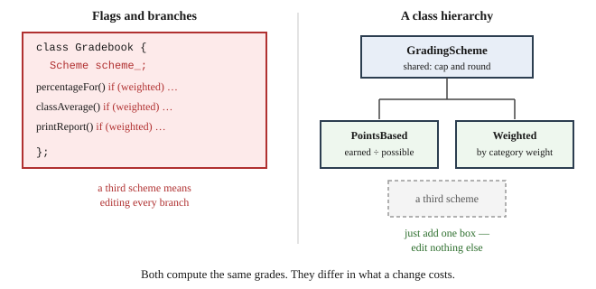

# Chapter 20 — Inheritance

## Learning Objectives

When you finish this chapter you will be able to:

- State the weighted-grading requirement precisely and compute a weighted percentage by hand. *(SLO 2.1)*
- Compare a flag-and-branch design with a class hierarchy, and name the specific costs of each. *(SLO 2.3, 2.8)*
- Identify "is-a" relationships and distinguish them from "has-a". *(SLO 2.3)*
- Declare a derived class and call a base constructor. *(SLO 2.3)*
- Use `protected` members appropriately. *(SLO 2.3)*
- Override a base class member function. *(SLO 2.3)*
- Choose between inheritance and composition. *(SLO 2.3, 2.8)*
- Build Grade Calculator v3.0 — weighted-category grading, working.

---

## 20.1 A New Requirement: Weighted Grading

Since Chapter 1, your specification has carried a sentence:

> **Out of scope for Course I:** weighted-category grading, in which categories such as exams and homework carry different percentages of the final grade. This calculator computes grades on total points only. Weighted grading is deferred as a planned future enhancement.

Twelve chapters of Course I never needed it. Chapter 13 had you analyze it. This chapter builds it.

### What weighted grading is

Assignments belong to **categories**, and each category carries a **weight** — a percentage of the final grade:

| Category | Weight |
|---|---|
| Exams | 50% |
| Homework | 30% |
| Participation | 20% |

Each category is scored **separately** as a fraction of its own possible points. Those fractions are then combined by weight.

### Worked by hand

A student with `Exam 1` at 90/100, `HW1` at 10/10, and `HW2` at 5/10:

**Points-based** adds everything together:

```text
(90 + 10 + 5) / (100 + 10 + 10) = 105 / 120 = 87.5%
```

**Weighted** scores each category first:

```text
Exams:    90/100  = 0.90  ×  50 = 45.0
Homework: 15/20   = 0.75  ×  30 = 22.5
                                  ----
                                  67.5   out of the 80 weight used
67.5 / 80 × 100 = 84.4%
```

```text
points-based: 87.5%
weighted:     84.4%
```

**Same work, two defensible grades, a 3.1 point difference.** Neither is wrong. They answer different questions, and an instructor is entitled to choose.

Note that Participation contributed nothing because the student has no participation assignments yet. The design decision above — **divide by the weight actually used, not by 100** — means a student is not penalized for work that has not been assigned. That was one of the questions Chapter 13 asked you to answer before knowing the implementation.

### Why the accumulator pattern cannot do this

Chapter 7 Section 7.9 said points-based grading *is* the accumulator pattern: two running totals, one division. It also said what that implies.

**Every point counts the same, regardless of where it came from.** Two running totals cannot express "these points are worth more than those." You would need separate totals per category, combined afterward by weight — a fundamentally different computation, not a variation on the same one.

That is why this arrives now. It is not a feature Course I forgot; it is a feature Course I's approach could not express.

---

## 20.2 Two Designs Compared

You have a working `Gradebook` with one grading rule. You need two. There are two ways to do it, and the choice matters more than it first appears.



**Figure 20.1 — Two designs for supporting more than one grading scheme.**

*Description of Figure 20.1.* The left panel shows the **flag design**: one `Gradebook` class holding a `Scheme scheme_` member, with three operations — `percentageFor`, `classAverage`, `printReport` — each containing an `if (weighted)` branch. A note records that a third scheme means editing every branch.

The right panel shows the **hierarchy design**: an abstract `GradingScheme` at the top holding shared behavior (capping and rounding), with `PointsBased` and `Weighted` below it. A dashed box shows where a third scheme would go, with a note that adding one means adding a box and editing nothing else.

Both compute the same grades. They differ in what a change costs.

### Design A — a flag and branches

```cpp
class Gradebook {
public:
    enum class Scheme { Points, Weighted };

    double percentageFor(const Student& s) const {
        if (scheme_ == Scheme::Weighted) {
            // ... weighted computation ...
        } else {
            // ... points-based computation ...
        }
    }
private:
    Scheme scheme_;
};
```

This works. It is not stupid, and in a small program it would be entirely reasonable. Its costs are specific:

**The branch spreads.** Today one function needs it. Tomorrow the class average, the report header, and the file format each need to know which scheme is active. Every new operation on grades brings a new branch.

**A third scheme touches every branch.** Adding weighted-with-drop-lowest means finding each `if` and extending it. Miss one and you have a silent logic error of exactly the kind Chapter 4 Section 4.9.3 described.

**The branches cannot be tested independently.** Testing the weighted path means constructing a `Gradebook` with the flag set correctly. There is no way to test the weighted rule on its own.

**`Gradebook` accumulates knowledge that is not its job.** A gradebook holds students and produces reports. Under this design it also knows the arithmetic of every grading scheme that will ever exist.

### Design B — a class hierarchy

Make each scheme a separate type with a shared parent:

```cpp
class GradingScheme { /* shared behavior */ };
class PointsBased : public GradingScheme { /* one rule */ };
class Weighted    : public GradingScheme { /* another rule */ };
```

`Gradebook` holds one of these and asks it for a percentage. It does not know which kind it has.

**A third scheme is a new class, and nothing existing changes.**

### The comparison

| | Flag and branches | Class hierarchy |
|---|---|---|
| Adding a third scheme | edit every branch | add one class |
| Testing one rule alone | not possible | construct it directly |
| Where scheme knowledge lives | inside `Gradebook` | inside each scheme |
| Risk of missing a branch | real | none — there are none |
| Lines for two schemes | fewer | more |
| Lines for five schemes | many more | slightly more |

**The hierarchy costs more up front.** That is honest, and it is why the flag design is right for some programs. It pays off when the number of variants grows or when the variants must be tested and reasoned about separately — which is exactly this case.

You will build Design B. Chapter 21 will show what it makes possible that Design A cannot do at all.

---

## 20.3 Modeling "Is-A" Relationships

**Inheritance** creates a new class from an existing one. The new class gets everything the original had, and may add or change behavior.

The relationship it expresses is **"is-a"**:

- A `PointsBased` **is a** `GradingScheme`.
- A `Weighted` **is a** `GradingScheme`.

Test any proposed inheritance by saying it aloud. If "is-a" sounds wrong, inheritance is wrong.

Contrast with **"has-a"**, which means **composition** — one object holding another:

- A `Gradebook` **has a** `GradeScale`.
- A `Student` **has** `Assignment`s.

A `Gradebook` is not a kind of `GradeScale`, so it holds one rather than inheriting from one. **Getting this backwards is the most common inheritance mistake**, and Section 20.10 returns to it.

---

## 20.4 Base and Derived Classes

The **base class** holds what is common:

```cpp
class GradingScheme {
public:
    explicit GradingScheme(const std::string& name) : name_(name) {}

    const std::string& name() const { return name_; }

protected:
    /** Applies the course cap-and-round policy. Shared by every scheme. */
    static double finalize(double rawPercentage);

private:
    std::string name_;
};
```

A **derived class** names its base after a colon:

```cpp
class PointsBased : public GradingScheme {
public:
    PointsBased() : GradingScheme("Points-based") {}
    double computePercentage(const std::vector<Assignment>& work) const;
};
```

`public` inheritance means "is-a" — everything public in the base stays public in the derived class. Other forms exist and are rarely what you want.

A `PointsBased` object contains a complete `GradingScheme` inside it. It has a `name_`, it can be asked its `name()`, and it can call `finalize` — all without those being written twice.

---

## 20.5 Constructors Under Inheritance

A derived class must construct its base part first. Do it in the **initializer list**:

```cpp
PointsBased::PointsBased() : GradingScheme("Points-based") {}

Weighted::Weighted() : GradingScheme("Weighted") {
    weights_ = { {"Exam", 50.0}, {"Homework", 30.0}, {"Participation", 20.0} };
}
```

The base constructor runs, then the derived class's members initialize, then the derived constructor body runs. **Construction proceeds from the base outward**, which makes sense: the derived part may depend on the base part being ready.

If you do not name a base constructor, the compiler calls the base's default one. If there is none, the code will not compile — a common error when a base class has only parameterized constructors.

---

## 20.6 `protected` Members

Three access levels, now that inheritance exists:

| Specifier | Reachable from |
|---|---|
| `public` | anywhere |
| `protected` | the class **and its derived classes** |
| `private` | the class only |

`finalize` is `protected` because every scheme needs it and no outside code should:

```cpp
protected:
    static double finalize(double rawPercentage);
```

**Prefer `private` to `protected` for data.** A `protected` data member can be modified by any derived class, present or future, which puts your invariant back at the mercy of code you have not written. `protected` functions are less risky than `protected` data.

`Weighted` does declare `weights_` as `protected` rather than private — deliberately, because Chapter 21 adds a class deriving from `Weighted` that needs it. That is a decision made in anticipation of a known requirement, not a default.

---

## 20.7 Overriding Member Functions

A derived class may replace a base class function by declaring one with the same signature. This is **overriding**, and it is different from the overloading in Chapter 10 Section 10.2:

| | Overloading | Overriding |
|---|---|---|
| Same name | yes | yes |
| Same parameters | **no** | **yes** |
| Involves inheritance | no | yes |
| Resolved | at compile time | see Chapter 21 |

`PointsBased` and `Weighted` each define `computePercentage`:

```cpp
double PointsBased::computePercentage(const std::vector<Assignment>& work) const {
    double earned = 0.0;
    double possible = 0.0;
    for (const Assignment& a : work) {
        earned   += a.totalEarned();
        possible += a.pointsPossible();
    }
    if (possible <= 0.0) { return 0.0; }
    return finalize(earned / possible * 100.0);
}

double Weighted::computePercentage(const std::vector<Assignment>& work) const {
    double weightedSum = 0.0;
    double weightUsed  = 0.0;

    for (const CategoryWeight& w : weights_) {
        double earned = 0.0;
        double possible = 0.0;
        for (const Assignment& a : work) {
            if (a.category() == w.name) {
                earned   += a.totalEarned();
                possible += a.pointsPossible();
            }
        }
        // A category with no graded work is skipped, and its weight is
        // redistributed. Otherwise a student would be penalized for
        // assignments not yet given.
        if (possible > 0.0) {
            weightedSum += (earned / possible) * w.weight;
            weightUsed  += w.weight;
        }
    }
    if (weightUsed <= 0.0) { return 0.0; }
    return finalize(weightedSum / weightUsed * 100.0);
}
```

Both take the same argument and return a percentage. Both call the inherited `finalize`. **The cap-and-round policy exists once**, and a third scheme would inherit it too.

> **A limitation, stated now.** These are not yet `virtual`, which means the *type of the variable*, not the type of the object, decides which one runs. Chapter 21 removes this, and it is why v3.0 fixes the scheme at startup. The limitation is real and disclosed rather than hidden.

---

## 20.8 Multilevel Hierarchies

A derived class may itself be a base:

```cpp
class GradingScheme { };
class Weighted : public GradingScheme { };
class WeightedDropLowest : public Weighted { };
```

`WeightedDropLowest` is a `Weighted`, which is a `GradingScheme`. It inherits from both levels.

Chapter 21 adds exactly this class, as proof the design is open to extension.

Keep hierarchies **shallow**. Two or three levels is usually plenty; deeper ones become hard to reason about, because behavior may come from any level and you must check them all.

---

## 20.9 Composition as an Alternative

**Composition** — holding an object rather than inheriting from one — is often the better choice.

```cpp
class Gradebook {
private:
    GradeScale scale_;                  // has-a
    std::vector<Student> roster_;       // has-a
};
```

A `Gradebook` is not a kind of `GradeScale`; it holds one.

The general advice is **prefer composition to inheritance**. Composition is more flexible: a held object can be replaced at run time, and it exposes only what you choose. Inheritance is a permanent, visible commitment.

Reach for inheritance when both conditions hold:

1. The relationship is genuinely **is-a**, and
2. You need code to treat different derived types **uniformly**.

Condition 2 is what makes the grading schemes a real case, and Chapter 21 is where it becomes visible.

---

## 20.10 When Not to Inherit

Four warning signs:

**"Is-a" sounds wrong.** A `Gradebook` is not a `std::vector<Student>`, even though it holds one.

**You inherit to reuse code, not to model a relationship.** If you want the base's functions but the is-a claim is false, use composition.

**The derived class must remove behavior.** If a derived class has to disable something the base offers, the is-a relationship is false — anything you can do with the base should work with the derived.

**The hierarchy is deep and behavior is scattered.** Three levels is a signal to reconsider.

---

## Common Errors and Warnings

| What you see | Cause | Fix |
|---|---|---|
| `error: no matching function for call to 'GradingScheme::GradingScheme()'` | Base has no default constructor and none was named | Call one in the initializer list |
| `error: 'name_' is private within this context` | Derived class touching base's private data | Use a public accessor, or `protected` |
| Base's function runs when the derived one was expected | Not `virtual` — Section 20.7 | Chapter 21 |
| `error: cannot convert 'PointsBased' to 'GradingScheme'` | Wrong direction — a base is not a derived | Only derived-to-base is automatic |
| Base constructor runs after derived members initialize | It does not; construction is base-outward | Nothing to fix; check your expectation |
| `error: invalid use of incomplete type` | Base class not fully declared before use | Include the base's header |
| Derived class changed base state unexpectedly | `protected` data member | Make it `private` with a `protected` accessor |
| Duplicate code across derived classes | Common behavior in the wrong place | Move it to the base |

---

## Design Notes

**Say "is-a" aloud before inheriting.** If it sounds wrong, use composition.

**Prefer composition to inheritance.** Inherit when the relationship is genuine *and* code must treat several types uniformly.

**Put shared behavior in the base once.** `finalize` is the model.

**Prefer `private` to `protected` data.** A `protected` member is reachable by every future derived class.

**Keep hierarchies shallow.**

---

## Grade Calculator v3.0 — Weighted Grading

### What v3.0 does

Everything v2.6 did, **plus weighted-category grading**. The scheme is chosen at startup and applies for the session.

The deferred requirement from Chapter 1 is now built.

### Assignments gain a category

```cpp
Assignment(const std::string& name, double earned, double possible,
           double bonus = 0.0, const std::string& category = "Uncategorized");
```

Both new parameters have defaults, so **every existing call still compiles unchanged** — Chapter 10 Section 10.3's technique for extending an interface without breaking it. Two hundred lines of calling code needed no edits.

### Weights are validated

```cpp
double Weighted::weightTotal() const {
    double sum = 0.0;
    for (const CategoryWeight& w : weights_) { sum += w.weight; }
    return sum;
}

bool Weighted::weightsValid() const {
    return std::abs(weightTotal() - 100.0) < 0.001;
}
```

Note the comparison. Weights are `double`, so `weightTotal() == 100.0` is exactly the floating-point equality trap from Chapter 6 Section 6.12. **Comparing against a tolerance** is Chapter 9 Section 9.10's `nearlyEqual` technique, applied where it matters.

### The selection, in one place

```cpp
double Gradebook::percentageFor(const Student& s) const {
    // The single branch. One place today; one place per operation as soon as
    // a third scheme or a second calculation is added. See Section 20.2.
    if (scheme_ == Scheme::Weighted) {
        return weighted_.computePercentage(s.assignments());
    }
    return points_.computePercentage(s.assignments());
}
```

This is Design A's branch, deliberately confined to one function. **v3.0 is a hybrid**: it has the hierarchy, and it still selects with an `if`, because the functions are not yet `virtual`.

That is the honest state of the program at the end of this chapter, and the comment says so. Chapter 21 removes the branch entirely.

### Expected output

Ada with `Exam 1` 90/100 in category Exam, and `HW1` 10/10 in category Homework:

```text
  Grading: Points-based
1001  Ada                     90.9%   A
```

```text
  Grading: Weighted
1001  Ada                     93.8%   A
```

Check the weighted figure by hand: exams are 90/100 = 0.90 × 50 = 45; homework is 10/10 = 1.00 × 30 = 30; total 75 out of the 80 weight used; 75/80 × 100 = 93.75%, rounded to 93.8%.

**The same scores, two grades.** That is not a bug — it is the point.

### What did not change

This is the chapter's real result, and it is worth checking rather than taking on trust.

| Class | Changes needed |
|---|---|
| `GradeScale` | **none** |
| `Student` | **none** |
| `Assignment` | two parameters added, both defaulted |
| Report formatting | **none** |
| Bonus point handling | **none** |
| Drop-lowest | **none** |

The classes you spent Chapters 18 and 19 encapsulating **absorbed a change to the grading model without modification**. `GradeScale` maps a percentage to a letter; it does not care where the percentage came from. `Student` holds work; it does not care how the work is scored.

That is the return on encapsulation, and you can verify it with `diff` rather than believe it.

### What v3.0 still cannot do

Switching schemes requires restarting the program. The selection lives in a branch at one point, so the scheme is effectively fixed once chosen.

More seriously: **look at what a third scheme would cost.** With the current design you would add a class — which is cheap — and then extend that `if` into an `if/else if` chain. And when a second operation needs the scheme, it gets its own chain.

The hierarchy is built. The branch is the thing still standing between you and the design in Figure 20.1's right panel. Chapter 21 removes it in one step.

### Your StudySite Lab — Add Weighted Grading with Inheritance

- **Course:** COSC 1437 — Object-Oriented Programming
- **Project checkpoint:** v3.0
- **Starting point:** The working Chapter 19 v2.6 multi-file program.

> **One-repository rule:** Continue in the same COSC 1437 Grade Calculator
> repository from Chapter 13 through Chapter 24. Do not create a chapter folder
> or a new repository. The supplied Chapter 12 solution is the foundation;
> your COSC 1437 work is what you add in Chapters 13–24.

#### Required work

1. Add a `category` parameter to `Assignment`, defaulted to `"Uncategorized"`, so every existing constructor call still compiles unchanged.
2. Create a `GradingScheme` base class and `PointsBased` and `Weighted` derived classes.
3. Move the shared cap-and-round policy (`finalize`) into the base class so neither derived class repeats it.
4. Give `Weighted` a `weightsValid()` that checks whether its category weights total 100 within a floating-point tolerance (`std::abs(weightTotal() - 100.0) < 0.001`) — but see "What changes from Chapter 19" below for what happens when they don't.
5. Let the user choose the grading scheme (points-based or weighted) at startup, through `Gradebook`'s constructor.
6. Do not penalize a student for a weighted category with no graded assignments yet: skip it, and redistribute its weight across the categories that do have work.
7. Carry the Chapter 15–19 features forward onto the scheme-aware `Gradebook`: saving and loading, the regression-test suite, checked access, and sort/search all still need to work under either scheme.

Item 7 is the one most worth double-checking, as in the last two chapters: it is easy, while adding a second grading scheme, to carry forward only the report and quietly lose the rest.

#### What changes from Chapter 19

- **"Validate" means detect and warn, not reject.** Item 4's `weightsValid()` is a query, not a gate — `Gradebook::setWeights` accepts whatever weights it is given, valid or not. This lab's own verification list once said "weights totaling 80% are rejected," which is not what the reference program does or should do: dividing by `weightTotal()` (the weight actually used) rather than by a hardcoded 100 already normalizes correctly no matter what the weights sum to, so there is nothing to reject. Report the total to the user with `weightsValid()` when it looks wrong; do not block the run.
- **Two independent sort mechanisms now sit on top of two grading schemes.** `Gradebook::sortByPercentage()` (Chapter 19's `operator<`) always orders by `Student`'s raw points-based `percentage()`, regardless of which scheme is active. `Gradebook::sortRoster(SortKey::Percentage)` (the Chapter 17 selection sort, carried forward again this chapter) uses `percentageFor()` — the scheme-aware grade the report actually shows. Under `Weighted` grading these two can disagree on ordering. That is not a defect to fix in this chapter; it is a difference worth knowing about, because it is exactly the kind of thing Chapter 21's redesign will make easier to reason about.
- **The save file grows two new fields**: a `SCHEME` line (`POINTS` or `WEIGHTED`) and, for a weighted gradebook, one `WEIGHT` line per category. Loading a saved gradebook restores its scheme and its weights — including custom weights the user entered — rather than always falling back to the session's startup prompt. If the two disagree, the loaded file's scheme wins, and the program says so.
- **Each `STUDENT` row gains a fifth field per assignment**: the category. Chapter 19's four-field-per-assignment format (`name, earned, possible, bonus`) becomes five (`name, earned, possible, bonus, category`).
- **The regression suite grows by two checks.** Both are new to this chapter, and both come directly from required-work items 4 and 6: the documented 93.8% example (a 90/100 exam at weight 50 plus 10/10 homework at weight 30, with participation ungraded) and a check that an ungraded category's weight is redistributed rather than counted against the student.

Everything else genuinely carries over: `GradeScale`, `Student`, `Gradebook`'s report layout, and the D1–D3 defects' pass/fail wording are all unchanged from Chapter 19 — exactly the point the chapter's own "What did not change" table makes.

#### Build it: step by step

##### Step 1 — Add a category to `Assignment`, with a default

```cpp
class Assignment {
public:
    Assignment() = default;
    Assignment(const std::string& name, double earned, double possible,
               double bonus = 0.0, const std::string& category = "Uncategorized");
    // ...
    const std::string& category() const { return category_; }
    // ...
private:
    // ...
    std::string category_ = "Uncategorized";
};
```

Every call site from Chapters 13–19 that constructs an `Assignment` with three or four arguments still compiles: the new parameter defaults, so nothing already written breaks.

##### Step 2 — Create `GradingScheme` and its two derived classes

```cpp
class GradingScheme {
public:
    explicit GradingScheme(const std::string& name) : name_(name) {}
    const std::string& name() const { return name_; }

protected:
    /** Applies the course cap-and-round policy. Shared by every scheme. */
    static double finalize(double rawPercentage);

private:
    std::string name_;
};

class PointsBased : public GradingScheme {
public:
    PointsBased() : GradingScheme("Points-based") {}
    double computePercentage(const std::vector<Assignment>& work) const;
};

class Weighted : public GradingScheme {
public:
    struct CategoryWeight {
        std::string name;
        double weight = 0.0;
    };

    Weighted();
    explicit Weighted(const std::vector<CategoryWeight>& weights);

    double computePercentage(const std::vector<Assignment>& work) const;
    const std::vector<CategoryWeight>& weights() const { return weights_; }
    double weightTotal() const;
    bool weightsValid() const;

private:
    std::vector<CategoryWeight> weights_;
};
```

`PointsBased::computePercentage` is the same total-earned-over-total-possible math every chapter since Chapter 14 has used, just moved into its own class:

```cpp
double PointsBased::computePercentage(const std::vector<Assignment>& work) const {
    double earned = 0.0;
    double possible = 0.0;
    for (const Assignment& a : work) {
        earned   += a.totalEarned();
        possible += a.pointsPossible();
    }
    if (possible <= 0.0) { return 0.0; }
    return finalize(earned / possible * 100.0);
}
```

##### Step 3 — Implement weighted grading, without penalizing ungraded categories

```cpp
double Weighted::computePercentage(const std::vector<Assignment>& work) const {
    double weightedSum = 0.0;
    double weightUsed  = 0.0;

    for (const CategoryWeight& w : weights_) {
        double earned = 0.0;
        double possible = 0.0;
        for (const Assignment& a : work) {
            if (a.category() == w.name) {
                earned   += a.totalEarned();
                possible += a.pointsPossible();
            }
        }
        // A category with no graded work yet is skipped, and its weight is
        // redistributed across the categories that do have work. Otherwise a
        // student would be penalized for assignments not yet given.
        if (possible > 0.0) {
            weightedSum += (earned / possible) * w.weight;
            weightUsed  += w.weight;
        }
    }

    if (weightUsed <= 0.0) { return 0.0; }
    return finalize(weightedSum / weightUsed * 100.0);
}
```

Dividing by `weightUsed` — the weight actually seen, not a hardcoded 100 — is what makes weights that don't total 100 still produce a sane percentage, and what makes an ungraded category's weight vanish rather than count against the student.

##### Step 4 — Make `Gradebook` scheme-aware

```cpp
enum class Scheme { Points, Weighted };

explicit Gradebook(const std::string& courseName = "Untitled Course",
                   Scheme scheme = Scheme::Points);

double percentageFor(const Student& s) const;
std::string schemeName() const;
Scheme scheme() const { return scheme_; }
const Weighted& weightedScheme() const { return weighted_; }
void setWeights(const std::vector<Weighted::CategoryWeight>& w) { weighted_ = Weighted(w); }
```

```cpp
double Gradebook::percentageFor(const Student& s) const {
    // The single branch. One place today; one place per operation as soon as
    // a third scheme or a second calculation is added.
    if (scheme_ == Scheme::Weighted) {
        return weighted_.computePercentage(s.assignments());
    }
    return points_.computePercentage(s.assignments());
}
```

Every place that used to call `s.percentage()` for the *course grade* now calls `book.percentageFor(s)` instead — the report, the class average, and (see Step 6) the scheme-aware sort key. `s.percentage()` itself is untouched and still used for the raw points-based ordering in `sortByPercentage()`.

##### Step 5 — Carry persistence forward, with a `SCHEME` line and per-category `WEIGHT` lines

```cpp
bool Gradebook::save(const std::string& filename) const {
    std::ofstream out(filename);
    if (!out) { return false; }

    out << "# Grade Calculator gradebook file, version 3 (Chapter 20)\n";
    out << "# Section tags allow new record types to be added later.\n";
    out << "COURSE," << courseName_ << "\n";
    out << "SCHEME," << (scheme_ == Scheme::Weighted ? "WEIGHTED" : "POINTS") << "\n";
    out << "NEXTID," << nextId_ << "\n";
    for (const GradeScale::Tier& t : scale_.tiers()) {
        out << "TIER," << t.cutoff << "," << t.letter << "\n";
    }
    if (scheme_ == Scheme::Weighted) {
        for (const Weighted::CategoryWeight& w : weighted_.weights()) {
            out << "WEIGHT," << w.name << "," << w.weight << "\n";
        }
    }
    for (const Student& s : roster_) {
        out << "STUDENT," << s.id() << "," << s.name();
        for (const Assignment& a : s.assignments()) {
            out << "," << a.name() << "," << a.pointsEarned() << ","
                << a.pointsPossible() << "," << a.bonusPoints() << "," << a.category();
        }
        out << "\n";
    }
    return out.good();
}
```

`load` mirrors it: a `SCHEME` line sets `scheme_`, `WEIGHT` lines are collected and, if any were found, replace `weighted_` with `Weighted(loadedWeights)`; each `STUDENT` row's assignments are now read five fields at a time instead of four, with the fifth restoring `category()`.

##### Step 6 — Carry sort/search forward, using the scheme-aware grade where it matters

```cpp
void Gradebook::sortRoster(SortKey key) {
    for (std::size_t i = 0; i + 1 < roster_.size(); ++i) {
        std::size_t best = i;
        for (std::size_t j = i + 1; j < roster_.size(); ++j) {
            bool jComesFirst = false;
            switch (key) {
                case SortKey::Name:       jComesFirst = roster_[j].name() < roster_[best].name(); break;
                case SortKey::Percentage: jComesFirst = percentageFor(roster_[j]) > percentageFor(roster_[best]); break;
                case SortKey::Id:         jComesFirst = roster_[j].id() < roster_[best].id(); break;
            }
            if (jComesFirst) { best = j; }
        }
        if (best != i) { std::swap(roster_[i], roster_[best]); }
    }
}
```

Notice the `Percentage` case calls `percentageFor(roster_[j])`, not `roster_[j].percentage()`. `linearFindById` and `binaryFindById` are otherwise byte-for-byte what Chapter 19 had; only the printed percentage on a successful find changes, from `s.percentage()` to `book.percentageFor(s)`, so **Find by ID** reports the grade the active scheme actually produces.

##### Step 7 — Rebuild `main`: choose a scheme, weigh in on weights, keep every menu option

```cpp
std::cout << "Grading scheme for this session:\n";
std::cout << "  1) Points-based   2) Weighted by category\n";
std::string choice = readLine("Choice: ");

Gradebook::Scheme requestedScheme = (!choice.empty() && choice[0] == '2')
                         ? Gradebook::Scheme::Weighted
                         : Gradebook::Scheme::Points;
Gradebook book("Programming Fundamentals", requestedScheme);

std::string message;
if (book.load(DEFAULT_FILE, message)) {
    std::cout << "\n" << message << "\n";
    if (book.scheme() != requestedScheme) {
        std::cout << "  Note: " << DEFAULT_FILE << " was saved under "
                  << (book.scheme() == Gradebook::Scheme::Weighted ? "weighted" : "points-based")
                  << " grading; using the saved scheme instead of tonight's choice.\n";
    }
} else {
    std::cout << "\n" << message << " Starting a new gradebook.\n";
}
```

A saved gradebook's scheme takes precedence over tonight's prompt, and the program says so rather than silently overriding the user's choice. If the active scheme is `Weighted`, the current weights — the loaded ones if a file existed, the defaults otherwise — are shown before offering to replace them:

```cpp
if (book.scheme() == Gradebook::Scheme::Weighted) {
    std::cout << "\nCurrent weights: ";
    for (const Weighted::CategoryWeight& w : book.weightedScheme().weights()) {
        std::cout << w.name << " " << w.weight << "   ";
    }
    std::cout << "\n";
    if (readLine("Enter your own weights? (y/n): ").substr(0, 1) == "y") {
        // ... unchanged from the original ...
    }
}
```

The menu itself is unchanged from Chapter 19 — all nine options carry forward, none of them new to this chapter:

```cpp
std::cout << "\n1) Add student  2) Report  3) Sort by grade  4) Custom scale  5) Save\n"
             "6) Run tests  7) Sort roster  8) Find by ID  9) Quit\nChoice: ";
```

**Add student** now also prompts for each assignment's category, defaulting to `"Uncategorized"` when left blank, matching the required default on the constructor itself.

The regression suite gains its two new checks — the documented weighted example, and the no-penalty-for-ungraded-categories rule:

```cpp
Weighted defaultWeights;
Student weightedExample("Test", 9999);
weightedExample.addAssignment(Assignment("Midterm", 90.0, 100.0, 0.0, "Exam"));
weightedExample.addAssignment(Assignment("HW1", 10.0, 10.0, 0.0, "Homework"));
check(defaultWeights.computePercentage(weightedExample.assignments()) == 93.8,
      "D4 exam 90/100@50 + homework 10/10@30 (no participation) is 93.8%");

Student redistribute("Test", 9999);
redistribute.addAssignment(Assignment("Midterm", 80.0, 100.0, 0.0, "Exam"));
redistribute.addAssignment(Assignment("Speech", 10.0, 10.0, 0.0, "Participation"));
// Homework (weight 30) has no assignments yet and must not count against the total.
check(defaultWeights.computePercentage(redistribute.assignments()) == 85.7,
      "D5 Weighted redistributes an ungraded category's weight, not penalizes it");
```

#### Verification

- The existing points-based examples still produce the same grades as Chapter 19.
- A 90/100 exam at weight 50 and 10/10 homework at weight 30 reports 93.8% when only those categories contain work — `Run tests` checks this automatically now.
- Weights totaling 80% are **not** rejected: `weightsValid()` reports them as invalid and the program says so, but the percentage is still computed correctly because it divides by the weight actually used, not by a hardcoded 100.
- A weighted category with no assignments yet does not lower a student's grade — `Run tests` checks this automatically too, and should report **11 of 11 checks passed**.
- Saving, quitting, and relaunching restores the course name, roster, grade scale, chosen scheme, and (for a weighted gradebook) its category weights.
- `GradeScale`, `Student`, and the report layout are unchanged from Chapter 19, exactly as the "What did not change" table claims — verify this with a diff if you want to see it rather than take it on trust.
- `Sort by grade`, `Sort roster`, and `Find by ID` all still work under either scheme.

#### StudySite workflow

1. Confirm that your previous chapter is committed on GitHub, then open this
   chapter's **coding panel on the StudySite main stage**.
2. Close stale project tabs from an earlier session before loading. This
   avoids creating files with names such as `_imported` when the same path
   is already open.
3. Click **Load from GitHub**, select
   **COSC1437xxx-Grade-Calculator-YourLastName**, and click each source,
   header, or documentation file needed for this chapter. Confirm the editor
   shows the expected file paths before editing.
4. Continue the existing project in StudySite's internal editor. For a
   multi-file program, keep every source and header file needed by the build
   open in the editor.
5. Click **Run**. Read compiler messages and program output in the embedded
   Terminal, and type program input there when prompted.
6. Fix every compiler error and warning, then complete the verification
   list.
7. Use the Tutor with the current code or Terminal output when you need
   help.

#### Save this checkpoint

> **IMPORTANT — commit to save your work:** StudySite autosaves editor tabs
> locally on this device, but local autosave is not a durable GitHub backup.
> Your work is not safely saved in your repository until **Save to GitHub**
> finishes a successful **Commit**.

1. Keep every project file that belongs in this checkpoint open in the
   editor. **Save to GitHub includes every open editor file**, so close
   scratch files and accidental `_imported` duplicates first.
2. Click **Save to GitHub**.
3. Select **COSC1437xxx-Grade-Calculator-YourLastName** and the existing
   **main** branch.
4. Enter the commit message **Complete Chapter 20 Grade Calculator v3.0**.
5. Click **Commit** and wait for StudySite's confirmation.
6. Open the commit link, or open the repository on GitHub, and confirm the
   new commit and expected files are present before leaving StudySite.

#### Complete when

- The verification list passes.
- **COSC1437xxx-Grade-Calculator-YourLastName** contains the Chapter 20
  checkpoint.
- The GitHub commit is visible; StudySite's local autosave alone is not
  completion.

---

## Try It Yourself

### 1. Two schemes, one hierarchy

```cpp
#include <algorithm>
#include <cmath>
#include <iostream>
#include <string>
#include <vector>

class Assignment {
public:
    Assignment(const std::string& n, double e, double p,
               double b = 0.0, const std::string& c = "Uncategorized")
        : name_(n), earned_(e), possible_(p), bonus_(b), category_(c) {}
    double totalEarned() const { return earned_ + bonus_; }
    double pointsPossible() const { return possible_; }
    const std::string& category() const { return category_; }
private:
    std::string name_;
    double earned_ = 0.0;
    double possible_ = 0.0;
    double bonus_ = 0.0;
    std::string category_;
};

class GradingScheme {
public:
    explicit GradingScheme(const std::string& n) : name_(n) {}
    const std::string& name() const { return name_; }
protected:
    static double finalize(double raw) {
        return std::round(std::min(raw, 100.0) * 10.0) / 10.0;
    }
private:
    std::string name_;
};

class PointsBased : public GradingScheme {
public:
    PointsBased() : GradingScheme("Points-based") {}
    double computePercentage(const std::vector<Assignment>& w) const {
        double e = 0.0;
        double p = 0.0;
        for (const Assignment& a : w) { e += a.totalEarned(); p += a.pointsPossible(); }
        return p <= 0.0 ? 0.0 : finalize(e / p * 100.0);
    }
};

class Weighted : public GradingScheme {
public:
    struct CategoryWeight { std::string name; double weight = 0.0; };
    Weighted() : GradingScheme("Weighted") {
        weights_ = {{"Exam", 50.0}, {"Homework", 30.0}, {"Participation", 20.0}};
    }
    double computePercentage(const std::vector<Assignment>& w) const {
        double sum = 0.0;
        double used = 0.0;
        for (const CategoryWeight& cw : weights_) {
            double e = 0.0;
            double p = 0.0;
            for (const Assignment& a : w) {
                if (a.category() == cw.name) { e += a.totalEarned(); p += a.pointsPossible(); }
            }
            if (p > 0.0) { sum += (e / p) * cw.weight; used += cw.weight; }
        }
        return used <= 0.0 ? 0.0 : finalize(sum / used * 100.0);
    }
protected:
    std::vector<CategoryWeight> weights_;
};

int main() {
    std::vector<Assignment> work = {
        {"Exam 1", 90, 100, 0, "Exam"},
        {"HW1", 10, 10, 0, "Homework"},
        {"HW2", 5, 10, 0, "Homework"}
    };
    PointsBased pb;
    Weighted wt;
    std::cout << "points-based: " << pb.computePercentage(work) << "%\n";
    std::cout << "weighted:     " << wt.computePercentage(work) << "%\n";
    return 0;
}
```

**Expected output:**

```text
points-based: 87.5%
weighted:     84.4%
```

*Try:* Add a participation assignment worth 10/10. Which percentage changes, and by how much? Predict before running.

### 2. Constructors run base-first

```cpp
#include <iostream>
#include <string>

class Base {
public:
    explicit Base(const std::string& n) {
        std::cout << "Base constructor for " << n << "\n";
    }
};

class Derived : public Base {
public:
    Derived() : Base("derived object") {
        std::cout << "Derived constructor body\n";
    }
};

int main() {
    Derived d;
    return 0;
}
```

**Expected output:**

```text
Base constructor for derived object
Derived constructor body
```

*Try:* Remove `: Base("derived object")` and read the error. What does that tell you about default constructors in base classes?

### 3. `protected` versus `private`

```cpp
#include <iostream>

class Base {
public:
    Base() : pub_(1), prot_(2), priv_(3) {}
    int pub_;
protected:
    int prot_;
private:
    int priv_;
};

class Derived : public Base {
public:
    void show() {
        std::cout << "pub_  " << pub_  << "\n";
        std::cout << "prot_ " << prot_ << "\n";
        // std::cout << priv_;   // uncomment this line
    }
};

int main() {
    Derived d;
    d.show();
    return 0;
}
```

**Expected output:**

```text
pub_  1
prot_ 2
```

*Try:* Uncomment the `priv_` line and read the error. Then, in `main`, try `d.prot_`. Why does that also fail?

### 4. Shared behavior in the base

```cpp
#include <cmath>
#include <iostream>

class Scheme {
public:
    virtual ~Scheme() = default;
protected:
    static double round1(double x) { return std::round(x * 10.0) / 10.0; }
};

class A : public Scheme {
public:
    double compute() const { return round1(87.4567); }
};

class B : public Scheme {
public:
    double compute() const { return round1(92.9876); }
};

int main() {
    A a;
    B b;
    std::cout << a.compute() << "\n";
    std::cout << b.compute() << "\n";
    return 0;
}
```

**Expected output:**

```text
87.5
93
```

*Try:* Change `round1` to round to two decimal places. How many classes did you edit? What would the answer be if each class had its own copy?

### 5. Is-a or has-a?

For each pair, say whether inheritance or composition is right, and why:

- `Car` and `Engine`
- `Square` and `Rectangle`
- `Gradebook` and `GradeScale`
- `WeightedDropLowest` and `Weighted`
- `Student` and `Assignment`
- `Manager` and `Employee`
- `Playlist` and `Song`

### 6. Cost a change

For each design in Section 20.2, count the edits needed to add a third grading scheme:

- Design A, with the branch in one function
- Design A, with branches in three functions
- Design B, the hierarchy

Now do the same for adding a *fourth* scheme. Which numbers grow?

### 7. Reason about inheritance

- What does `public` inheritance mean, in one sentence?
- Why must a derived constructor call a base constructor before its own body runs?
- Why prefer `private` data to `protected`?
- What is the difference between overloading and overriding?
- Give one specific case where inheriting to reuse code is the wrong choice.

---

## Summary

- **Weighted-category grading** scores each category separately as a fraction of its own points, then combines by weight. It is a different computation from points-based grading, not a variation.
- **Two running totals cannot express weighting**, which is why Course I could not do this.
- A **flag and branches** works and costs: the branch spreads, a third variant touches every branch, and the rules cannot be tested alone.
- A **class hierarchy** costs more up front and makes a third variant a new class with nothing else edited.
- **Inheritance expresses "is-a."** Say it aloud; if it sounds wrong, use **composition** ("has-a").
- A **derived class** inherits everything from its **base**. `public` inheritance means "is-a".
- Derived constructors call a base constructor in the **initializer list**. **Construction proceeds base-outward.**
- **`protected`** is reachable by derived classes. Prefer `private` for data.
- **Overriding** replaces a base function with the same signature; **overloading** uses a different signature.
- **Prefer composition to inheritance.** Inherit when the relationship is genuine *and* code must treat several types uniformly.
- **v3.0 works and still selects with a branch**, because the functions are not yet `virtual`. That limitation is disclosed, and Chapter 21 removes it.
- The classes encapsulated in Chapters 18 and 19 **needed no changes at all** — the measurable return on that work.

---

## Key Terms

**base class** — a class from which another inherits.

**category weight** — the percentage of a final grade a category contributes.

**composition** — holding an object as a member, expressing "has-a".

**derived class** — a class inheriting from another.

**has-a** — a relationship expressed by composition.

**inheritance** — deriving a new class from an existing one.

**is-a** — a relationship expressed by inheritance.

**multilevel hierarchy** — a chain in which a derived class is itself a base.

**overriding** — replacing a base class function with one of the same signature.

**protected** — an access level permitting the class and its derived classes.

---

**Next:** Chapter 21 removes the branch. `GradingScheme` becomes abstract, `Gradebook` holds a pointer to it and stops asking which scheme it has, and the user can switch schemes mid-session with every grade recomputed. Then you add a third scheme and confirm nothing else changes. Grade Calculator v3.1.
