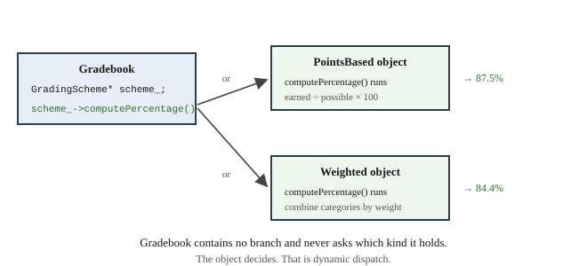

# Chapter 21 — Polymorphism

## Learning Objectives

When you finish this chapter you will be able to:

- Explain what polymorphism is and the problem it solves. *(SLO 2.3)*
- Declare `virtual` functions and explain dynamic binding. *(SLO 2.3)*
- Use base class pointers and references to hold derived objects. *(SLO 2.3)*
- Declare an abstract class with a pure virtual function. *(SLO 2.3)*
- Explain why a base class needs a virtual destructor. *(SLO 2.3)*
- Recognize and avoid object slicing. *(SLO 2.3)*
- Store mixed types in a polymorphic collection. *(SLO 2.3, 2.6)*
- Explain the costs of polymorphism honestly. *(SLO 2.8)*
- Build Grade Calculator v3.1 — schemes switchable at run time, and a third one added without editing anything.

---

## 21.1 The Problem Polymorphism Solves

Chapter 20 built the hierarchy and left one thing standing:

```cpp
double Gradebook::percentageFor(const Student& s) const {
    if (scheme_ == Scheme::Weighted) {
        return weighted_.computePercentage(s.assignments());
    }
    return points_.computePercentage(s.assignments());
}
```

That branch is the problem. `Gradebook` holds both scheme objects, knows both types by name, and selects between them. Add a third scheme and this becomes a chain. Add a second operation needing the scheme and it gets its own chain.

**What you want is for `Gradebook` to hold one scheme and ask it for a percentage, without knowing which kind it has.**

That is **polymorphism** — from the Greek for "many forms." One call, many possible behaviors, decided by the object rather than by the calling code.

---

## 21.2 Virtual Functions

The obstacle in v3.0 was that `computePercentage` was an ordinary function. With ordinary functions, **the type of the variable decides which one runs**, and that is settled at compile time. This is **static binding**.

Mark a function `virtual` and the rule changes:

```cpp
class GradingScheme {
public:
    virtual double computePercentage(const std::vector<Assignment>& work) const;
};

class Weighted : public GradingScheme {
public:
    double computePercentage(const std::vector<Assignment>& work) const override;
};
```

Now **the type of the object decides**, at run time. This is **dynamic binding**, or dynamic dispatch.

The `override` keyword is not required, and you should use it anyway. It asks the compiler to check that you really are overriding something. Misspell the name or get a parameter type wrong and, without `override`, you have quietly written a *new* function that never runs — a silent logic error. With `override`, the compiler stops you.

---

## 21.3 Base Class Pointers and References

Dynamic binding needs the object reached through a **base class pointer or reference**:

```cpp
void show(const Shape& s) {
    std::cout << s.describe() << "\n";     // which describe()? depends on the object
}

Circle c;
Square q;
show(c);      // circle
show(q);      // square
```

```text
through references:
  circle
  square
```

`show` has one parameter type and produces different behavior for different objects. It has never heard of `Circle` or `Square`.

**A derived object can always be used where a base is expected.** A `Circle` is a `Shape`, so a `Shape&` may refer to one. The reverse is not true and does not compile.

---

## 21.4 Object Slicing

Here is a trap worth meeting deliberately, because it is silent.

Dynamic binding requires a pointer or a reference. Pass a derived object **by value** and something destructive happens:

```cpp
void byValue(Shape s)            { std::cout << s.name() << "\n"; }
void byReference(const Shape& s) { std::cout << s.name() << "\n"; }

Circle c;
byValue(c);
byReference(c);
```

```text
  by value:     shape
  by reference: circle
```

Passing by value copies **only the `Shape` part** of the `Circle`. The derived portion is sliced off and discarded, leaving a genuine `Shape` object — so `Shape::name` runs. No error, no warning, wrong answer.

This is called **object slicing**, and it is the single most common polymorphism bug.

**The rule: with polymorphism, always use a reference or a pointer, never a value.** Chapter 10 Section 10.7 told you to pass large objects by `const&` for efficiency. Here it is a correctness requirement.

---

## 21.5 Abstract Classes and Pure Virtual Functions

`GradingScheme` has no sensible default way to compute a percentage. Every scheme must supply its own.

Say so with a **pure virtual function** — `= 0` instead of a body:

```cpp
class GradingScheme {
public:
    explicit GradingScheme(const std::string& name) : name_(name) {}
    virtual ~GradingScheme() = default;

    /** Computes the course percentage. Every scheme defines its own rule. */
    virtual double computePercentage(const std::vector<Assignment>& work) const = 0;

    const std::string& name() const { return name_; }

protected:
    static double finalize(double rawPercentage);

private:
    std::string name_;
};
```

A class with at least one pure virtual function is **abstract**, and cannot be instantiated:

```cpp
GradingScheme s;      // error: cannot instantiate abstract class
```

That refusal is a feature. "A grading scheme" with no rule is not a meaningful object, and the compiler now enforces it. Any derived class failing to supply `computePercentage` is also abstract — so you cannot forget.

An abstract class defines an **interface**: a promise about what every scheme can do, with the how left to each.

Note that it may still hold data and non-virtual functions. `GradingScheme` has a `name_` and a shared `finalize`, inherited by every scheme. Abstract does not mean empty.

---

## 21.6 Virtual Destructors

**A base class used polymorphically must have a virtual destructor.**

```cpp
virtual ~GradingScheme() = default;
```

Here is why. When you delete through a base pointer:

```cpp
GradingScheme* scheme = new Weighted();
delete scheme;
```

Without a virtual destructor, only `~GradingScheme` runs. `~Weighted` never does, so anything `Weighted` owned — its vector of category weights — is never released. That is a memory leak, and Chapter 22 shows how to see one.

**The rule is absolute: if a class has any virtual function, give it a virtual destructor.** `= default` costs one line and asks the compiler to generate the right one.

---

## 21.7 Polymorphic Collections

Virtual functions make a genuinely new thing possible: **one collection holding several different types**, each behaving as itself.

```cpp
std::vector<std::unique_ptr<Shape>> shapes;
shapes.push_back(std::make_unique<Circle>());
shapes.push_back(std::make_unique<Square>());

for (const auto& s : shapes) {
    std::cout << s->describe() << "\n";
}
```

```text
through a collection of base pointers:
  circle
  square
```

One loop, one call, different behavior per element. **The loop has never heard of `Circle` or `Square`** — add a `Triangle` and the loop is unchanged.

Note that the elements are pointers, not values. A `std::vector<Shape>` would slice every element on insertion. `std::unique_ptr` is Chapter 22's subject; for now, read `std::make_unique<Circle>()` as "create a Circle and hand over ownership."

---

## 21.8 Runtime Type Information

C++ can ask what a pointer actually points to:

```cpp
if (Weighted* w = dynamic_cast<Weighted*>(scheme)) {
    // scheme really is a Weighted
}
```

`dynamic_cast` returns `nullptr` when the object is not of the requested type.

**Needing this is usually a design smell.** If you find yourself writing a chain of `dynamic_cast` tests, you have reinvented the branch that polymorphism was supposed to remove — with worse syntax. The right question is: what behavior did you want, and could it be a virtual function instead?

It is covered so you recognize it, and so you recognize what it usually indicates.

---

## 21.9 I/O Streams as a Case Study

You have used polymorphism since Chapter 15 without noticing.

`std::ostream` is a base class. `std::ofstream` and `std::ostringstream` derive from it. When you write:

```cpp
std::ostream& operator<<(std::ostream& out, const Student& s);
```

that one function works with `std::cout`, with a file, and with a string stream — because the parameter is a base class **reference** and the actual output behavior is virtual.

Chapter 19's promise that `out << book` would write to a file unchanged was polymorphism, working before it was named.

---

## 21.10 The Costs

An honest accounting, because polymorphism is not free.

**A small run-time cost.** A virtual call is an indirect call — the object carries a hidden pointer to a table of its functions, and the call goes through it. This is typically a few nanoseconds and is irrelevant unless the call is in a very hot loop.

**A small memory cost.** Each polymorphic object carries that hidden pointer, usually 8 bytes.

**Real conceptual cost.** Reading `scheme_->computePercentage(...)` does not tell you which code runs. You have to know what the pointer holds. The debugger from Chapter 16 answers this — pause and inspect the object's type — and it is a real cost when reading unfamiliar code.

**Design cost.** A hierarchy is a commitment. Getting the base class interface wrong is expensive to change once several classes depend on it.

**When it is not worth it.** Two variants that will never become three. A branch confined to one function that no other operation needs. Performance-critical inner loops. Chapter 20 Section 20.2's flag design is genuinely right in those cases.

**When it is worth it.** Several variants, growing. Behavior that must be selected at run time. Code that should not need editing when a variant is added. The Grade Calculator is all three.

---

## Common Errors and Warnings

| What you see | Cause | Fix |
|---|---|---|
| The base function runs, not the derived one | Function not `virtual` | Add `virtual` in the base |
| The base function runs, and it *is* virtual | **Object slicing** — passed by value | Take a reference or pointer |
| `error: cannot declare variable to be of abstract type` | Instantiating a class with a pure virtual | Instantiate a derived class |
| `error: 'computePercentage' marked 'override' but does not override` | Signature mismatch — often a missing `const` | Match the base exactly |
| Memory leaks when deleting through a base pointer | No virtual destructor | Add `virtual ~Base() = default;` |
| A derived class is unexpectedly abstract | A pure virtual was not implemented | Implement it, or check the signature |
| `error: no matching function` on `push_back` | Storing objects, not pointers | Store `std::unique_ptr<Base>` |
| Chains of `dynamic_cast` | Reinventing the branch | Make the behavior virtual instead |

---

## Design Notes

**Always use `override`.** It turns a silent logic error into a compile error.

**Always give a polymorphic base a virtual destructor.**

**Never pass polymorphic objects by value.** Reference or pointer, always.

**Make a function pure virtual when no sensible default exists.** The compiler then enforces that every derived class supplies one.

**A chain of `dynamic_cast` means you want a virtual function.**

---

## Grade Calculator v3.1 — Two Schemes, Chosen at Run Time

### What v3.1 does

`GradingScheme` becomes abstract. `Gradebook` holds a `GradingScheme*` and **the branch from v3.0 is gone**. The user can switch schemes mid-session and every grade recomputes. A third scheme is added as proof.

### The abstract base

```cpp
/**
 * Abstract base class for grading schemes.
 *
 * computePercentage is pure virtual, so GradingScheme cannot be instantiated
 * and every concrete scheme must supply a rule. Gradebook holds a pointer to
 * this type and never asks which scheme it has - the branch from v3.0 is gone.
 *
 * The destructor is virtual because Gradebook deletes through a base pointer.
 * Without it, only the base part of the object would be destroyed.
 *
 * OWNERSHIP NOTE (revisited in Chapter 22): Gradebook owns a raw pointer.
 * That is correct here, but only because Gradebook also writes a destructor,
 * deletes the old scheme before replacing it, and disables copying. Miss any
 * one of those three and the program leaks or double-frees. Chapter 22 shows
 * how to get the same behavior with none of that hand-written ceremony.
 */
class GradingScheme {
public:
    explicit GradingScheme(const std::string& name) : name_(name) {}
    virtual ~GradingScheme() = default;

    virtual double computePercentage(const std::vector<Assignment>& work) const = 0;

    const std::string& name() const { return name_; }

protected:
    static double finalize(double rawPercentage);

private:
    std::string name_;
};
```

### Gradebook stops asking

```cpp
double Gradebook::percentageFor(const Student& s) const {
    // Dynamic dispatch: the object decides which computePercentage runs.
    return scheme_->computePercentage(s.assignments());
}

std::string Gradebook::schemeName() const {
    return scheme_->name();
}
```



**Figure 21.1 — How a call through a base pointer reaches the right function.**

*Description of Figure 21.1.* A `Gradebook` holds a pointer `scheme_` of type `GradingScheme*`. The call `scheme_->computePercentage()` follows that pointer. When the pointer refers to a `PointsBased` object, the points-based rule runs — earned ÷ possible × 100 — producing 87.5%. When it refers to a `Weighted` object, the weighted rule runs, combining categories by weight, producing 84.4%. `Gradebook` contains no branch and never asks which kind it holds. The object decides.

### Ownership, done by hand

Since `Gradebook` owns a raw pointer, three pieces of bookkeeping are required and all three are present:

```cpp
Gradebook::Gradebook(const std::string& courseName)
    : courseName_(courseName), scheme_(new PointsBased()) {}

Gradebook::~Gradebook() {
    delete scheme_;                    // 1. release on destruction
}

void Gradebook::setScheme(GradingScheme* scheme) {
    if (scheme == nullptr || scheme == scheme_) { return; }
    delete scheme_;                    // 2. release before replacing
    scheme_ = scheme;
}
```

```cpp
// 3. disable copying — two Gradebooks must not delete the same scheme
Gradebook(const Gradebook&) = delete;
Gradebook& operator=(const Gradebook&) = delete;
```

**v3.1 does not leak.** It is correct because all three were remembered. Chapter 22 is about what happens when one is not.

### A third scheme, proving the design

```cpp
/**
 * Proof that the design is open to extension: a third scheme.
 *
 * Adding this class required NO change to Gradebook, Student, GradeScale,
 * Assignment, or the report code. Compare with the flag-based design of
 * Section 20.2, where a third scheme means editing every branch.
 */
class WeightedDropLowest : public Weighted {
public:
    WeightedDropLowest();
    explicit WeightedDropLowest(const std::vector<CategoryWeight>& weights);
    double computePercentage(const std::vector<Assignment>& work) const override;
};
```

It drops each category's weakest item before scoring the category. Recall from Chapter 20 Section 20.6 that `Weighted::weights_` was made `protected` specifically so this class could reach it.

### Expected output

The same student — `Exam 1` 90/100 in Exam, `HW1` 10/10 and `HW2` 5/10 in Homework — with the scheme switched twice without re-entering anything:

```text
  Grading: Points-based
1001  Ada                     87.5%   B

  Grading: Weighted
1001  Ada                     84.4%   B

  Grading: Weighted
1001  Ada                     93.8%   A
```

**Three schemes, three defensible grades, from identical data.**

The third figure is worth checking. Dropping HW2 (5/10, the weaker homework) leaves homework at 10/10 = 1.00 × 30 = 30, and exams at 0.90 × 50 = 45. That is 75 out of the 80 weight used, giving 93.75%, rounded to 93.8%. **Dropping one assignment moved Ada from a B to an A** — which is why drop-lowest policies matter and why the arithmetic has to be right.

### The one place that names concrete types

```cpp
void chooseScheme(Gradebook& book) {
    std::string c = readLine("  Choice: ");
    if      (!c.empty() && c[0] == '2') { book.setScheme(new Weighted()); }
    else if (!c.empty() && c[0] == '3') { book.setScheme(new WeightedDropLowest()); }
    else                                { book.setScheme(new PointsBased()); }
    std::cout << "  Grading is now: " << book.schemeName() << "\n";
}
```

There is still a branch — but look at where it is and what it does. It runs **once**, when the user chooses, and its only job is to construct the right object. It does not compute anything.

That is the difference. In v3.0 the branch was inside the *calculation*, so every calculation needed one. Here it is inside the *creation*, so there is exactly one, forever. Everything downstream sees only `GradingScheme`.

### What did not change

| File | Changes for v3.1 |
|---|---|
| `gradescale.h` / `.cpp` | **none** |
| `student.h` / `.cpp` | **none** |
| `assignment.h` / `.cpp` | **none** |
| Report `operator<<` | **none** |

Adding a third grading scheme to a working application required **one new class and no edits to anything else.** That is the claim Chapter 20 Section 20.2 made about Design B, now verifiable with `diff`.

### Your task

1. Make `computePercentage` pure virtual and add a virtual destructor. Change `Gradebook` to hold a `GradingScheme*`. Confirm the branch in `percentageFor` disappears.

2. **Verify all three grades by hand** using the numbers above: 87.5%, 84.4%, 93.8%.

3. **Add the third scheme.** Then run `diff` against your v3.0 for `gradescale.cpp`, `student.cpp`, `assignment.cpp`, and the report code. **Report how many lines differ.** Compare with the list you made in Chapter 20 task 7.

4. **Reproduce slicing.** Write a function taking `GradingScheme` **by value** and call it with a `Weighted`. Which `computePercentage` runs? Then take it by `const&`. Explain the difference in one sentence.

5. **Remove the virtual destructor**, rebuild, switch schemes several times, and run under AddressSanitizer:

   ```text
   g++ -std=c++17 -fsanitize=address -g *.cpp -o gradecalc
   ```

   What does it report? Restore the destructor and confirm it is clean.

6. **Break `override`.** Change `Weighted::computePercentage` to take a non-`const` parameter, keeping `override`. Read the error. Then remove `override` and rebuild — it compiles, and the wrong function runs. Which failure would you rather have?

7. **Revisit your Chapter 15 file format.** Weighted grading needs category names and weights stored. Can your format hold them? You predicted this in Chapter 15 task 5 — check your answer, and implement it if it works.

---

## Try It Yourself

### 1. Virtual dispatch through references and a collection

```cpp
#include <iostream>
#include <memory>
#include <string>
#include <vector>

class Shape {
public:
    virtual ~Shape() = default;
    virtual std::string describe() const = 0;
};

class Circle : public Shape {
public:
    std::string describe() const override { return "circle"; }
};

class Square : public Shape {
public:
    std::string describe() const override { return "square"; }
};

void show(const Shape& s) { std::cout << "  " << s.describe() << "\n"; }

int main() {
    Circle c;
    Square q;
    std::cout << "through references:\n";
    show(c);
    show(q);

    std::cout << "through a collection of base pointers:\n";
    std::vector<std::unique_ptr<Shape>> shapes;
    shapes.push_back(std::make_unique<Circle>());
    shapes.push_back(std::make_unique<Square>());
    for (const auto& s : shapes) { std::cout << "  " << s->describe() << "\n"; }
    return 0;
}
```

**Expected output:**

```text
through references:
  circle
  square
through a collection of base pointers:
  circle
  square
```

*Try:* Add a `Triangle` class and push one into the vector. **How many existing lines did you change?** Then try `Shape s;` and read the error.

### 2. Object slicing

```cpp
#include <iostream>
#include <string>

class Shape {
public:
    virtual ~Shape() = default;
    virtual std::string name() const { return "shape"; }
};

class Circle : public Shape {
public:
    std::string name() const override { return "circle"; }
};

void byValue(Shape s)            { std::cout << "  by value:     " << s.name() << "\n"; }
void byReference(const Shape& s) { std::cout << "  by reference: " << s.name() << "\n"; }

int main() {
    Circle c;
    byValue(c);
    byReference(c);
    return 0;
}
```

**Expected output:**

```text
  by value:     shape
  by reference: circle
```

*Try:* No warning was produced. Write one sentence on why that makes slicing dangerous, and state the rule that prevents it.

### 3. `override` catches a mistake

```cpp
#include <iostream>

class Base {
public:
    virtual ~Base() = default;
    virtual void greet() const { std::cout << "base\n"; }
};

class Derived : public Base {
public:
    void greet() const override { std::cout << "derived\n"; }
};

int main() {
    Derived d;
    const Base& b = d;
    b.greet();
    return 0;
}
```

**Expected output:**

```text
derived
```

*Try:* Remove `const` from `Derived::greet` but keep `override`. Read the error. Then remove `override` as well and rerun — which greeting prints now, and why is that worse than a compile error?

### 4. Virtual destructors matter

```cpp
#include <iostream>

class Base {
public:
    Base()  { std::cout << "Base built\n"; }
    virtual ~Base() { std::cout << "Base destroyed\n"; }
};

class Derived : public Base {
public:
    Derived()  { std::cout << "Derived built\n"; }
    ~Derived() override { std::cout << "Derived destroyed\n"; }
};

int main() {
    Base* p = new Derived();
    delete p;
    return 0;
}
```

**Expected output:**

```text
Base built
Derived built
Derived destroyed
Base destroyed
```

*Try:* Remove `virtual` from `~Base` and rerun. Which line disappears? Now imagine `Derived` held a `std::vector` — what happened to it?

### 5. An abstract interface

Write an abstract class `Reporter` with a pure virtual `report(const std::string& text)`. Derive `ConsoleReporter` and `PrefixReporter`, the second adding a prefix.

Then write one function taking `const Reporter&` and call it with both. Confirm the function never names either concrete class.

### 6. Cost a change, again

Using v3.1, count the edits to add a fourth scheme — say, "points-based with the lowest two dropped."

Compare with the count you produced in Chapter 20 task 7 for v3.0's design. Which grew, and which did not?

### 7. Reason about polymorphism

- What is the difference between static and dynamic binding?
- Why does dynamic binding require a pointer or reference?
- What makes a class abstract, and why is that useful?
- Why must a polymorphic base class have a virtual destructor?
- Give one situation where the flag design from Chapter 20 Section 20.2 is the better choice.
- You find a function containing four `dynamic_cast` tests. What does that suggest, and what would you do instead?

---

## Summary

- **Polymorphism** means one call producing different behavior depending on the object. It removes the branch that variant-handling would otherwise require.
- **`virtual`** switches from **static binding** (the variable's type decides, at compile time) to **dynamic binding** (the object's type decides, at run time).
- **Always write `override`.** It turns a silent mismatch into a compile error.
- Dynamic binding requires a **base class pointer or reference**. Passing by value causes **object slicing** — the derived part is discarded, silently.
- A **pure virtual function** (`= 0`) makes a class **abstract**: it cannot be instantiated, and every derived class must supply an implementation. An abstract class defines an **interface** and may still hold data and shared functions.
- **A polymorphic base class must have a virtual destructor**, or deleting through a base pointer leaks the derived part.
- A **polymorphic collection** of base pointers holds mixed types, each behaving as itself. Store pointers, never values.
- **`dynamic_cast` in a chain is a design smell** — it usually means a virtual function was wanted.
- Costs are a small run-time indirection, a small memory overhead, and the real conceptual cost that a call site no longer tells you which code runs.
- **v3.1 added a third grading scheme with one new class and no edits to anything else** — the claim Chapter 20 made, now verifiable.

---

## Key Terms

**abstract class** — a class with at least one pure virtual function; cannot be instantiated.

**dynamic binding** — deciding at run time which function a call invokes, based on the object's type.

**dynamic_cast** — a cast checking at run time whether an object is of a given type.

**interface** — the set of operations an abstract class promises every derived class provides.

**object slicing** — losing the derived part of an object by copying it into a base-typed variable.

**override** — a keyword asking the compiler to verify that a function overrides a base virtual.

**polymorphic collection** — a container of base pointers holding objects of several derived types.

**polymorphism** — one call producing behavior determined by the object rather than the calling code.

**pure virtual function** — a virtual function with no implementation, declared `= 0`.

**static binding** — deciding at compile time which function a call invokes.

**virtual destructor** — a destructor declared `virtual`, ensuring the full object is destroyed through a base pointer.

**virtual function** — a member function whose implementation is chosen by the object's actual type.

---

**Next:** Chapter 22 examines the raw pointer `Gradebook` has been holding. It does not leak — but only because three separate pieces of bookkeeping were remembered. You will delete one of them, watch the leak appear under a sanitizer, and then replace all three with a smart pointer that cannot be got wrong. Grade Calculator v3.2.
