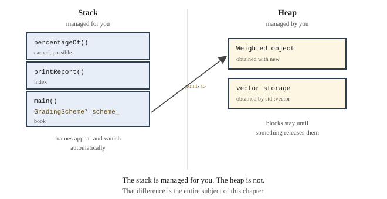

# Chapter 22 — Memory Management and Smart Pointers

## Learning Objectives

When you finish this chapter you will be able to:

- Describe the four regions of memory a program uses. *(SLO 2.1)*
- Distinguish automatic from dynamic storage. *(SLO 2.1)*
- Allocate and release memory with `new` and `delete`. *(SLO 2.1)*
- Identify memory leaks, dangling pointers, and double frees, and detect them with a sanitizer. *(SLO 2.7)*
- Explain RAII and why destructors make it work. *(SLO 2.1, 2.8)*
- State the Rule of Three and say when it applies. *(SLO 2.2)*
- Use `std::unique_ptr` and `std::shared_ptr`. *(SLO 2.1)*
- Build Grade Calculator v3.2 — the same behavior with none of the ownership bookkeeping.

---

## 22.1 Memory Regions

Chapter 1 Section 1.2 described main memory as a sequence of addressed cells. A running program divides that space into four regions with different rules.

| Region | Holds | Managed by | Lifetime |
|---|---|---|---|
| **Code** | the machine instructions | the loader | the whole run |
| **Static** | globals and `static` locals | the compiler | the whole run |
| **Stack** | local variables, parameters | **automatically** | until the function returns |
| **Heap** | anything obtained with `new` | **by you** | until something releases it |

The last two are what this chapter is about.



**Figure 22.1 — Where a program's data lives.**

*Description of Figure 22.1.* The left column is the **stack**, holding three frames: `percentageOf()` with `earned` and `possible` at the top, `printReport()` with `index` below it, and `main()` at the bottom holding `book` and a pointer `scheme_`. A note records that frames appear and vanish automatically as functions are entered and left.

The right column is the **heap**, holding two blocks: a `Weighted` object obtained with `new`, and storage obtained internally by a `std::vector`. A note records that heap blocks stay until something releases them.

An arrow runs from `scheme_` in the `main` frame to the `Weighted` object on the heap.

**The stack is managed for you. The heap is not.** That difference is the entire subject of this chapter.

---

## 22.2 Automatic and Dynamic Storage

**Automatic storage** is what you have used since Chapter 3:

```cpp
void example() {
    double score = 84.0;          // created here
    Student ada("Ada", 1001);     // created here
}                                 // both destroyed here, automatically
```

The stack frame vanishes when the function returns, and everything in it is destroyed. You cannot forget, because you were never asked.

**Dynamic storage** is obtained explicitly and stays until released:

```cpp
Student* p = new Student("Ada", 1001);    // on the heap
// ...
delete p;                                 // released, by you
```

Three reasons to need it:

**The size is not known at compile time.** `std::vector` uses the heap for exactly this.

**The object must outlive the function that created it.** Returning a pointer to a local is undefined behavior; returning a pointer to a heap object is fine.

**Polymorphism.** Chapter 21 Section 21.4 showed that a base-typed *value* slices. Holding a `GradingScheme*` avoids that, and the object it points at is on the heap.

The Grade Calculator uses the heap for the third reason and no other.

---

## 22.3 `new` and `delete`

```cpp
GradingScheme* scheme = new Weighted();    // allocate and construct
delete scheme;                             // destruct and release
```

`new` finds space, runs the constructor, and returns a pointer. `delete` runs the destructor and returns the space.

Two rules with no exceptions. **Every `new` needs exactly one matching `delete`.** And **`delete` through a base pointer requires a virtual destructor** — Chapter 21 Section 21.6, or only the base part is destroyed.

---

## 22.4 Three Ways to Get It Wrong

### Memory leak

You allocate and never release:

```cpp
void leak() {
    GradingScheme* s = new Weighted();
    // no delete — the object is unreachable and never freed
}
```

The memory is gone for the rest of the run. One leak is harmless; a leak inside a loop exhausts memory.

**Leaks are silent.** Nothing crashes, nothing warns, and the program appears to work.

### Dangling pointer

You keep using a pointer after releasing what it pointed at:

```cpp
GradingScheme* s = new Weighted();
delete s;
s->computePercentage(work);      // undefined behavior
```

Sometimes it works, sometimes it crashes, sometimes it silently reads garbage — the Chapter 11 out-of-bounds situation again. **Set a pointer to `nullptr` after deleting** if it stays in scope.

### Double free

You delete the same object twice:

```cpp
delete s;
delete s;                        // undefined behavior, usually a crash
```

This most often happens when two objects both think they own something — which is exactly why Chapter 21's `Gradebook` disabled copying.

### Detecting them

**AddressSanitizer** finds all three. Add `-fsanitize=address -g`:

```text
g++ -std=c++17 -fsanitize=address -g *.cpp -o gradecalc
```

The program runs normally and reports problems as they happen:

```text
SUMMARY: AddressSanitizer: 264 byte(s) leaked in 4 allocation(s).
```

This belongs with Chapter 16's debugging toolkit. **A leak you cannot see is a leak you cannot fix**, and a sanitizer makes the invisible visible.

---

## 22.5 RAII

Here is the idea that resolves all of this, and it is one of the best in C++.

**RAII** — Resource Acquisition Is Initialization — means: **tie a resource's lifetime to an object's lifetime.** Acquire it in the constructor, release it in the destructor. Because the destructor runs automatically when the object goes out of scope, the resource is released automatically too.

You have used RAII since Chapter 12 without knowing it:

```cpp
{
    std::vector<double> scores;
    scores.push_back(9.0);          // vector allocates heap memory
}                                   // destructor runs; memory released
```

`std::vector` allocates on the heap. You never call `delete` because its destructor does. Same for `std::string`, and for `std::ofstream` in Chapter 15, which closes the file when it goes out of scope.

**The general principle: never manage a resource by hand if an object can manage it for you.** Files, memory, locks, network connections — the pattern is identical.

---

## 22.6 The Rule of Three

If a class manages a resource directly, it usually needs **three** functions:

```cpp
class Owner {
public:
    ~Owner();                              // 1. destructor
    Owner(const Owner& other);             // 2. copy constructor
    Owner& operator=(const Owner& other);  // 3. copy assignment
};
```

**The Rule of Three: if you need any one of these, you almost certainly need all three.**

Chapter 19 Section 19.6 said the compiler generates these for you and that the generated versions are correct for classes holding `std::string` and `std::vector`. The moment a class holds a raw pointer, they stop being correct: the generated copy copies the *pointer*, so two objects point at one thing and both eventually delete it.

Chapter 21's `Gradebook` handled this by **disabling** copying:

```cpp
Gradebook(const Gradebook&) = delete;
Gradebook& operator=(const Gradebook&) = delete;
```

Deleting them is a legitimate choice when copying makes no sense. It is also a symptom: the class needed a decision it should not have had to make.

---

## 22.7 Smart Pointers

A **smart pointer** applies RAII to memory. It behaves like a pointer and releases what it holds when destroyed.

### `std::unique_ptr`

**One owner.** When the pointer is destroyed, the object is destroyed.

```cpp
#include <memory>

std::unique_ptr<GradingScheme> scheme = std::make_unique<Weighted>();
scheme->computePercentage(work);     // used exactly like a pointer
// no delete — released automatically
```

```text
--- raw pointer, managed by hand ---
  built Points
  destroyed Points
--- unique_ptr, managed for you ---
  built Points
  destroyed Points
```

The behavior is identical; the second required no `delete`.

**Assigning to a `unique_ptr` releases what it held:**

```text
--- reassigning a unique_ptr releases the old one ---
  built Points
  built Weighted
  destroyed Points
  now holding Weighted
  destroyed Weighted
```

That one line replaces the manual `delete scheme_;` that Chapter 21's `setScheme` needed.

A `unique_ptr` **cannot be copied** — that is what "unique" means. It can be **moved** with `std::move`, which transfers ownership:

```cpp
void Gradebook::setScheme(std::unique_ptr<GradingScheme> scheme) {
    scheme_ = std::move(scheme);
}

book.setScheme(std::make_unique<Weighted>());
```

Taking the parameter *by value* as a `unique_ptr` is deliberate: it makes the transfer of ownership visible at every call site, because a caller must hand the pointer over rather than share it.

### `std::shared_ptr`

**Several owners**, with a count. The object is destroyed when the last owner goes away.

```text
--- shared_ptr counts owners ---
  built Points
  use_count 1
  use_count 2
  use_count 1
  destroyed Points
```

`shared_ptr` is more flexible and more expensive — it maintains a count, and the count must be updated safely. **Prefer `unique_ptr`.** Reach for `shared_ptr` only when ownership genuinely is shared, which is rarer than people expect.

### Choosing

| Situation | Use |
|---|---|
| A value with a clear scope | **no pointer at all** — automatic storage |
| One owner | `std::unique_ptr` |
| Genuinely shared ownership | `std::shared_ptr` |
| Referring without owning | a plain reference or raw pointer |

Note the first row. Much code that reaches for `new` did not need the heap at all.

---

## 22.8 Linked Lists

A **linked list** is the classic example of manual memory management, and worth seeing once:

```cpp
struct Node {
    double value = 0.0;
    Node* next = nullptr;
};
```

Each node holds a value and a pointer to the next. The list is a chain, ending with `nullptr`.

Unlike a vector, inserting in the middle costs nothing beyond finding the position — no elements move. In exchange, reaching element *k* means walking *k* links, so there is no `[]` in any useful sense.

**Managing a linked list by hand means every node must be deleted exactly once**, which requires walking the chain in the destructor and being careful about the order. This is where the Rule of Three earns its name.

The Grade Calculator uses `std::vector` throughout and never needs this. Linked lists are covered because they are the standard illustration of pointer-based structures, and because `std::list` exists if you ever want one without the bookkeeping.

---

## 22.9 Move Semantics, Briefly

Copying a large object is expensive. Sometimes you do not need a copy — you need to *transfer* it, because the source is about to be discarded.

**Move semantics** does that:

```cpp
std::vector<Student> a = makeRoster();
std::vector<Student> b = std::move(a);    // b takes a's storage; nothing is copied
```

After a move, the source is in a valid but unspecified state. **Do not use a moved-from object except to assign to it or destroy it.**

`std::move` does not move anything by itself — it marks a value as movable, permitting the compiler to choose a transfer instead of a copy. That is the mechanism behind `unique_ptr`'s ownership transfer in Section 22.7.

---

## Common Errors and Warnings

| What you see or observe | Cause | Fix |
|---|---|---|
| `SUMMARY: AddressSanitizer: N byte(s) leaked` | `new` without a matching `delete` | Use `std::unique_ptr` |
| `heap-use-after-free` | Dangling pointer | Do not use after delete; set to `nullptr` |
| `attempting double-free` | Two owners of one object | One owner; use `unique_ptr` |
| Only the base destructor runs | No virtual destructor | Add `virtual ~Base() = default;` |
| `error: use of deleted function` on copy | Copying a `unique_ptr` | Use `std::move`, or `shared_ptr` |
| Memory grows steadily during a run | Leak inside a loop | Build with a sanitizer and find it |
| `error: 'unique_ptr' was not declared` | Missing `#include <memory>` | Add the header |
| A moved-from object behaves oddly | Used after `std::move` | Do not use it except to reassign |
| Two objects delete the same memory | Generated copy constructor copied a raw pointer | Rule of Three, or a smart pointer |

---

## Design Notes

**Prefer automatic storage.** Most objects do not need the heap.

**Never write `new` without an owner.** If you type `new`, the result should go straight into a smart pointer.

**One owner.** `unique_ptr` unless ownership is genuinely shared.

**Every polymorphic base gets a virtual destructor.**

**Run a sanitizer before you ship.** Leaks are silent; a sanitizer is the only cheap way to see them.

---

## Grade Calculator v3.2 — Safe Ownership

### The honest framing

The obvious version of this chapter's lesson would be: *v3.1 leaked, and smart pointers fix it.* That would be false, and it is worth being exact about why.

**v3.1 does not leak.** Its raw-pointer ownership is correct. Build it under AddressSanitizer, switch schemes repeatedly, and it reports nothing.

It is correct because `Gradebook` does **three separate things**:

```cpp
Gradebook::~Gradebook() {
    delete scheme_;                          // 1. release on destruction
}

void Gradebook::setScheme(GradingScheme* scheme) {
    if (scheme == nullptr || scheme == scheme_) { return; }
    delete scheme_;                          // 2. release before replacing
    scheme_ = scheme;
}

Gradebook(const Gradebook&) = delete;        // 3. prevent two owners
Gradebook& operator=(const Gradebook&) = delete;
```

Eight lines of bookkeeping, each of which had to be remembered.

### The lab: remove one line

Take a copy of your working v3.1 and delete **one line** — the `delete scheme_;` inside `setScheme`. Nothing else.

Build it under the sanitizer and switch schemes twice:

```text
g++ -std=c++17 -fsanitize=address -g *.cpp -o gradecalc
```

```text
SUMMARY: AddressSanitizer: 264 byte(s) leaked in 4 allocation(s).
```

**One line. Four leaked allocations.** The program still produced correct grades — the leak is invisible from the outside, which is why Section 22.4 calls leaks silent.

Now put it back and confirm the report is clean again.

### The conversion

`unique_ptr` replaces all three pieces:

```cpp
// gradebook.h
#include <memory>

class Gradebook {
public:
    explicit Gradebook(const std::string& courseName = "Untitled Course");

    // No destructor is needed now. unique_ptr releases the scheme when the
    // Gradebook is destroyed, and again whenever the scheme is replaced.
    // The compiler-generated destructor is correct, so none is written here.

    /**
     * Installs a grading scheme. Ownership transfers to the Gradebook.
     * The unique_ptr parameter makes that transfer visible at every call site:
     * a caller must std::move into it, so ownership is never ambiguous.
     */
    void setScheme(std::unique_ptr<GradingScheme> scheme);

    double percentageFor(const Student& s) const;

private:
    // An owning smart pointer to an abstract base. Polymorphism is unchanged;
    // only the ownership question is answered differently.
    std::unique_ptr<GradingScheme> scheme_;
};
```

```cpp
// gradebook.cpp
Gradebook::Gradebook(const std::string& courseName)
    : courseName_(courseName), scheme_(std::make_unique<PointsBased>()) {}

void Gradebook::setScheme(std::unique_ptr<GradingScheme> scheme) {
    if (!scheme) { return; }
    // Assigning to a unique_ptr destroys whatever it held first. This one line
    // replaces v3.1's manual delete, and the destructor and deleted copy
    // operations that had to accompany it.
    scheme_ = std::move(scheme);
}
```

And at the call site:

```cpp
book.setScheme(std::make_unique<Weighted>());
```

### The tally

| | v3.1 | v3.2 |
|---|---|---|
| Destructor | hand-written | **not needed** |
| `delete` in `setScheme` | required | **not needed** |
| Deleted copy operations | required | **not needed** |
| Lines of ownership bookkeeping | 8 | **0** |
| Leaks | none | none |
| Behavior | identical | identical |

### The actual lesson

**v3.1 is correct because its author remembered three separate things. v3.2 is correct because there is nothing to remember.**

That is a stronger claim than "smart pointers fix leaks," and it is the real argument for RAII. Correctness that depends on vigilance degrades — under deadline, under a new maintainer, under a refactor that moves a line. Correctness that is structural does not.

Notice too that **the polymorphism is untouched.** `GradingScheme` is still abstract, `computePercentage` is still virtual, dispatch still works exactly as in Chapter 21. Only the ownership question was answered differently.

### Expected output

Identical to v3.1 in every respect:

```text
  Grading: Weighted
1001  Ada                     90.0%   A
```

### Your task

1. **Confirm v3.1 does not leak.** Build it under AddressSanitizer, switch schemes several times, exit. The report should be clean.

2. **Do the one-line lab.** Remove `delete scheme_;` from `setScheme`, rebuild under the sanitizer, and reproduce the 264-byte leak. Restore it.

3. **Now remove the destructor instead**, leaving the `delete` in `setScheme`. Does it still leak? What does that tell you about the three pieces being independent?

4. **Convert to `unique_ptr`.** Delete the destructor, the manual `delete`, and the deleted copy operations. Confirm the program compiles, behaves identically, and reports no leaks.

5. **Try to break v3.2 the same way.** Attempt to remove a line that causes a leak. Write one sentence on what you find.

6. **Try to copy a `Gradebook`** in v3.2. Read the error — it comes from `unique_ptr` being non-copyable, which is the class refusing an unsafe operation on your behalf rather than you having to remember to forbid it.

7. **Find the heap in a vector.** Build a program that adds 1,000 students to a `std::vector` under the sanitizer. It should report no leaks — even though the vector allocated heap memory many times. Explain why in one sentence, using the word RAII.

---

## Try It Yourself

### 1. Raw pointers, smart pointers, and ownership

```cpp
#include <iostream>
#include <memory>
#include <string>

class Scheme {
public:
    explicit Scheme(const std::string& n) : name_(n) {
        std::cout << "  built " << name_ << "\n";
    }
    virtual ~Scheme() { std::cout << "  destroyed " << name_ << "\n"; }
    const std::string& name() const { return name_; }
private:
    std::string name_;
};

class Points   : public Scheme { public: Points()   : Scheme("Points")   {} };
class Weighted : public Scheme { public: Weighted() : Scheme("Weighted") {} };

int main() {
    std::cout << "--- raw pointer, managed by hand ---\n";
    { Scheme* s = new Points(); delete s; }

    std::cout << "--- unique_ptr, managed for you ---\n";
    { std::unique_ptr<Scheme> s = std::make_unique<Points>(); }

    std::cout << "--- reassigning releases the old one ---\n";
    {
        std::unique_ptr<Scheme> s = std::make_unique<Points>();
        s = std::make_unique<Weighted>();
        std::cout << "  now holding " << s->name() << "\n";
    }
    return 0;
}
```

**Expected output:**

```text
--- raw pointer, managed by hand ---
  built Points
  destroyed Points
--- unique_ptr, managed for you ---
  built Points
  destroyed Points
--- reassigning releases the old one ---
  built Points
  built Weighted
  destroyed Points
  now holding Weighted
  destroyed Weighted
```

*Try:* Remove the `delete s;` from the first block and rebuild with `-fsanitize=address`. What is reported? Then try removing something from the second block that causes a leak — can you?

### 2. Shared ownership and counting

```cpp
#include <iostream>
#include <memory>

class Thing {
public:
    Thing()  { std::cout << "  built\n"; }
    ~Thing() { std::cout << "  destroyed\n"; }
};

int main() {
    auto a = std::make_shared<Thing>();
    std::cout << "  use_count " << a.use_count() << "\n";
    {
        auto b = a;
        std::cout << "  use_count " << a.use_count() << "\n";
    }
    std::cout << "  use_count " << a.use_count() << "\n";
    return 0;
}
```

**Expected output:**

```text
  built
  use_count 1
  use_count 2
  use_count 1
  destroyed
```

*Try:* Note *when* "destroyed" prints. Why not when `b` went out of scope?

### 3. A leak you can see

```cpp
#include <iostream>

int main() {
    for (int k = 0; k < 5; ++k) {
        double* p = new double(k * 1.5);
        std::cout << *p << " ";
        // no delete
    }
    std::cout << "\n";
    return 0;
}
```

**Expected output:**

```text
0 1.5 3 4.5 6 
```

*Try:* The program looks fine. Build with `-fsanitize=address -g` and rerun. How many allocations leaked? Then fix it two ways — with `delete`, and with no pointer at all. Which fix is better?

### 4. Ownership transfer with `std::move`

```cpp
#include <iostream>
#include <memory>
#include <string>

int main() {
    std::unique_ptr<std::string> a = std::make_unique<std::string>("Ada");
    std::cout << "a holds: " << *a << "\n";

    std::unique_ptr<std::string> b = std::move(a);
    std::cout << "b holds: " << *b << "\n";
    std::cout << "a is now " << (a ? "non-empty" : "empty") << "\n";
    return 0;
}
```

**Expected output:**

```text
a holds: Ada
b holds: Ada
a is now empty
```

*Try:* Replace `std::move(a)` with plain `a` and read the error. Why does `unique_ptr` refuse to be copied?

### 5. RAII with something other than memory

```cpp
#include <fstream>
#include <iostream>

int main() {
    {
        std::ofstream out("raii.txt");
        out << "written inside the block\n";
    }   // out goes out of scope here — the file is closed automatically

    std::ifstream in("raii.txt");
    std::string line;
    std::getline(in, line);
    std::cout << "read back: " << line << "\n";
    return 0;
}
```

**Expected output:**

```text
read back: written inside the block
```

*Try:* You never called `close()`. Explain in one sentence, using the word destructor, why the file was nevertheless closed and flushed.

### 6. Rule of Three

This class leaks and can double-free. Identify both problems, then fix it two ways: by following the Rule of Three, and by using `std::unique_ptr`.

```cpp
class Holder {
public:
    Holder() : data_(new double[100]) {}
private:
    double* data_;
};
```

Which fix is shorter? Which is harder to get wrong?

### 7. Reason about memory

- What is the difference between the stack and the heap, in one sentence each?
- Why is a memory leak harder to notice than a crash?
- What does RAII mean, and which destructor makes it work?
- Why can a `unique_ptr` not be copied?
- You see `new` in unfamiliar code with no smart pointer nearby. What are you looking for?
- Give one case where `shared_ptr` is right and `unique_ptr` is not.

---

## Summary

- A program uses four memory regions: **code**, **static**, **stack**, and **heap**. **The stack is managed for you; the heap is not.**
- **Automatic storage** is destroyed when its scope ends. **Dynamic storage** obtained with `new` stays until `delete`.
- Three failure modes: a **memory leak** (never released), a **dangling pointer** (used after release), and a **double free** (released twice). All are undefined or silent.
- **AddressSanitizer** (`-fsanitize=address -g`) detects all three. Leaks are invisible without it.
- **RAII** ties a resource's lifetime to an object's lifetime: acquire in the constructor, release in the destructor. `std::vector`, `std::string`, and `std::ofstream` all work this way.
- **The Rule of Three**: a class managing a resource directly needs a destructor, a copy constructor, and copy assignment — or must forbid copying.
- **`std::unique_ptr`** has one owner and releases automatically; assigning to one releases what it held. It cannot be copied, only **moved**.
- **`std::shared_ptr`** counts owners and releases when the last goes away. Prefer `unique_ptr`.
- **v3.1 did not leak.** It was correct because three separate pieces of bookkeeping were remembered. **v3.2 is correct because there is nothing to remember** — which is the real argument for RAII.

---

## Key Terms

**automatic storage** — memory for local variables, released when scope ends.

**dangling pointer** — a pointer to memory that has been released.

**double free** — releasing the same memory twice.

**dynamic storage** — heap memory obtained with `new` and released with `delete`.

**heap** — the memory region for dynamically allocated objects.

**linked list** — a chain of nodes, each holding a value and a pointer to the next.

**memory leak** — allocated memory that is never released.

**move semantics** — transferring a resource from one object to another instead of copying.

**RAII** — Resource Acquisition Is Initialization; tying resource lifetime to object lifetime.

**Rule of Three** — needing any of destructor, copy constructor, or copy assignment implies needing all three.

**shared_ptr** — a smart pointer with reference counting and shared ownership.

**smart pointer** — an object that owns a pointer and releases it automatically.

**stack** — the memory region holding function frames and local variables.

**unique_ptr** — a smart pointer with sole ownership, releasing on destruction.

---

**Next:** Chapter 23 makes your calculator generic. A `Statistics<T>` template computes mean, median, and standard deviation for any numeric type; `std::map` indexes students by ID and counts the grade distribution; and lambdas state a sort's ordering where it is used rather than hiding it in `operator<`. Grade Calculator v3.3.
